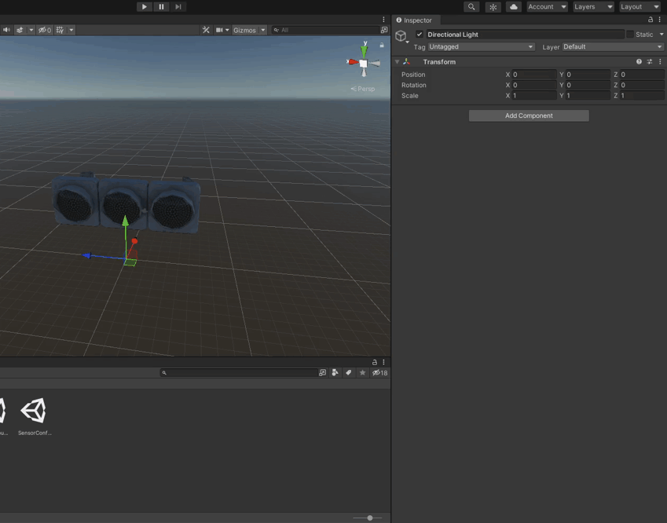
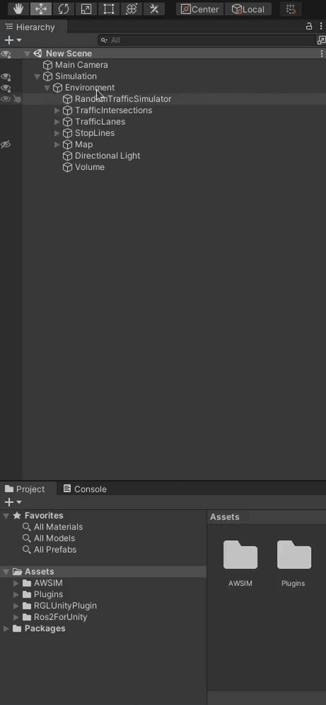
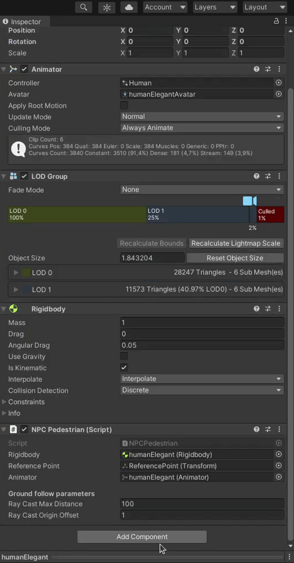
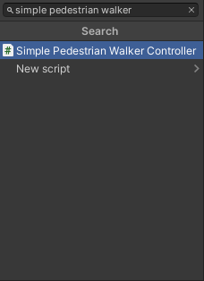

# Add a Environment
<!-- TODO: here you should add a short introduction to what the environment is and a link to Components/Environment -->
## Create a Lanelet2
<!-- TODO: here you should add information that the lanelet2 should be developed using MGRS coordinates and the origin of the system in which it is defined should be known -->
Create a *Lanelet2* using [VectorMapBuilder](https://tools.tier4.jp/feature/vector_map_builder/) from the *PCD* obtained from real-life *LiDAR* sensor.
## Create 3D models
<!-- TODO here you should add a description that models can be prepared in the form of fbx files that load textures and materials from separate folders (as it is in External) -->
To properly create 3D models of the environment please keep in mind the following notes:

- Creating a 3D model based on actual point cloud data makes it more realistic.
- *AWSIM* is created using *HDRP* (High Definition Rendering Pipeline) which performs better when object meshes are merged.
- Occlusion culling and flutter culling cannot be used because the sensors detection target will disappear.
- Each traffic light should have a separate GameObject. Also, each light in the traffic light should be split into separate materials.

### Guidelines
<!-- TODO: here you should add tips in consultation with Piotr Rząd and report from Unity -->
## Create a Environment prefab
### Add a 3D models
<!-- TODO: here you should describe how to create a prefab using models in fbx, you should mention about creating a hierarchy (groups) and about setting materials and textures, gifs/screens -->
Add roads, buildings, greenery, signs, road markings…

In `AWSIM` all objects are located with their real world coordinates.
This way the real world is represented accurately.

!!! tip
    When adding some static element to your scene that is a part of the world (like 3D models of buildings, lights etc.) it is a good practice to aggregate them in one parent *Object* called `Map` or something similar.

    Then you can set a transformation of the parent Object `Map` to adjust the world position in reference to loaded objects from `Lanelet2`.

### Add a Environment Script
Add an `Environment Script` as component in the `Environment` object.

1. Click on the *Add Component* button in the `Environment` object

    

1. Search for `Environment` and select it

    

1. Set the [`MGRS`](https://en.wikipedia.org/wiki/Military_Grid_Reference_System) offset to the origin position of the coordinate system where the *Lanelet2* used is defined.

    

1. Due to the differences in the coordinate systems between *VectorMapBuilder* and *Unity*, it is sometimes necessary to appropriately complete and transform the `Environment` object.
The transform in Environment should be set in such a way that the Traffic Lanes match the modeled roads. Most often it is necessary to set the positive `90` degree rotation over `Y` axis

    

### Add a Directional Light

1. Create a new child Object of the Environment and name it `Directional Light`

    

1. Click `Add Component` button, search for `light` and select it. 

    

2. Change light Type to `Directional`.
3. Now you can configure the directional light as you wish. E.g. change the intensity or orientation.

    

!!!tip
    For more details on lighting check out [official Unity documentation](https://docs.unity3d.com/Manual/Lighting.html).
### Add a Volume

1. Create a new child object of the Environment and name it `Volume`

    

1. Click `Add Component` search for `volume` and select it.

    

1. Change the Profile to `Volume Profile` and wait for changes to take effect.

    

1. Now you can configure the Volume individually as you wish.

!!!tip
    For more details on volumes checkout [official Unity documentation](https://docs.unity3d.com/Packages/com.unity.render-pipelines.high-definition@11.0/manual/Volumes.html).
### Add NPCPedestrians
1. Make NPCPedestrians parent object.

    

2. Open `Assets/AWSIM/Prefabs/NPCs/Pedestrians` in Project view and drag a humanElegant into the NPCPedestrians parent object

    

    

1. Click `Add Component` in the humanElegant object and search for `Simple Pedestrian Walker Controller` Script and select it.

    This is a simple Script that makes the pedestrian indefinitely walk straight and turn around.
    You can configure pedestrian behavior with 2 parameters.

    - Duration: how long will the pedestrian walk straight
    - Speed: how fat will the pedestrian walk straight

    !!!tip
        The `Simple Pedestrian Walker Controller` Script is best suited to be used on pavements.

    

    

2. Finally position the NPCPedestrian on the scene where you want it to start walking.

    !!! warning
        Remember to set correct orientation, as the NPCPedestrian will walk straight from the starting position with the starting orientation.

!!! success
    Once you've added the environment, you need to add and configure TrafficLights to it, details about it are described here.
