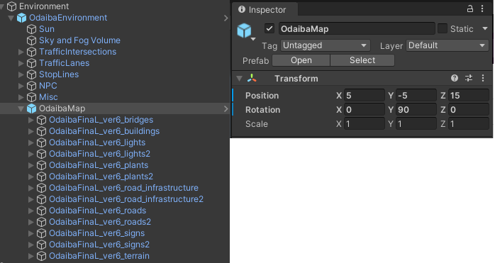
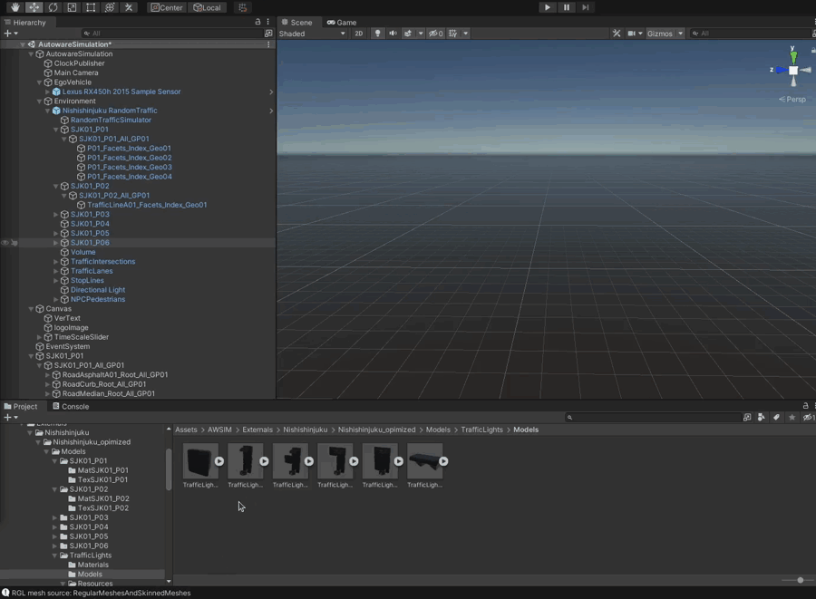
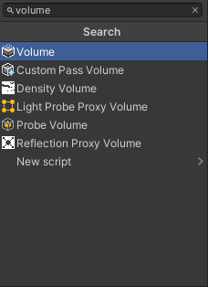

# Add an Environment

*Environment* is an important part of a *Scene* in *AWSIM*.
Every aspect of the simulated surrounding world needs to be included in the `Environment` prefab - in this section you will learn how to develop it. However, first [Lanelet2](https://github.com/fzi-forschungszentrum-informatik/Lanelet2) needs to be developed along with *3D* models of the world, which will be the main elements of this prefab.

!!! tip
    If you want to learn more about the *Environment* at *AWSIM*, please visit [this page](../../../../UserGuide/ProjectGuide/Components/Environment/).

## Create a *Lanelet2*
Before you start creating *Lanelet2*, we encourage you to read the [documentation](https://github.com/fzi-forschungszentrum-informatik/Lanelet2/tree/master) to find out what *Lanelet2* is all about.

*Lanelet2* can be created using [*VectorMapBuilder*](https://tools.tier4.jp/feature/vector_map_builder/) (`VMP`) based on the *PCD* obtained from real-life *LiDAR* sensor.
For details please visit the [basic operation](https://tools.tier4.jp/vector_map_builder/user_guide/) and [official user guide](https://tools.tier4.jp/static/manuals/vector_map_builder_ll2_user_guide.pdf).

When working with the `VMP`, it is necessary to ensure the most accurate mapping of the road situation using the available elements.
Especially important are `TrafficLanes` created in `VMB` as connected `Road Nodes` and `StopLines` created in VMB as `Road Surface Stoplines`.

!!! warning "*Lanelet2* positioning"
    *Lanelet2* should be created in [*MGRS* coordinates](https://www.maptools.com/tutorials/mgrs/quick_guide) of the real place you are recreating.
    Please position your *Lanelet2* relative to the origin (bottom left corner) of the *MGRS Grid Zone* with the 100 km *Square ID* in which the location lays. More details can be read [here](https://www.maptools.com/tutorials/100km_square_id).

    You can think of the *Grid Zone* as a local coordinate system.
    Instead of making global *(0,0)* point (crossing of *Equator* and *Prime Median*) our coordinate system origin we take a closer one.
    The *MGRS Grid Zone* with 100 km *Square ID* code designates a 100x100 [kmxkm] square on the map and we take its bottom left corner as our local origin.

    Lets examine one node from an example *Lanelet2* map:

    ```xml
    <node id="4" lat="35.68855194431519" lon="139.69142711058254">
        <tag k="mgrs_code" v="54SUE815501"/>
        <tag k="local_x" v="81596.1357"/>
        <tag k="local_y" v="50194.0803"/>
        <tag k="ele" v="34.137"/>
    </node>
    ```

    The node with `id="4"` position is described as absolute coordinates given in the `<node>`.
    In this example the coordinates are as follows `lat="35.68855194431519" lon="139.69142711058254`.

    It is also described as local transformation defined as a translation relative to the origin of the *MGRS Grid Zone* with 100 km *Square ID* (bottom left corner).
    The *MGRS Grid Zone* designation with 100 km *Square ID* in this case is equal to `54SUE`.
    In this example the offset in the *X axis* is as follows `k="local_x" v="81596.1357"`
    and the offset in the *Y axis* is as follows `k="local_y" v="50194.0803"`.

    Note that elevation information is also included.

## Create 3D models
You can create `3D` models of an `Environment` as you wish.
It is advised however, to prepare the models in form of `.fbx` files.
Additionally you should include materials and textures in separate directories.
Many models are delivered in this format.
This file format allows you to import models into Unity with materials and replace materials while importing. You can learn more about it [here](https://unity.com/how-to/work-assets-between-unity-and-autodesk).

<!-- TODO: Here are still missing examples of fbx as added to prefab and how to set materials/textures - unless it is/will be in the next part -->

### Guidelines
<!-- TODO: here you should add tips in consultation with Piotr Rząd and report from Unity -->
To improve the simulation performance of a scene containing your  `Environment` prefab, please keep in mind some of these tips when creating *3D* models:

1. Prefer more smaller models over a few big ones.

    In general it is beneficial for performance when you make one small mesh of a object like tree and reuse it on the scene placing many prefabs instead of making one giant mesh containing all trees on the given scene.
    Even in situations when you are not reusing meshes it is beneficial.
    Lets say you have a city with many buildings - and every one of those buildings is different - it is still advised to model those building individually and make them separate *GameObjects*.

1. Choose texture resolution appropriately.

    Always have in mind what is the target usage of your texture.
    Avoid making a high resolution texture for a small object or the one that will always be far away from the camera.
    This way you can save some computing power by not calculating the details that will not be seen because of the screen resolution.

What's more, consider these tips related directly to the use of 3D models in *AWSIM*:
<!-- TODO: what is flutter culling - i can't find it -->
 1. Creating a *3D* model based on actual point cloud data makes it more realistic.
 1. *AWSIM* is created using *HDRP* ([*High Definition Rendering Pipeline*](https://unity.com/srp/High-Definition-Render-Pipeline)) which performs better when object meshes are merged.
 1. [Occlusion culling](https://docs.unity3d.com/Manual/OcclusionCulling.html) and flutter culling cannot be used because the sensors detection target will disappear.
 1. Each traffic light should have a separate `GameObject`. Also, each light in the traffic light should be split into separate materials.

## Create an Environment prefab
<!-- TODO: please add after each step the effect (screen of scene elements) that the reader should achieve -->
In this part, you will learn how to create a `Environment` prefab - that is, develop a *GameObject* containing all the necessary elements and save it as a prefab.
### 1. Add a 3D models
In this section we will add roads, buildings, greenery, signs, road markings etc. to our scene.

Most often your models will be saved in the `.fbx` format.
If so, you can customize the materials in the imported model just before importing it.
Sometimes it is necessary as models come with placeholder materials.
 You can either:

 - replace materials for every added *GameObject* into the *Scene*,
 - or replace materials for one *GameObject* and save this object as a prefab to easily load it later.

In order to add *3D* models from the `.fbx` file to the *Scene* please do the following steps:
<!-- TODO: gif/video -->
1. In the *Project* view navigate to directory where the model is located and click on the model file.
2. Now you can customize the materials used in the model in the *Inspector* view.
3. Drag the model into the *Scene* where you want to position it.
4. Move the *Object* in the *Hierarchy* tree appropriately.
5. (optional) Now you can save this model configuration as a *prefab* to easily reuse it.
    Do this by dragging the *Object* from the *Scene* into the *Project* view.
    When you get a warning make sure to select you want to create an original new prefab.

When creating a complex *Environment* with many elements you should group them appropriately in the Hierarchy view.
This depends on the individual style you like more, but it is a good practice to add all repeating elements into one common *Object*.
E.g. all identical traffic lights grouped in *TrafficLights* Object.
The same can be done with trees, buildings, signs etc.
You can group Objects as you like.

!!! tip "Object hierarchy"
    When adding elements to the *Environment* that are part of the static world (like 3D models of buildings, traffic lights etc.) it is good practice to collect them in one parent *GameObject* called `Map` or something similar.

    By doing this you can set a transformation of the parent *GameObject* `Map` to adjust the world pose in reference to e.g. loaded objects from *Lanelet2*.<br>
    

!!! warning "Remember to unpack"
    Please remember to unpack all *Object* added into the scene.
    If you don't they will change materials together with the `.fbx` model file as demonstrated in the example below.
    In this example we will first position the model on the Scene and only then change the materials to visualize the difference.
    <!-- TODO: but there is no unpacking here - so should we do it or not, write to me because I don't understand something here-->
    
    

### 2. Add an Environment Script
<!-- TODO: maybe in the section above, write what should be the final result - with a screenshot, so that you can see where you need to add this component -->
Add an `Environment Script` as component in the `Environment` object.

1. Click on the *Add Component* button in the `Environment` object.

    

1. Search for `Environment` and select it.

    

1. Set the [`MGRS`](https://en.wikipedia.org/wiki/Military_Grid_Reference_System) to the offset of your Environment as explained [in this section](../../../../UserGuide/ProjectGuide/Components/Environment/#environment-script).

    

2. Due to the differences between *VectorMapBuilder* and *Unity*, it may be necessary to set the transform of the `Environment` object.
The transform in `Environment` should be set in such a way that the `TrafficLanes` match the modeled roads. Most often it is necessary to set the positive `90` degree rotation over `Y` axis.
    <!-- TODO: here you have to add that this action should be done after loading traffic lanes, and here we only inform -->
    

### 3. Add a Directional Light

1. Create a new child Object of the Environment and name it `Directional Light`.

    

1. Click `Add Component` button, search for `light` and select it. 

    

2. Change light Type to `Directional`.
3. Now you can configure the directional light as you wish. E.g. change the intensity or orientation.

    

!!!tip
    For more details on lighting check out [official Unity documentation](https://docs.unity3d.com/Manual/Lighting.html).
### 4. Add a Volume

1. Create a new child object of the Environment and name it `Volume`.

    

1. Click `Add Component` search for `volume` and select it.

    

1. Change the Profile to `Volume Profile` and wait for changes to take effect.

    

1. Now you can configure the *Volume* individually as you wish.

!!!tip
    For more details on volumes checkout [official Unity documentation](https://docs.unity3d.com/Packages/com.unity.render-pipelines.high-definition@11.0/manual/Volumes.html).
### 5. Add NPCPedestrians
1. Make `NPCPedestrians` parent object.

    

2. Open `Assets/AWSIM/Prefabs/NPCs/Pedestrians` in Project view and drag a `humanElegant` into the `NPCPedestrians` parent object.

    

    

1. Click `Add Component` in the humanElegant object and search for `Simple Pedestrian Walker Controller` Script and select it.

    This is a simple *Script* that makes the pedestrian indefinitely walk straight and turn around.
    You can configure pedestrian behavior with 2 parameters.

    - *Duration* - how long will the pedestrian walk straight
    - *Speed* - how fast will the pedestrian walk straight

    !!!tip
        The `Simple Pedestrian Walker Controller` Script is best suited to be used on pavements.
    <!-- TODO: here's something wrong with the screenshots -->
    

    

2. Finally position the `NPCPedestrian` on the scene where you want it to start walking.

    !!! warning
        Remember to set correct orientation, as the `NPCPedestrian` will walk straight from the starting position with the starting orientation.

!!! success
    Once you've added the `Environment`, you need to add and configure `TrafficLights`.
    For details please visit [this tutorial](../AddTrafficLights/).
