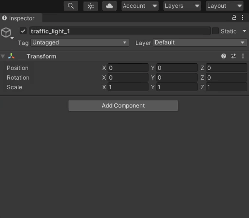
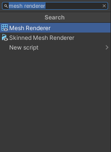
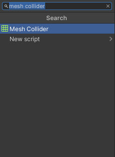
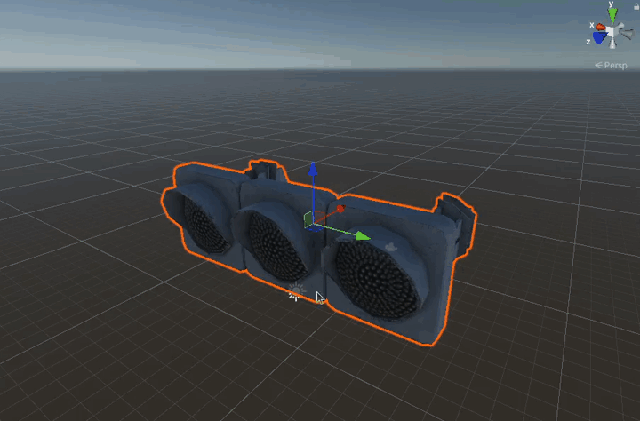
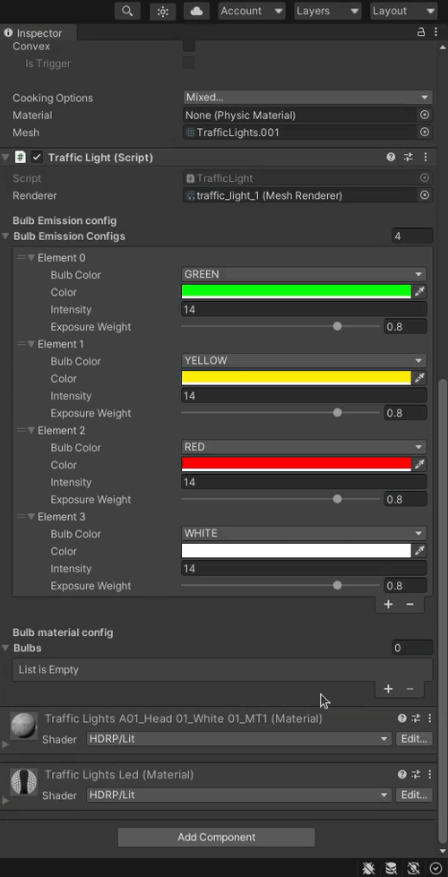

# Add TrafficLights
To add `TrafficLights` into your `Environment` follow steps below.
!!!tip
    In the `Environment` you are creating there will most likely be many `TrafficLights` that should look and work the same way.
    To simplify the process of creating an environment it is advised to create one `TrafficLight` of each type with this tutorial and then save them as prefabs that you will be able to reuse.

## 1. Add TrafficLight Object
Into your `Map` object in the *Hierarchy* view add a new *Child Object* and name it appropriately.

## 2. Add a Mesh Filter and select meshes

1. Click on the `Add Component` button.

    

1. Search for `Mesh filter` and select it by clicking on it.

    

1. For each `TrafficLight` specify the mesh you want to use.

    

## 3.Add a Mesh Renderer and specify materials

1. The same way as above search for `Mesh renderer` and select it.

    

1. Now you need to specify individual component materials.

    For example in the `Traffic.Lights.001` mesh there are four sub-meshes that need their individual materials.

    To specify a material click on the selection button on `Materials` element and search for the material you want to use and select it.

    

    Repeat this process until you specify all materials.
    When you add one material more than there are sub-meshes you will see this warning.
    Then just remove the last material and the `TrafficLight` is prepared.

    

    !!! warning
        When specifying materials remember the order in which they are used in the mesh.
        Especially remember what `Materials Elements` are associated with every `Bulb` in the `TrafficLight`.
        This information will be needed later.

    

    

    

    In the case of `Traffic.Lights.001` the bulb materials are ordered starting from the left side with index 1 and increasing to the right.
    
    !!!warning
        Different material for every bulb is necessary for the color changing behavior that we expect from traffic lights.
        Even though in most cases you will use the same material for every `Bulb`, having them as different elements is necessary.
        Please only use models of `TrafficLights` that have different `Materials Elements` for every `Bulb`.

## 4. Add a Mesh Collider
The same way as above search for `Mesh collider` and select it.
Collider may not seem useful, as the `TrafficLight` in many cases will be out of reach of vehicles.
It is however used for Lidar simulation, so it is advised to always add colliders to Objects that should be detected by Lidars.

## 5. Position TrafficLight in the Environment
Finally after configuring all visual aspects of the `TrafficLight` you can position it in the environment.
Do this by dragging a `TrafficLight` with a square representing a plane or with an arrow representing one axis.

## 6. Add TrafficLight Script
The `Traffic Light` Script will enable you to control how the `TrafficLight` lights up and create sequences.

1. Click on `Add Component`, search for the `Traffic Light` script and select it.

    

2. You should see the `Bulb Emission config` already configured. These are the colors that will be used to light up the Bulbs in `TrafficLight`. You may adjust them to suit your needs.

    

3. You will have to specify `Bulb material config`, in which you should add elements with fields:
    - `Bulb Type` - One of the predefined Bulb types that describes the Bulb (its color and pattern).

    - `Material Index` - Index of the material that you want to be associated with the Bulb Type. This is where you need to use the knowledge from earlier where we said you have to remember what Materials Element corresponds to which bulb sub-mesh.

    In the example below we specify an element Type as `RED_BULB` and associate it with Material that has an index 3.
    This will result in associating the right most bulb with the name `RED_BULB`.
    This information will be of use to us when specifying `TrafficLights` sequences.

    

!!! success
    Once you have added `TrafficLights` to your `Environment`, you can start configuring `RandomTraffic` which will add moving vehicles to it! Details [here](../../AddARandomTraffic/AddARandomTrafficSimulatorScript/).
