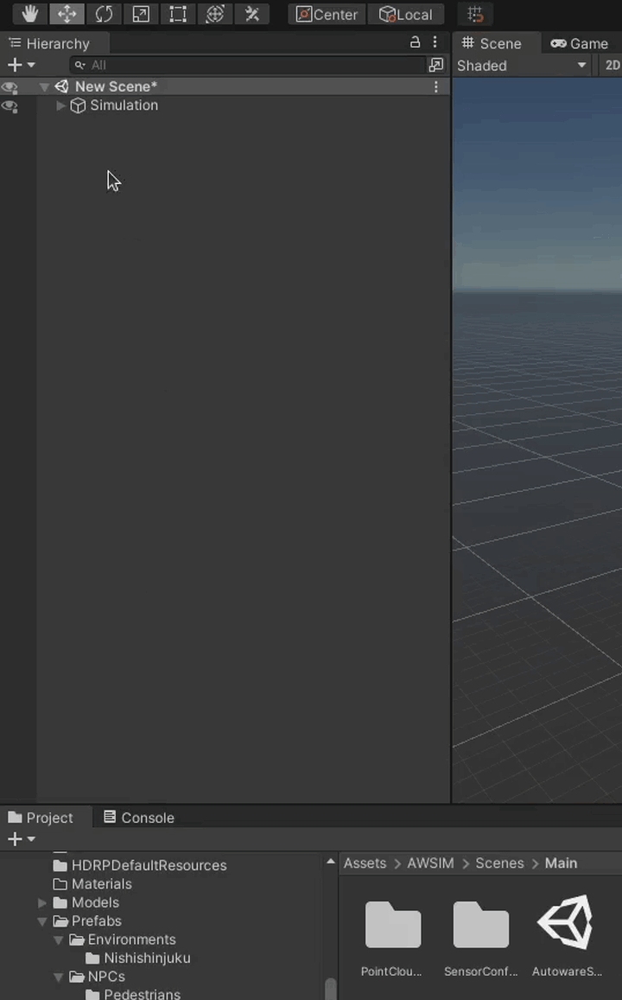
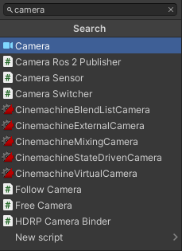
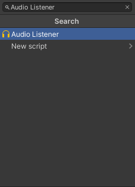
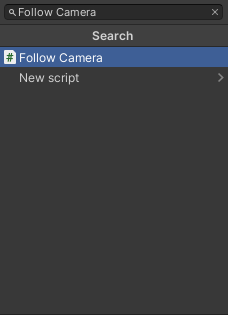
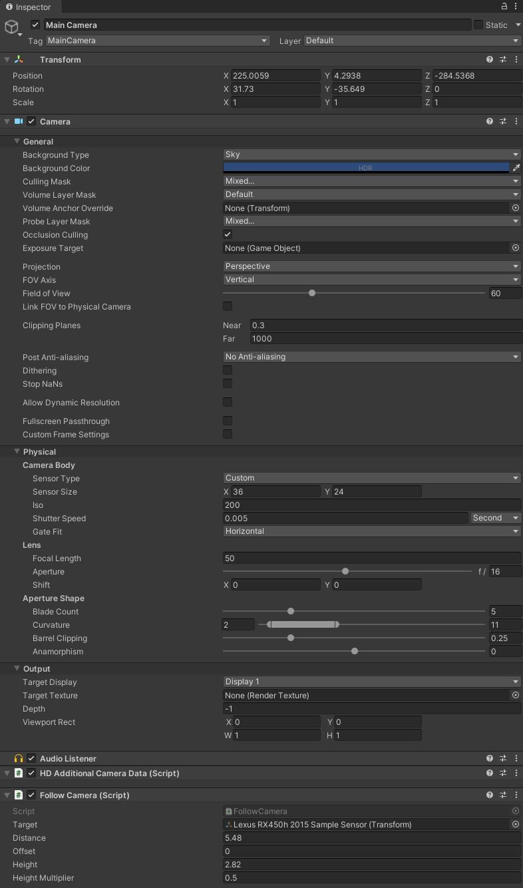
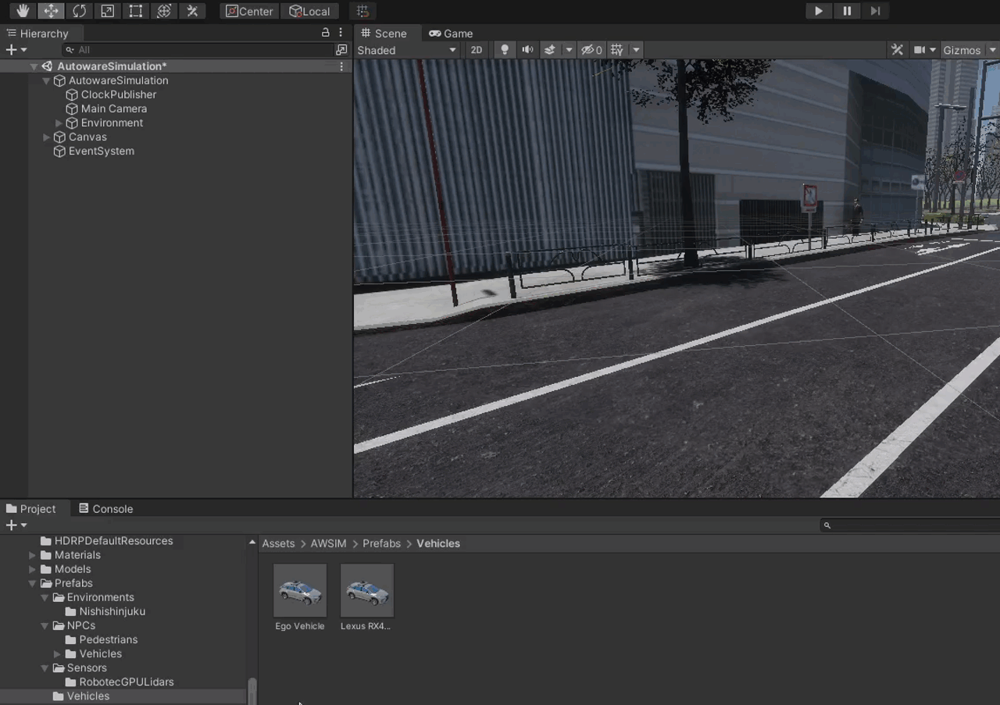

## Add a ClockPublisher
1. Add a child *Object* to a *Simulation*.

    <!--  -->
    

1. Click 'Add Component' button, search for `Clock Publisher` Script and select it.

    

    

1. Finally you can configure your Clock Publisher by changing the topic or Quality of Service (qos) settings.

    !!! danger
        Change these settings only when you know what you are doing, otherwise you can break the communication between the simulation and self-driving software.

## Add a MainCamera
To add a Main Camera please do the following

1. Add a child *Object* to a *Simulation* called 'Main Camera'

    <!--  -->
    

1. Click 'Add Component' button, search for `Camera` and select it.

    
    <!--  -->

    

    !!! note
        With the `Camera` component there should automatically be added a `HD Additional Camera Data` Script as seen below.

        

    !!! info "Further configuration"
        In this step you can adjust some of the camera setting if you wish.
        For more information please visit the [official Unity documentation](https://docs.unity3d.com/Manual/class-Camera.html).

1. Click 'Add Component' button, search for `Audio Listener` and select it.

    This step is identical as the step before, just search for a different component as seen below.

    

1. Click 'Add Component' button, search for `Follow Camera` Script and select it.

    This step is identical as the step before, just search for a different component as seen below.

    

    Now you will need to configure the `Follow Camera` Script

    - From the `Target` drop-down menu select the transformation of the vehicle you want the camera to follow.
    - Configure the distance of the camera relative to the vehicle.
        The final configuration should look similar to the example below.

        

??? example "Example Camera configuration"
    After following all the steps above your Main Camera should look similar to the one below.

    

## Add a Vehicle
To add a Vehicle to the Scene do the following

1. Locate the following directory containing a Vehicle *prefab* in the *Project* view.
    
    ```
    Assets/AWSIM/Prefabs/Vehicles
    ```

1. Drag the Vehicle from the *Project* view to the Scene.

1. Move the Vehicle *Object* in the *Hierarchy* view to make it s child of the Simulation *Object*.



## Add a Scene Manager Component
If your simulation uses a *LiDAR* sensor it is required to add `SceneManager` component.
In such a case please follow [the tutorial](../AddASceneManager/).

## Add an Environment prefab
!!! note "Environment creation"
    Environment is a very important part of your scene.
    If you haven't created your Environment yet, please visit a [dedicated tutorial](../../AddANewEnvironment/AddAEnvironment/).

To add an Environment prefab into your Scene please

1. Locate the following directory  containing an Environment *prefab* in the *Project* view.

    ```
    Assets/AWSIM/Prefabs/Environments
    ```

2. Drag the Environment of your choice into the Simulation *Object* in the *Hierarchy* view.

    !!! note "Drag Environment correctly"
        It is important to drag the Environment into a Hierarchy view and **not** a Scene view.
        This way no offset will be applied - which is a desired behavior.


