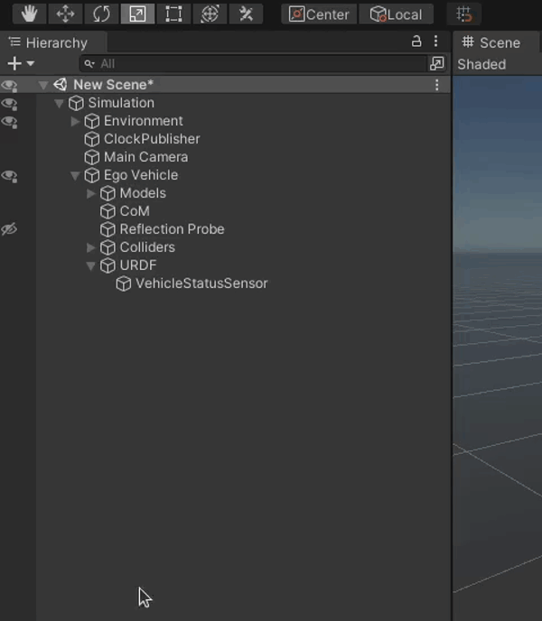

### AWSIM Sensors
<!-- TODO: ad links to sensors -->
There is a number of different sensors available in *AWSIM*.
Below we present a list of sensors with links to their individual pages

- [Vehicle Status Sensor](../../../UserGuide/ProjectGuide/Components/Sensors/VehicleStatus/)
- [GNSS](../../../UserGuide/ProjectGuide/Components/Sensors/Gnss/)
- [LiDAR](../../../UserGuide/ProjectGuide/Components/Sensors/Lidar/)
- [IMU](../../../UserGuide/ProjectGuide/Components/Sensors/Imu/)
- [Camera](../../../UserGuide/ProjectGuide/Components/Sensors/Camera/)
- [Pose Sensor](../../../UserGuide/ProjectGuide/Components/Sensors/GroundTruths/Pose/)

### Add links for sensors
!!! warning "Coordinate system conversion"
    Please note that Unity uses less common *left-handed* coordinate system.
    Please keep this in mind while defining transformations.
    More details about right-handed and left-handed systems can be found [here](https://en.wikipedia.org/wiki/Right-hand_rule).

    To simplify the conversion process always remember that any point in ROS coordinate system (x, y, z) has an equivalent in the Unity coordinate system being (-y, z, x).

    The same can be done with the rotation.
    ROS orientation described with roll, pitch and yaw (r, p, y) can be translated to Unity Rotation as follows (p, -y, -r).

Best practice is to replicate a *ROS* sensors transformations tree in Unity using *Objects*.

1. To add sensors in this ways first you need to make sure you have an `URDF` *Object* added like shown in [this section](../#add-a-base-for-sensors-urdf).

1. Next you will need to add a `Vehicle Status Sensor`.

    1. To do this add an `VehicleStatusSensor` *Object* as a child to the `URDF` *Object*.

        

    2. Next add a `Vehicle Report Ros 2 Publisher` Script by clicking 'Add Component' button in the `VehicleStatusSensor` *Object*, searching for the script and selecting it like shown below.
        You will also need to specify your Vehicle in the Script.

        

        

    3. The Script should be configured to work with *Autoware* by default.
        Such a configuration is shown below.

        

        If you need to, you can change the topics of communication with your autonomous driving software stack.

1. After that we need to start adding real sensors.
    This means we will represent the transformations tree from the *ROS* into the Unity Scene.
    Transformations thee always begins with a `base_link`.
    Add a `base_link` *Object* as a child to the `URDF` *Object*.

    

    !!!info "`base_link` transformation"
        Please remember to set an appropriate transformation of the `base_link` *Object* so that it is identical as the `base_link` used in *ROS* in reference to the Vehicle.
        
        This is very important, as a mistake here will result in all subsequent sensors being misplaced.

1. Now add one additional sensor called `PoseSensor`.
    Just drag a prefab called the same into the `base_link` *Object*.
    You can locate it in the `Assets/AWSIM/Prefabs/Sensors` directory.

    

    Again, the `PoseSensor` is configured to work with *Autoware* by default.
    If you wish to use different autonomous driving software stack you will have to change the configuration.

2. In the `base_link` we will represent all transformations contained in the *ROS* tf tree.

    You will have to check your Vehicle specific configuration.
    You can do this in many ways, for example:
    
    - Check the ROS specific `.yaml` parameter files containing information about each transformation.

        Here we see an example `.yaml` file containing transformation from the `base_link` to the `sensor_kit_base_link`:

        ```yaml
        base_link:
            sensor_kit_base_link:
                x: 0.9
                y: 0.0
                z: 2.0
                roll: -0.001
                pitch: 0.015
                yaw: -0.0364
        ```

    - Check the values with *ROS* command line tools (for more information on these please visit [official ROS 2 documentation](https://docs.ros.org/en/foxy/Tutorials/Intermediate/Tf2/Introduction-To-Tf2.html)).

        You can run a command like the following to check a transformation between two frames.

        ```bash
        ros2 run tf2_ros tf2_echo [source_frame] [target_frame]
        ```

        Here we see an example command with the output containing transformation from the `base_link` to the `sensor_kit_base_link` (note that the line after `$` sign is the executed command):

        ```log
        $ ros2 run tf2_ros tf2_echo base_link sensor_kit_base_link
        [INFO] [1686654712.339110702] [tf2_echo]: Waiting for transform base_link ->  sensor_kit_base_link: Invalid frame ID "base_link" passed to canTransform argument target_frame - frame does not exist
        At time 0.0
        - Translation: [0.900, 0.000, 2.000]
        - Rotation: in Quaternion [-0.000, 0.008, -0.018, 1.000]
        - Rotation: in RPY (radian) [-0.001, 0.015, -0.036]
        - Rotation: in RPY (degree) [-0.057, 0.859, -2.086]
        - Matrix:
          0.999  0.036  0.015  0.900
         -0.036  0.999  0.000  0.000
         -0.015 -0.001  1.000  2.000
          0.000  0.000  0.000  1.000
        ```

    !!!note
        In this step we will only add one sensor link.
        You will need to repeat this step for every sensor you want to add to your Vehicle.

    Let's say we want to add a LiD|AR that is facing right.

    We have the following configuration files.

    ```yaml
    base_link:
        sensor_kit_base_link:
            x: 0.9
            y: 0.0
            z: 2.0
            roll: -0.001
            pitch: 0.015
            yaw: -0.0364
    ```

    ```yaml
        sensor_kit_base_link:
            velodyne_right_base_link:
                x: 0.0
                y: -0.56362
                z: -0.30555
                roll: -0.01
                pitch: 0.71
                yaw: -1.580
    ```
    <!-- FIXME finish this -->
