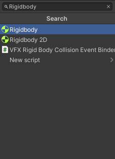
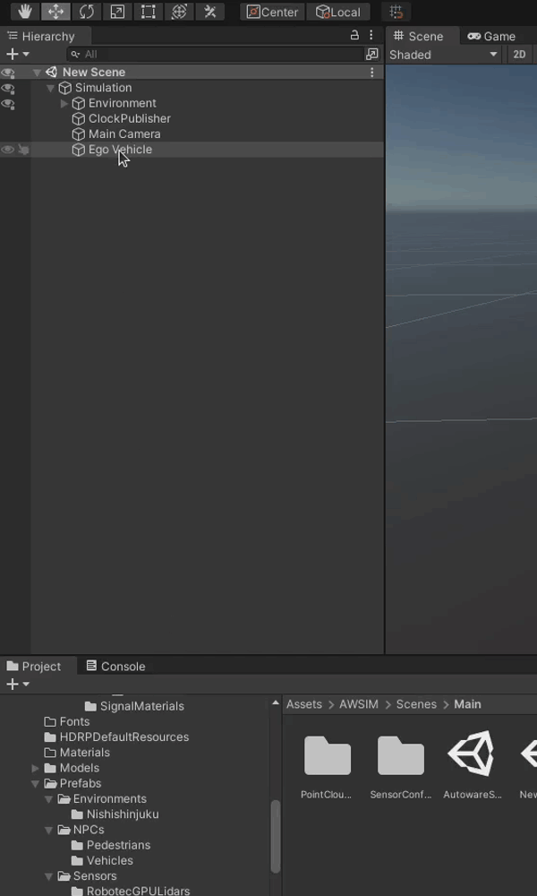
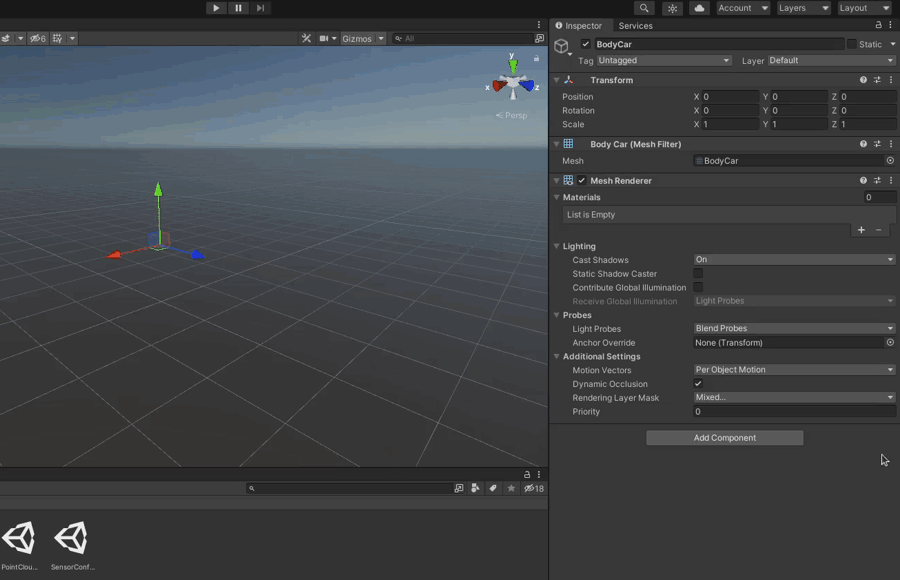

<!-- TODO everything -->

!!! Draft-note
    (highlight the part required by ego - not needed in npc)

    - Create a prefab (**gif**)
    - Add a Rightbody (**gif**)
    - Add visual elements (Body, Wheels, Sensor Kit) (what is needed, how to divide the model, how to import, **gifs**)
    - Add a center of mass (how to estimate, **screen**)
    - Add a reflection probe (sample configuration, **screen**)
    - Add a vehicle collider (what is needed, sample configuration, **screen**)
    - Add wheel colliders (how to properly configure, sample **screen**)
    - Add a base for sensors (URDF) (where to define, **screen**)
    - Add a Vehicle Keyboard Input Script (input limits)
    - Add a Vehicle Visual Effect (brake, turn signal, reverse lights, how to test - **gifs**)
    - Add a Vehicle Script (axes and physics settings, input limits, how to test - **video**)
    - Add links for sensors (how to define - reference to *sensors_calibration*, difference in right-handed and left-handed coordinate systems, **screens**)
    - Adding sensors
        - Add a VehicleStatusSensor (frame_id, Autoware topics, qos, how to test - **screens**)
        - Add a LiDAR (scene manager - hyperlink to 7.1.1, model selection, frame_id, Autoware topics, qos, visualization, ranges, gaussian noise, how to test - **screen**)
        - Add a IMU (frame_id, Autoware topics, qos, how to test - **screens**)
        - Add a GNSS (frame_id, Autoware topics, qos, how to test - **screens**)
        - Add a Camera (camera preview, fov, how prepare distorsion shader, ros image shader, parameters, frame_id, Autoware topics, qos, how to test - **screens** - including traffic light recognition)
    - Add a Vehicle Ros Input Script (disable keyboard input, Autoware topics, qos, how to test - hyperlink)
    - Add a Vehicle to scene (hyperlink)

!!! info "Ego Vehicle Component"
    In this tutorial we will create a new Ego Vehicle.
    To learn more about what an Ego Vehicle is in AWSIM please visit [Ego Vehicle description page](../../../UserGuide/ProjectGuide/Components/Vehicle/).

## Cerate an Object
Add a child *Object* to the *Simulation* called `EgoVehicle`.

## Add a Rigidbody
1. While having a newly created *Ego Vehicle* *Object* selected, in the *Inspector* view click on the 'Add Component' button, search for `Rigidbody` and select it.

    

    

1. Configure Mass and Drag with the correct values for your Vehicle.

    

1. Configure Interpolation and Collision Detection.

    

## Add visual elements
Your Ego Vehicle needs many individual visual parts.
Below we will add all needed visual elements.

First in `EgoVehicle` *Object* add a child *Object* called `Models`.

Inside `Models` *Object* we will add all visual models of out Ego Vehicle.

### Add a Body
First you will need to add a Body of your Vehicle.
It will contain many parts, so first lets create a `Body` parent *Object*.

Next we will need to add Car Body

1. Add a child *Object* `CarBody` to the `Body` *Object*.

    

1. To the `CarBody` *Object* add a Mesh Filter.

    Click on the 'Add Component' button, search for `Mesh Filter` and select it.

    

    

1. To the `CarBody` *Object* add a Mesh Renderer.

    Click on the 'Add Component' button, search for `Mesh Filter` and select it

    

    

1. Specify Materials.

    You need to specify what materials will be used for rendering your Ego Vehicle model.
    Do this by adding elements to the `Materials` list and selecting the materials you wish to use as shown below.

    

    Add as many materials as your model has sub-meshes.

    !!!tip
        When you add too many materials, meaning there will be no sub-meshes to apply these materials to, you will see this warning.
        In such a case please remove materials until this warning disappears.

        

## Add a Canter of Mass

## Add a Reflection Probe

## Colliders
### Add a Vehicle Collider
### Add Wheel Colliders
