<!-- TODO remaining -->

!!! Draft-note
    (highlight the part required by ego - not needed in npc)

    - Create a prefab (**gif**)
    - Add a Rightbody (**gif**)
    - Add visual elements (Body, Wheels, Sensor Kit) (what is needed, how to divide the model, how to import, **gifs**)
    - Add a center of mass (how to estimate, **screen**)
    - Add a reflection probe (sample configuration, **screen**)
    - Add a vehicle collider (what is needed, sample configuration, **screen**)
    - Add wheel colliders (how to properly configure, sample **screen**)
    - Add a base for sensors (URDF) (where to define, **screen**)
    - Add a Vehicle Keyboard Input Script (input limits)
    - Add a Vehicle Visual Effect (brake, turn signal, reverse lights, how to test - **gifs**)
    - Add a Vehicle Script (axes and physics settings, input limits, how to test - **video**)
    - Add links for sensors (how to define - reference to *sensors_calibration*, difference in right-handed and left-handed coordinate systems, **screens**)
    - Adding sensors
        - Add a VehicleStatusSensor (frame_id, Autoware topics, qos, how to test - **screens**)
        - Add a LiDAR (scene manager - hyperlink to 7.1.1, model selection, frame_id, Autoware topics, qos, visualization, ranges, gaussian noise, how to test - **screen**)
        - Add a IMU (frame_id, Autoware topics, qos, how to test - **screens**)
        - Add a GNSS (frame_id, Autoware topics, qos, how to test - **screens**)
        - Add a Camera (camera preview, fov, how prepare distorsion shader, ros image shader, parameters, frame_id, Autoware topics, qos, how to test - **screens** - including traffic light recognition)
    - Add a Vehicle Ros Input Script (disable keyboard input, Autoware topics, qos, how to test - hyperlink)
    - Add a Vehicle to scene (hyperlink)

!!! info "Ego Vehicle Component"
    In this tutorial we will create a new Ego Vehicle.
    To learn more about what an Ego Vehicle is in AWSIM please visit [Ego Vehicle description page](../../../UserGuide/ProjectGuide/Components/Vehicle/).

## Cerate an Object
Add a child *Object* to the *Simulation* called `EgoVehicle`.

## Add a Rigidbody
1. While having a newly created *Ego Vehicle* *Object* selected, in the *Inspector* view click on the 'Add Component' button, search for `Rigidbody` and select it.

    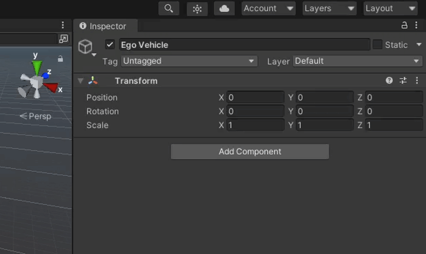

    

1. Configure Mass and Drag with the correct values for your Vehicle.

    

1. Configure Interpolation and Collision Detection.

    

## Add visual elements
Your Ego Vehicle needs many individual visual parts.
Below we will add all needed visual elements.

First in `EgoVehicle` *Object* add a child *Object* called `Models`.

Inside `Models` *Object* we will add all visual models of out Ego Vehicle.

### Add a Body
First you will need to add a Body of your Vehicle.
It will contain many parts, so first lets create a `Body` parent *Object*.

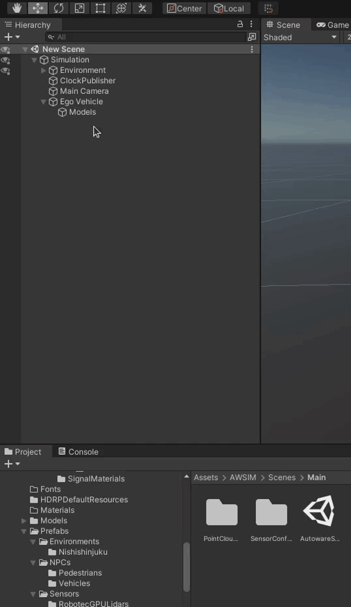

Next we will need to add Car Body

1. Add a child *Object* `CarBody` to the `Body` *Object*.

    

1. To the `CarBody` *Object* add a Mesh Filter.

    Click on the 'Add Component' button, search for `Mesh Filter` and select it.

    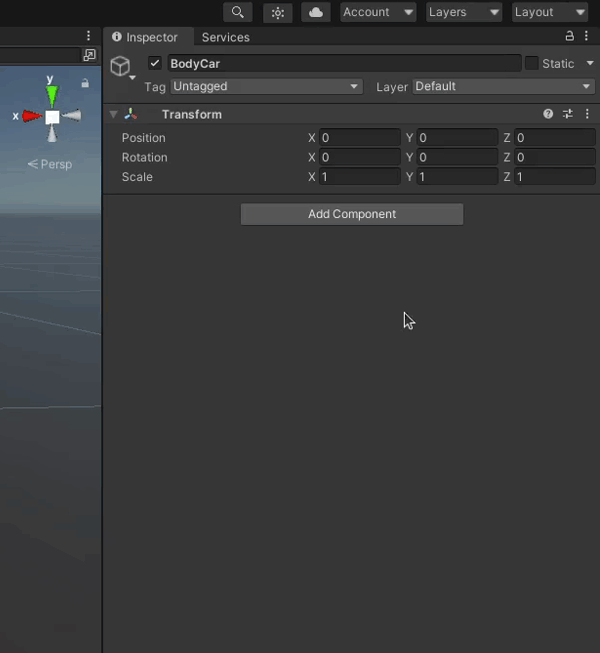

    

1. To the `CarBody` *Object* add a Mesh Renderer.

    Click on the 'Add Component' button, search for `Mesh Filter` and select it

    

    

1. Specify Materials.

    You need to specify what materials will be used for rendering your Ego Vehicle model.
    Do this by adding elements to the `Materials` list and selecting the materials you wish to use as shown below.

    

    Add as many materials as your model has sub-meshes.

    !!!tip
        When you add too many materials, meaning there will be no sub-meshes to apply these materials to, you will see this warning.
        In such a case please remove materials until this warning disappears.

        

### Add interactive Body parts
In this step we will add the following parts

- Break light
- Reverse Light
- Right Turn Signal
- Left Turn Signal
- (optional) other visual elements required specifically by your Vehicle.

!!!info
    It may seem like all of the elements above can be parts of the `Body` mesh, but it is important for these parts to be separate, because we need to be able to make them interactive (e.g. flashing turn signals).

    Other good reason for having different meshes for Vehicle parts is that you have a Vehicle model, but for the simulation you need to add e.g. a roof rack with sensors - which can be achieved by adding more meshes.

We will illustrate this step only for Break Light, but you should repeat this step of the tutorial for each element of the list above.

1. Add a child *Object* to the `Body` *Object*.

    

2. Add a Mesh Filter and select the mesh (the same as in [section before](#add-a-body)).

    

    

3. Add a Mesh Renderer and select the materials (the same as in [section before](#add-a-body)).

    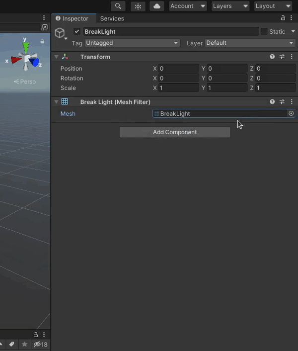

    

### Add Wheels
In this step we will add individual visuals for every wheel.
This process is very similar to [the one before](#add-interactive-body-parts).

1. Add a child *Object* to the `Models` *Object* called `WheelVisuals`.

    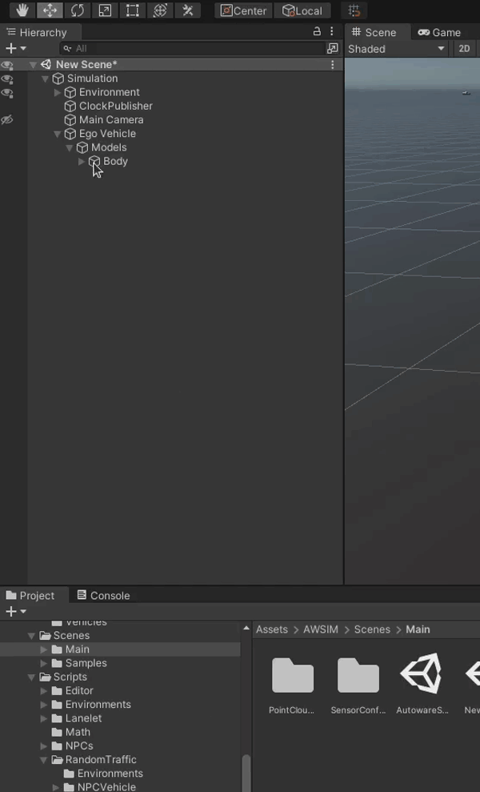

!!!note
    In this tutorial we will add only one wheel, but you should repeat the step for all 4 wheels.
    That is, follow the instructions that follow this message for every wheel your Vehicle has.

    - Front Left Wheel
    - Front Right Wheel
    - Rear Left Wheel
    - Rear Right Wheel

1. Add a child *Object* to the `WheelVisuals` *Object* called `FrontLeftWheel`.

    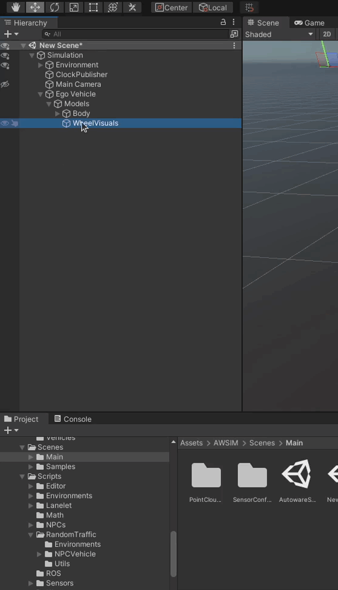

2. Add a child *Object* to the `FrontLeftWheel` *Object* called `WheelFrontL`.
    This *Object* will contain the actual wheel part.

    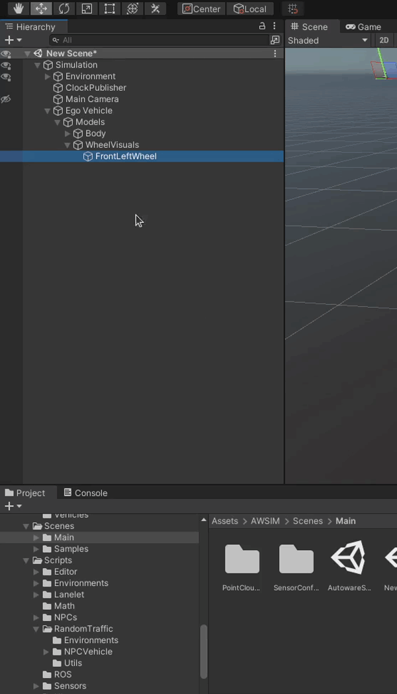

3. Add a Mesh Filter and select the wheel mesh.

    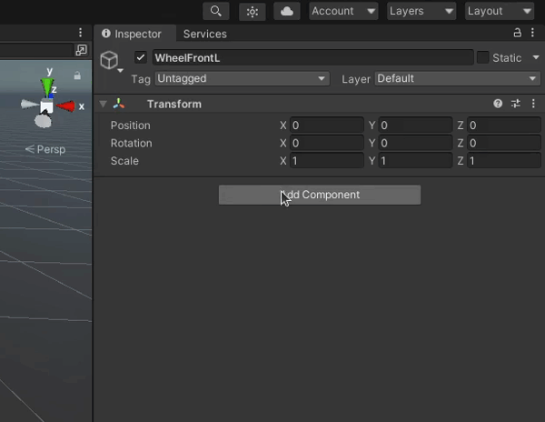

    

4. Add a Mesh Renderer and select the wheel materials.

    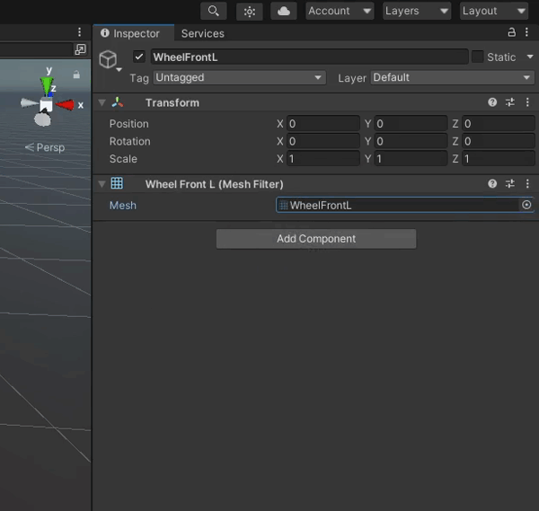

    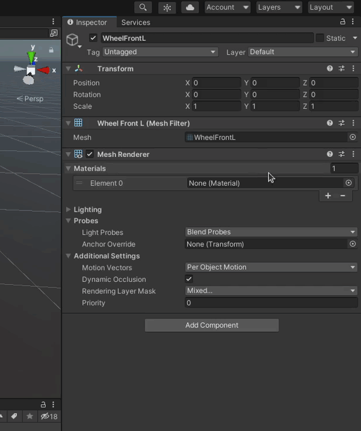

    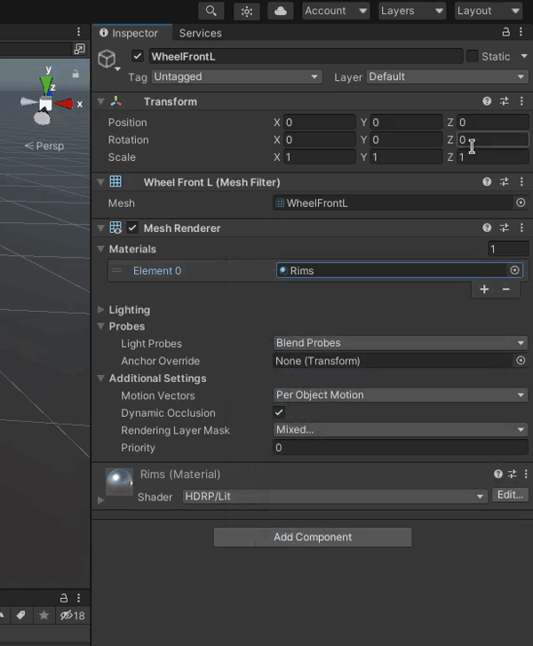

5. Repeat the steps before to add Breaks.

    The same way you have added the `WheelFrontL` *Object* now add the `WheelFrontLBreaks`.
    Naturally you will have to adjust the mesh and materials used as they will be different for breaks that for the wheel.

    Your final break configuration should look similar to the one following.

    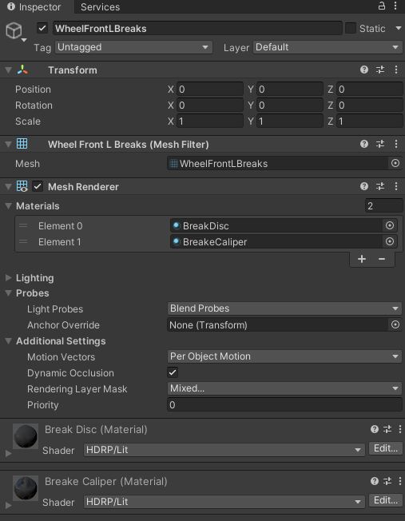

6. Set the `FrontLeftWheel` parent *Object* transformation to position the wheel in correct place.

    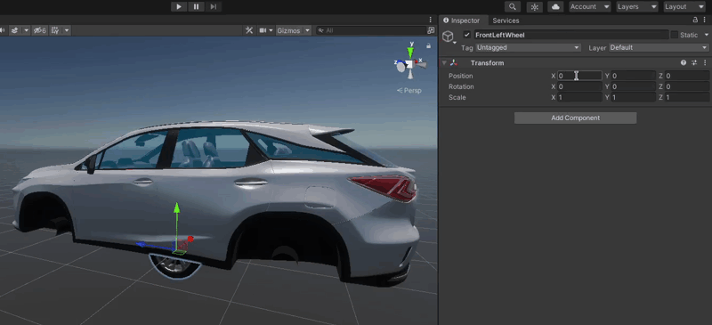

!!! success "Successful configuration"
    If you have done everything right your `WheelVisuals` *Object* should look similar to the one following.

    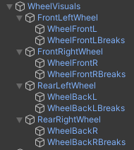

### Move the models
The last step to correctly configure Vehicle models is to shift them so that the `EgoVehicle` origin is in the center of **fixed** axis.

This means you need to shift the whole `Models` *Object* accordingly (change the *position* fields in *transformation*).

!!!tip
    Add a `dummy` *Object* as a child to the `EgoVehicle` *Object* (the same as in steps before) so it is located in the origin of the `EgoVehicle`.
    
    Now move `Models` around relative to the `dummy` - change *position* in the *Inspector* view.
    The `dummy` will help you see when the **fixed** axis (in case of the Lexus from example it is the rear axis) is aligned with origin of `EgoVehicle`.

    In the end delete the `dummy` *Object* as it is no longer needed.

    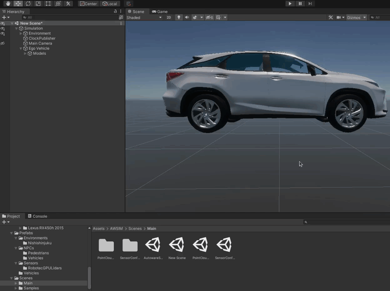

## Add a Canter of Mass
To add a center of mass to your vehicle you have to add a `CoM` child *Object* to the `EgoVehicle` *Object* (the same as in steps before).

Then just set the *position* of the `CoM` *Object* in the *Inspector* view to represent real-world center of mass of the Vehicle.

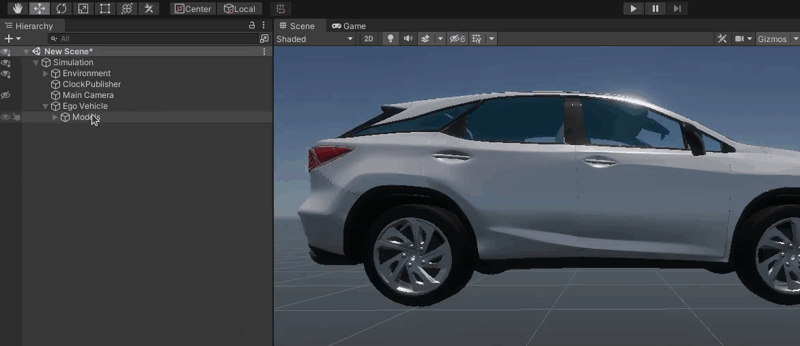

??? question "How to get to know the center of mass of my Vehicle"
    <!-- TODO: add guidelines on how to estimate CoM -->

## Add a Reflection Probe
1. Add a new *Object* called `Reflection Probe` as a child to the `EgoVehicle` *Object*.

    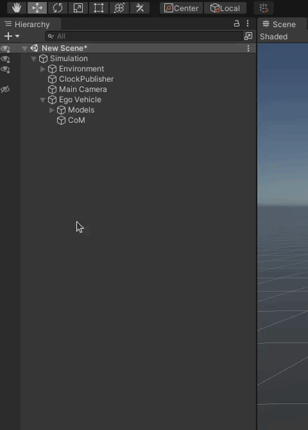

2. Click on the 'Add Component' button, in the windows that pops-up search for `Reflection Probe` and select it.

    

    !!!note
        Please note that with `Reflection Probe` there should also be automatically added a ``HD Additional Reflection Data` Script

        

3. Configure the `Reflection Probe` as you wish.

    !!! example "Example Configuration"
        Below you can see an example configuration of the `Reflection Probe`.

        

## Add Colliders
Next you need to add Colliders to your Vehicle.
To do this follow the steps below.

1. Add a child *Object* called `Colliders` to the `EgoVehicle` *Object*.

    

1. Shift parent *Object* `Colliders` accordingly as in earlier steps where we [shifted `Models`](#move-the-models).

### Add a Vehicle Collider
1. Add a child *Object* `Collider` to the `Colliders` *Object*.

    

1. Add a `Mesh Collider` component to the `Collider` *Object* by clicking on the 'Add Component' button in the *Inspector* view and searching for it.

    

1. Click on the arrow in mesh selection field and from the pop-up window select your collider mesh.
    Next click on the check-box called `Convex`, by now your collider mesh should be visible in the editor.

    

### Add Wheel Colliders
1. Add a child *Object* `Wheels` to the `Colliders` *Object*.

    

!!!note
    In this tutorial we will add only one wheel collider, but you should repeat the step for all 4 wheels.
    That is, follow the instructions that follow this message for every wheel your Vehicle has.

    - Front Left Wheel
    - Front Right Wheel
    - Rear Left Wheel
    - Rear Right Wheel

1. Add a child *Object* `FrontLeftWheel` to the `Wheels` *Object*.

    

2. Add a `Wheel Collider` component to the `FrontLeftWheel` *Object* by clicking 'Add Component' and searching for it.

    

3. Add a `Wheel` Script to the `FrontLeftWheel` *Object* by clicking 'Add Component' and searching for it.

    

4. Drag `FrontLeftWheel` *Object* from the `WheelVisuals` to the `Wheel visual Transform` field.

    

5. Add a `Wheel Collider Config` Script to the `FrontLeftWheel` *Object* by clicking 'Add Component' and searching for it.

    

6. Configure the `Wheel Collider Config` Script so that the Vehicle behaves as you wish.

    

7. Set the Transform of `FrontLeftWheel` *Object* to match the visuals of your Vehicle.

    

!!! success "Successful configuration"
    If you have done everything right your `Colliders` *Object* should look similar to the one following.

    
