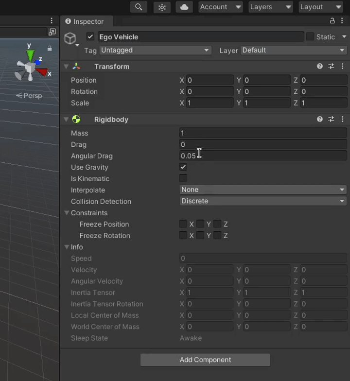
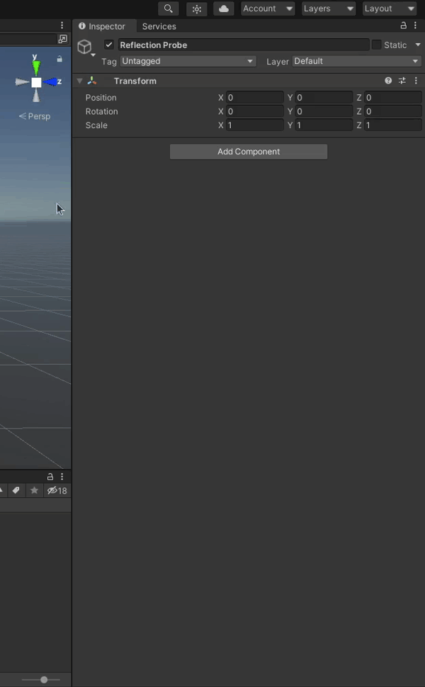

<!-- TODO remaining -->

!!! Draft-note
    (highlight the part required by ego - not needed in npc)

    - Create a prefab (**gif**)
    - Add a Rightbody (**gif**)
    - Add visual elements (Body, Wheels, Sensor Kit) (what is needed, how to divide the model, how to import, **gifs**)
    - Add a center of mass (how to estimate, **screen**)
    - Add a reflection probe (sample configuration, **screen**)
    - Add a vehicle collider (what is needed, sample configuration, **screen**)
    - Add wheel colliders (how to properly configure, sample **screen**)
    - Add a base for sensors (URDF) (where to define, **screen**)
    - Add a Vehicle Keyboard Input Script (input limits)
    - Add a Vehicle Visual Effect (brake, turn signal, reverse lights, how to test - **gifs**)
    - Add a Vehicle Script (axes and physics settings, input limits, how to test - **video**)
    - Add links for sensors (how to define - reference to *sensors_calibration*, difference in right-handed and left-handed coordinate systems, **screens**)
    - Adding sensors
        - Add a VehicleStatusSensor (frame_id, Autoware topics, qos, how to test - **screens**)
        - Add a LiDAR (scene manager - hyperlink to 7.1.1, model selection, frame_id, Autoware topics, qos, visualization, ranges, gaussian noise, how to test - **screen**)
        - Add a IMU (frame_id, Autoware topics, qos, how to test - **screens**)
        - Add a GNSS (frame_id, Autoware topics, qos, how to test - **screens**)
        - Add a Camera (camera preview, fov, how prepare distorsion shader, ros image shader, parameters, frame_id, Autoware topics, qos, how to test - **screens** - including traffic light recognition)
    - Add a Vehicle Ros Input Script (disable keyboard input, Autoware topics, qos, how to test - hyperlink)
    - Add a Vehicle to scene (hyperlink)

!!! info "Ego Vehicle Component"
    In this tutorial we will create a new Ego Vehicle.
    To learn more about what an Ego Vehicle is in AWSIM please visit [Ego Vehicle description page](../../../UserGuide/ProjectGuide/Components/Vehicle/).

## Cerate an Object
Add a child *Object* to the *Simulation* called `EgoVehicle`.

## Add a Rigidbody
1. While having a newly created *Ego Vehicle* *Object* selected, in the *Inspector* view click on the 'Add Component' button, search for `Rigidbody` and select it.

    

    

1. Configure Mass and Drag with the correct values for your Vehicle.

    

1. Configure Interpolation and Collision Detection.

    

## Add visual elements
For a detailed explanation hwo to add visual elements of your Vehicle check out this [dedicated tutorial](./AddVisualElements/).

## Add a Canter of Mass
To add a center of mass to your vehicle you have to add a `CoM` child *Object* to the `EgoVehicle` *Object* (the same as in steps before).

Then just set the *position* of the `CoM` *Object* in the *Inspector* view to represent real-world center of mass of the Vehicle.

??? question "How to get to know the center of mass of my Vehicle"
    <!-- TODO: add guidelines on how to estimate CoM -->

## Add a Reflection Probe
1. Add a new *Object* called `Reflection Probe` as a child to the `EgoVehicle` *Object*.

    

2. Click on the 'Add Component' button, in the windows that pops-up search for `Reflection Probe` and select it.

    

    !!!note
        Please note that with `Reflection Probe` there should also be automatically added a ``HD Additional Reflection Data` Script.

        

3. Configure the `Reflection Probe` as you wish.

    !!! example "Example Configuration"
        Below you can see an example configuration of the `Reflection Probe`.

        

## Add Colliders
For a detailed explanation how to add colliders to your Vehicle check out this [dedicated tutorial](./AddColliders/).

## Add a base for sensors (URDF)
You will most certainly want to add some sensors to your Ego Vehicle.
First you need to create a parent *Object* for all those sensors called `URDF`.
To do this we will add a child *Object* `URDF` to the `EgoVehicle` *Object*.

This *Object* will be used as a base for all sensors we will add later.

## Add a Vehicle Script
To be able to control your Ego Vehicle you need a `Vehicle` Script.

1. Add the `Vehicle` Script to the `EgoVehicle` *Object*.

    

    

1. Configure the `Vehicle` Script *Axle Settings* and *Center Of Mass Transform*.

    

## Add a Vehicle Keyboard Input Script
If, for any reason, you would like to control your Ego Vehicle in the simulation by hand you can do that with just one Script called `Vehicle Keyboard Input`.

If you want to add it just click the 'Add Component' button on the `EgoVehicle` *Object* and search for `Vehicle Keyboard Input` Script and select it.

## Add a Vehicle Visual Effect Script
For a visual indication of a Vehicle status you will need a `Vehicle Visual Effect` Script.
To add and configure it follow the steps below.

1. Add a `Vehicle Visual Effect` Script by clicking 'Add Component' button, searching for it and selecting it.

    

1. Configure the lights.

    !!!note
        In this step we will configure only `Brake Lights`, but should repeat this for every Light.
        The process is almost the same for all Lights - just change the mesh renderer and lighting settings according to your preference.

    

### How to test
After configuring `Vehicle Visual Effect` Script it is advised to test whether everything works as expected.

1. Make sure you have a [`Vehicle Keyboard Input` Script](#add-a-vehicle-keyboard-input-script) added and that it is enabled.

1. If your scene does not have any models yet please turn the gravity off in `Rigidbody` configuration so that the Vehicle does not fall down into infinity.

    

1. Start the simulation.

    

1. Test the Turn Signals.

    You can control the Turn Signals with a `Vehicle Keyboard Input` Script.
    Activate the Turn Signals with one of the following keys

    - `1` - Left Turn Signal
    - `2` - Right Turn Signal
    - `3` - Hazard Lights
    - `4` - Turn Off all Signals

    

1. Test the Lights.

    You can control the lights by "driving" the Vehicle using `Vehicle Keyboard Input` Script.
    Although if you have an empty Environment like in this tutorial the Vehicle won't actually drive.

    To test Brake Lights change the gear to Drive by pressing `D` on the keyboard and activate braking by holding `arrow down`.

    To test the Reverse Light change the gear to Reverse by pressing `R` on the keyboard.
    The Reverse Light should turn on right away.

    

!!! tip "Camera tip"
    If you have not configured a camera or configured it in such a way that you can't see the Vehicle well you can still test most of the lights by changing views.

    - Turn the Light (or Signal) on by pressing the appropriate key
    - Move to the Scene View by pressing `ctrl + 1` - now you can move the camera freely
    - To change the Lights you need to go back to Game View by pressing `ctrl + 2`

    Pleas note that this method **won't** work for testing Brake Lights, as for them to work you need to keep the `arrow down` button pressed all the time.

## Add a Vehicle Ros Input Script
For controlling your Vehicle with autonomous driving software (e.g. [Autoware](../../../Introduction/Autoware/)) you need a `Vehicle Ros Input` Script.

!!! warning "Disable `Vehicle Keyboard Input` Script"
    If you have added a `Vehicle Keyboard Input` Script in your Vehicle please disable it when using the `Vehicle Ros Input` Script.

    Not doing so will lead to the vehicle receiving two different inputs which will cause many problems.

    

Add it to the `EgoVehicle` *Object* by clicking on the 'Add Component' button, searching for it and selecting it.

The Script is configured to work with [Autoware](../../../Introduction/Autoware/) by default, but you can change the topics and Quality of Service settings as you wish.

!!!note
    The `Vehicle` should be configured correctly, but if you have many Vehicles or something goes wrong, please select the right Vehicle in the `Vehicle` field by clicking on the small arrow icon and choosing the right item from the list.

## Add Sensors
For a detailed explanation how to add sensors to your Vehicle check out this [dedicated tutorial](./AddSensors/).

## Add a Vehicle to Scene
<!-- TODO -->
