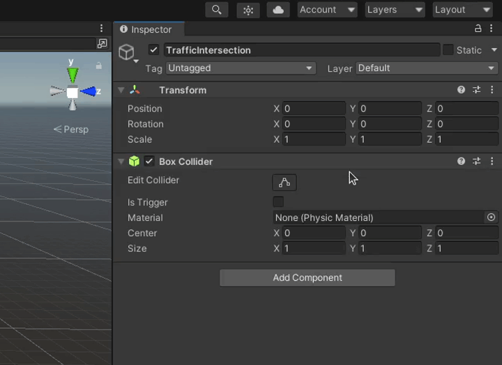
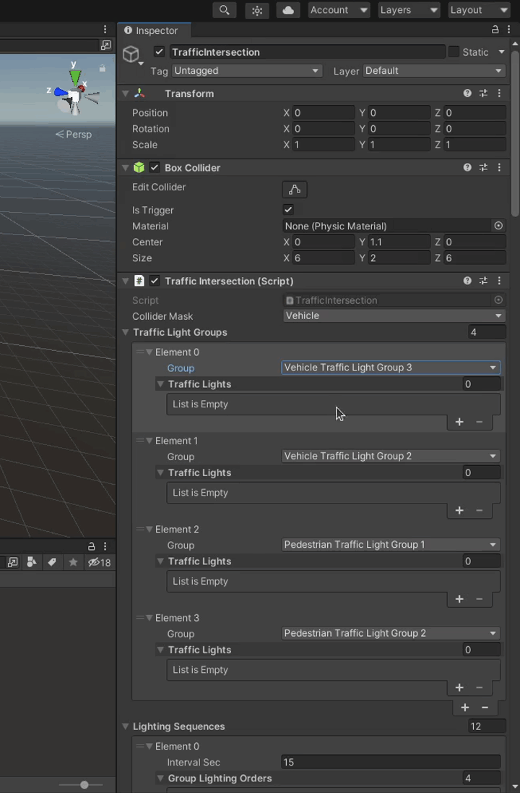
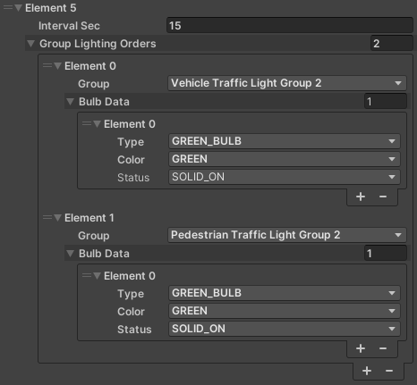

Every `TrafficIntersection` on the scene needs to be added as a GameObject.
Best practice is to create a parent object `TrafficIntersections` and add all instances of `TrafficIntersection` as its children.
You can do this the same as with [Random Traffic Simulator](../AddARandomTrafficSimulatorScript/).

!!! warning
    Before performing this step, check all `TrafficLights` for correct configuration and make sure that `TrafficLights` have added scripts. If you want to learn how to add and configure it check out [this tutorial](../../AddANewEnvironment/AddTrafficLights/).

## Add a box collider
<!-- TODO add guidelines -->
1. `TrafficIntersection` needs to be marked with a box collider.
First click on the `Add Component` button.

    

1. In the window that popped up search for `Box Collider` and select it.

    

1. Then set the position and orientation and size of the collider box to match the intersection on the scene.
You can do this by manipulating Box Collider properties `Center` and `Size` in the Inspector view.

    

## Add a Traffic Intersection Script
1. Click on the `Add Component` button

    

1. In the window that popped up search for `Traffic Intersection` and select it

    

1. You need to set a proper Collider Mask in order for the script to work.

    

### Create traffic light groups
Traffic Light Groups are groups of traffic lights that are synchronized, meaning they light up with the same color and pattern at all times.

Traffic lights are divided into groups to simplify the process of creating a lighting sequence.
By default you will see 4 Traffic Light Groups, you can add and remove them to suit your needs.

1. First choose from the drop-down menu called `Group` the Traffic Light Group name you want to assign to your Traffic Light Group.

    <!--  -->
    

1. Then add as many Traffic Lights as you want your group to have.
From the drop-down menu select the Traffic Lights you want to add.

    <!--  -->
    

    !!! tip "Select Traffic Lights visually"
        If you have a lot of Traffic Lights it can be challenging to add them from the list.
        You can select them visually from the Scene the same as you had selected Traffic Lanes in the [Random Traffic Simulator](../AddARandomTrafficSimulatorScript/#add-spawnable-lanes).

### Create lighting sequences
Lighting Sequences is the list of commands based on which the Traffic Lights will operate on given intersection.
The elements in the Lighting Sequences list are changes (commands) that will be executed on the Traffic Light Groups.

Group Lighting Order should be interpreted as a command (or order) given to all Traffic Lights in selected Traffic Light Group.
In Group Lighting Orders you can set different traffic light status for every Traffic Light Group (in separate elements).
Lighting sequences list is processed in an infinite loop.

It should be noted that changes applied to one Traffic Light Group will remain the same until the next Group Lighting Order is given to this Traffic Light Group.
This means that if in one Group Lighting Order no command is sent to a Traffic Light Group then this Group will remain its current lighting pattern (color, bulb and status).

For every Lighting Sequences Element you have to specify the following

1. Interval Sec

    This is the time for which the sequence should wait until executing next order, so how long this state will be active.

1. For every element in Group Lighting Orders there needs to be specified

    1. Group to which this order will be applied
    2. List of orders (Bulb Data)

        In other words - what bulbs should be turned on, their color and pattern.
        
        - Type - What type of bulb should be turned on
        - Color - What color this bulb should have (in most cases this will be the same as color of the bulb if specified)
        - Status - How the bulb should light up (selecting `SOLID_OFF` is necessary only when you want to turn the Traffic Light completely)

        !!!note
            When applying the change to a Traffic Light

            - First all bulbs are turned off
            - Only after that changes made in the order are applied

            This means it is only necessary to supply the data about what bulbs should be turned on.
            E.g. you don't have to turn off a red bulb when turning on the green one.

!!!warning
    The first Element in the Lighting Sequences (in most cases) should contain bulb data for every Traffic Light Group.
    Traffic Light Groups not specified in the first Element will not light up at the beginning of the scene.

#### Example
In the Lighting Sequence Element 5 presented below we tell all Traffic Lights in the Vehicle Traffic Light Group 2 to light up their Green Bulb with the color Green and status Solid On which means that they will be turned on all the time.
We also implicitly tell them to turn all other Bulbs off.

In the same time we tell all Traffic Lights in the Pedestrian Traffic Light Group 2 to do the very same thing.

This state will be active for the next 15 seconds, and after that Traffic Intersection will move to the next Element in the Sequence.

<!-- It should now be clear that Vehicle Traffic Light Group 2 and Pedestrian Traffic Light Group 2 are pointed towards pedestrians and vehicles moving in the same direction. -->

Lets consider the following Lighting Sequences Element 6.
Here we order the Traffic Lights in the Pedestrian Traffic Light Group 2 to light up their Green Bulb with the color Green and status Flashing.
We also implicitly tell them to turn all other bulbs off, which were already off from the implicit change in Element 5, so this effectively does nothing.

Note that Lighting Sequences Element 6 has no orders for Vehicle Traffic Light Group 2.
This means that Traffic Light in the Vehicle Traffic Light Group 2 will hold on to their earlier orders.

This state will be active for 5 seconds, which means that Traffic Lights in the Vehicle Traffic Light Group 2 will be lighting solid green for the total of 20 seconds.

<!--  -->
<!--  -->
