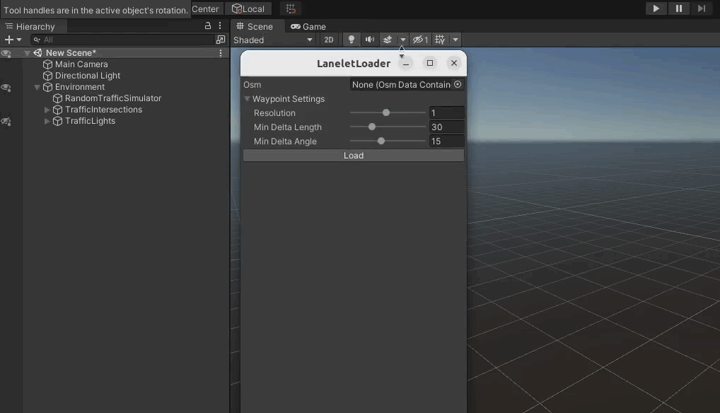

To add `RandomTraffic` to the `Environment`, it is necessary to load elements from the *lanelet2*. As a result of loading, `TrafficLanes` and `StopLines` will be added to the scene. Details of these components can be found here:
<!-- TODO -->
!!!warning
    Before following this tutorial make sure you have added an [Environment Script](../../AddANewEnvironment/AddAEnvironment/#add-an-environment-script) and set a proper `MGRS` offset position. This position is used when loading elements from the *lanelet2*!

1. Click on the `AWSIM` button in the top menu of the Unity editor and navigate to `AWSIM -> Random Traffic -> Load Lanelet`

    

2. In the window that pops-up select your osm file, change some Waypoint Settings to suit your needs and click `Load`

    

    Waypoint Settings explanation:

    - Resolution: resolution of resampling. Lower values provide better accuracy at the cost of processing time
    - Min Delta Length: minimum length(m) between adjacent points
    - Min Delta Angle: minimum angle(deg) between adjacent edges. Lowering this value produces a smoother curve

3. Traffic Lanes and Stop Lanes should occur in the Hierarchy view.
If they appear somewhere else in your Hierarchy tree, then move them into the `Environment` object

## Complete loaded TrafficLanes
<!-- TODO -->

## How to test
<!-- TODO -->

## Add a StopLine manually
<!-- TODO -->

## Add a TrafficLane manually
<!-- TODO -->
