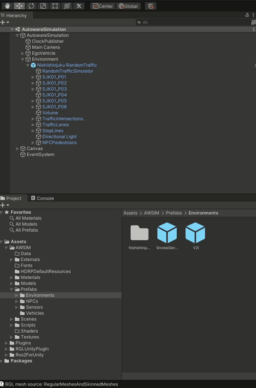
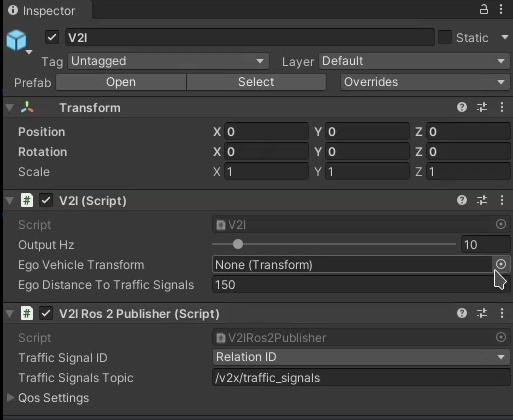
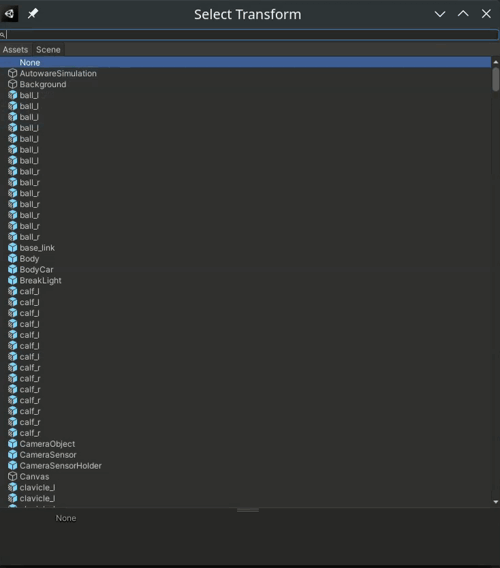
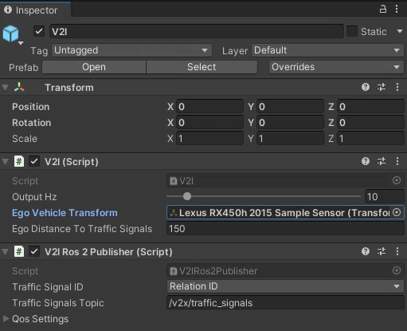

# Add V2I

## 1. Add V2I prefab

## 2. Select EGO transform
   

## 3. Configure

Name                            | Type      | Description
------------------------------- | --------- | -----------
Output Hz                       | int       | Topic publication frequency
Ego Vehicle Transform           | transform | Ego Vehicle object transform 
Ego Distance To Traffic Signals | double    | Maximum distance between Traffic Light and Ego
Traffic Signal ID               | enum      | Possibility to select if as `traffic_signal_id` field in msg is `Relation ID` or `Way ID`
Traffic Signals Topic           | string    | Topic name

!!! note 
    V2I feature can be used as Traffic Light ground truth information, and for that usage `Way ID` is supposed to be selected.