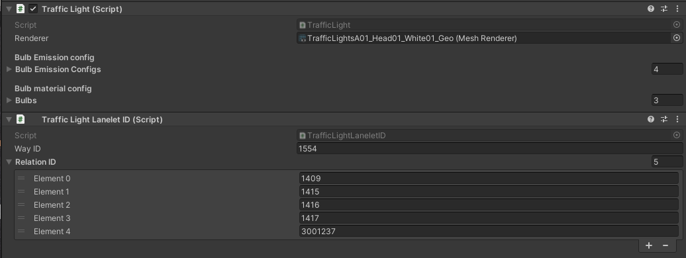
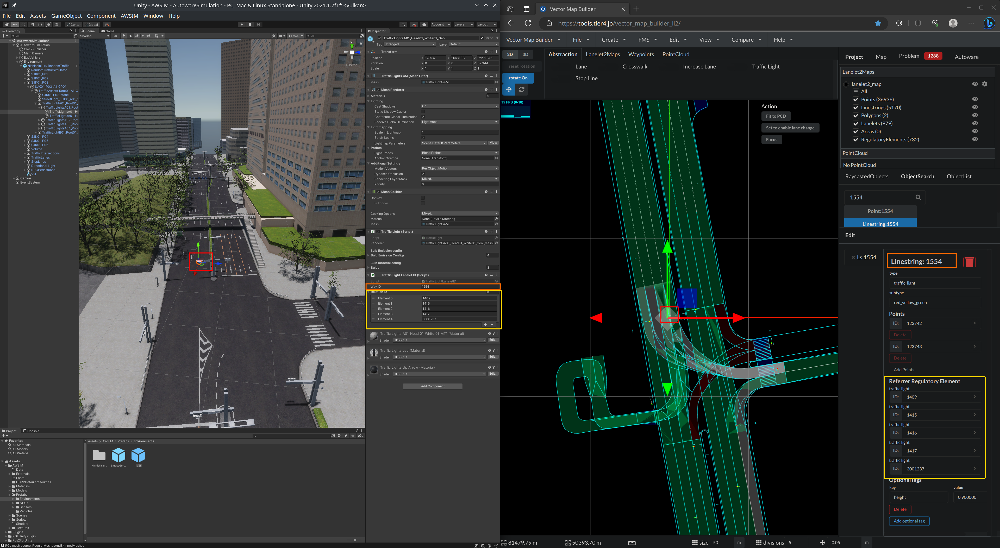
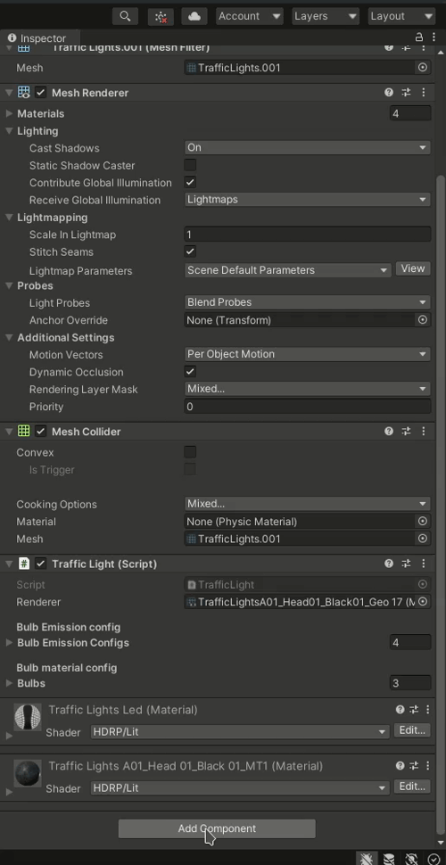
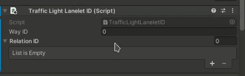
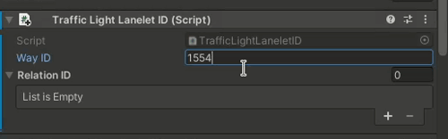

# Assign Lanelet2 WayID and RelationID to TrafficLight object

1. Load items from lanelet2 following [the instruction](../../../../DeveloperGuide/Tutorials/AddARandomTraffic/LoadItemsFromLanelet/index.md)

2. Verify if `Traffic Light Lanelet ID` component has been added to `Traffic Light` game objects.

3. Verify if `WayID` and `RelationID` has been correctly assigned. You can use [Vector Map Builder](https://tools.tier4.jp/vector_map_builder_ll2/) as presented below

## Add manually `Traffic Light Lanelet ID` component

If for some reason, `Traffic Light Lanelet ID` component is not added to `Traffic Light` object.

### 1. Add component manually

### 2. Fill Way ID

### 3. Fill Relation ID

