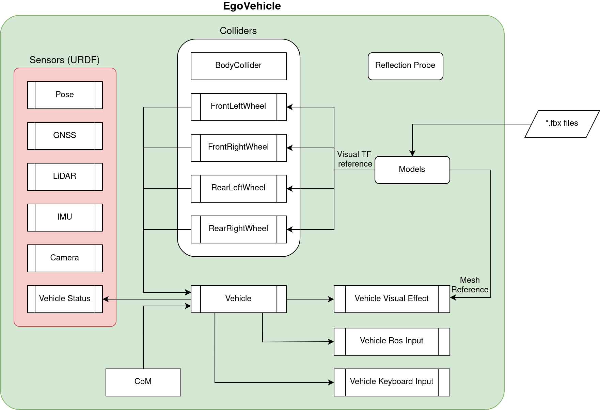

# AWSIM
<video width="1920" controls autoplay muted loop>
<source src="awsim_video.mp4" type="video/mp4">
</video>
[*AWSIM*](https://github.com/tier4/AWSIM) is an open-source simulator made with [*Unity*](https://unity.com/) for autonomous driving research and development. 
It is developed for self-driving software like [*Autoware*](../Autoware/). This simulator aims to bridge the gap between the virtual and real worlds, enabling users to train and evaluate their autonomous systems in a safe and controlled environment before deploying them on real vehicles. It provides a realistic virtual environment for training, testing, and evaluating various aspects of autonomous driving systems. 

*AWSIM* simulates a variety of real-world scenarios, with accurate physics and sensor models. It offers a wide range of sensors, such as: *Cameras*, *GNSS*, *IMU* and  *LiDARs*, allowing developers to simulate their  autonomous vehicle's interactions with the environment accurately. The simulator also models dynamic objects, such as pedestrians, other vehicles, and traffic lights, making it possible to study interactions and decision-making in complex traffic scenarios. This enables the testing and evaluation of perception, planning, and control algorithms under different sensor configurations and scenarios.

*AWSIM* supports a flexible and modular architecture, making it easy to customize and extend its capabilities. Users can modify the current or add a new environment with their own assets and traffic rules to create custom scenarios to suit their specific research needs. This allows for the development and testing of advanced algorithms in diverse driving conditions.

Because *AWSIM* was developed mainly to work with [*Autoware*](../Autoware/), it supports:

- *Ubuntu 22.04* and *Windows 10/11*
- [*ROS2*](https://docs.ros.org/en/humble/index.html) Humble distribution

!!! note "Prerequisites"
    You can read more about the prerequisites and running *AWSIM* [here](../../UserGuide/Installation/Prerequisites/).

!!! note "Connection with AWSIM"
    Introduction about how the connection between *AWSIM* and *Autoware* works can be read [here](../ConnectionWithAutoware/).

#### Why was AWSIM developed?

The main objectives of *AWSIM* are to facilitate research and development in autonomous driving, enable benchmarking of algorithms and systems, and foster collaboration and knowledge exchange within the autonomous driving community. By providing a realistic and accessible platform, *AWSIM* aims to accelerate the progress and innovation in the field of autonomous driving.

## Architecture

To describe the architecture of *AWSIM*, first of all, it is necessary to mention the `Scene`. It contains all the objects occurring in the simulation of a specific scenario and their configurations. The default *AWSIM* scene that is developed to work with [*Autoware*](https://github.com/autowarefoundation/autoware) is called *AutowareSimulation*.

In the scene we can distinguish basics components such like `MainCamera`, `ClockPublisher`, `EventSystem` and `Canvas`. A detailed description of the scene and its components can be found [here](../../UserGuide/ProjectGuide/Components/Scene/). 

Besides the elements mentioned above, the scene contains two more, very important and complex components: `Environment` and `EgoVehicle` - described below.

#### Environment

`Environment` is a component that contains all `Visual Elements` that simulate the environment in the scene and those that provide control over them. It also contains two components `Directional Light` and `Volume`, which ensure suitable lighting for `Visual Elements` and simulate weather conditions. A detailed description of these components can be found [here](../../UserGuide/ProjectGuide/Components/Environment/Environment/).

In addition to `Visual Elements` such as buildings or greenery, it contains the entire architecture responsible for traffic. The traffic involves `NPCVehicles` that are spawned in the simulation by `TrafficSimulator` - using traffic components. A quick overview of the traffic components is provided below, however, you can read their detailed description [here](../../UserGuide/ProjectGuide/Components/Environment/TrafficComponents/).

`NPCPedestrians` are also `Environment` components, but they are not controlled by `TrafficSimulator`. They have added scripts that control their movement - you can read more details [here](../../UserGuide/ProjectGuide/Components/NPCs/Pedestrian/).

##### Traffic Components

`TrafficLanes` and `StopLines` are elements loaded into `Environment` from *Lanelet2*.
`TrafficLanes` have defined cross-references in such a way as to create routes along the traffic lanes. In addition, each `TrafficLane` present at the intersection has specific conditions for yielding priority. `TrafficSimulator` uses `TrafficLanes` to spawn `NPCVehicles` and ensure their movement along these lanes. If some `TrafficLanes` ends just before the intersection, then it has a reference to `StopLine`. Each `StopLine` at the intersection with `TrafficLights` has reference to the nearest `TrafficLight`. `TrafficLights` belong to one of the visual element groups and provide an interface to control visual elements that simulate traffic light sources (bulbs). A single `Traffic Intersection` is responsible for controlling all `TrafficLights` at one intersection.
Detailed description of mentioned components is in [this section](../../UserGuide/ProjectGuide/Components/Environment/TrafficComponents/).

#### EgoVehicle

`EgoVehicle` is a component responsible for simulating an autonomous vehicle moving around the scene. It includes:

- `Models` and `Reflection Probe` components related to its visual appearance. 
- `Colliders` providing collisions and the ability to move on roads.
- `Sensors` providing data related to the state of the vehicle, including its position and speed in `Environment` and the state of its surroundings.
- `Vehicle` component that simulates dynamics, controls `**Wheel` and is responsible for ensuring their movement.
- `Vehicle Ros Input` and `Vehicle Keyboard Input `components that have a reference to the `Vehicle` object and set control commands in it.
- `Vehicle Visual Effect` provides an interface for `Vehicle` to control the lighting.

A detailed description of `EgoVehicle` and its components mentioned above can be found [here](../../UserGuide/ProjectGuide/Components/EgoVehicle/). The sensor placement on `EgoVehicle` used in the default scene is described [here](../../UserGuide/ProjectGuide/Components/EgoVehicle/URDF/). Details about each of the individual sensors are available in the following sections: [`Pose`](../../UserGuide/ProjectGuide/Components/Sensors/GroundTruths/Pose/), [`GNSS`](../../UserGuide/ProjectGuide/Components/Sensors/Gnss/), [`LiDAR`](../../UserGuide/ProjectGuide/Components/Sensors/Lidar/), [`IMU`](../../UserGuide/ProjectGuide/Components/Sensors/Imu/), [`Camera`](../../UserGuide/ProjectGuide/Components/Sensors/Camera/), [`Vehicle Status`](../../UserGuide/ProjectGuide/Components/Sensors/VehicleStatus/).
