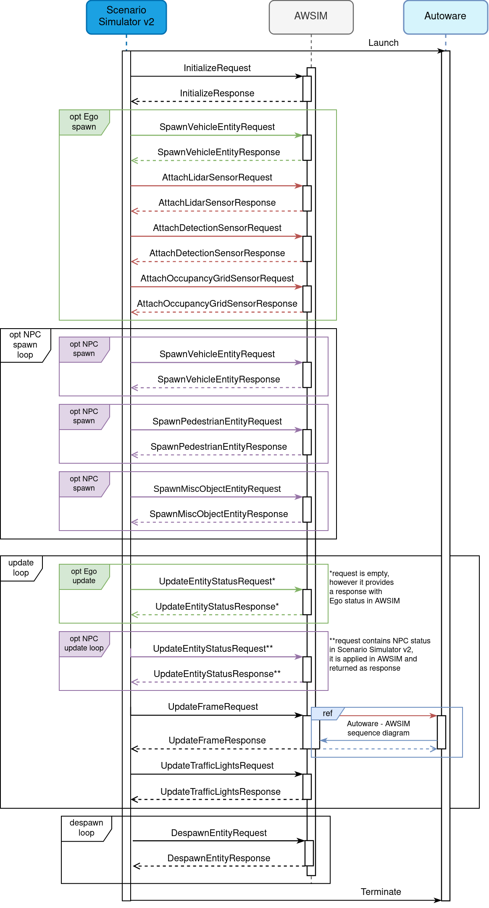

# Combination with Autoware and Scenario simulator v2

[*Scenario Simulator v2*](https://tier4.github.io/scenario_simulator_v2-docs/) (*SS2*) is a scenario testing framework specifically developed for [*Autoware*](../Autoware/), an open-source self-driving software platform. It serves as a tool for *Autoware* developers to conveniently create and execute scenarios across different simulators. 

The primary goal of [*SS2*](https://tier4.github.io/scenario_simulator_v2-docs/developer_guide/About/) is to provide *Autoware* developers with an efficient means of writing scenarios once and then executing them in multiple simulators. By offering support for different simulators and scenario description formats, the framework ensures flexibility and compatibility.

The default scenario format in this framework is [TIER IV Scenario Format version 2.0](https://tier4.github.io/scenario_simulator_v2-docs/developer_guide/TIERIVScenarioFormatVersion2/). The scenario defined on this format is converted by [`scenario_test_runner`](https://tier4.github.io/scenario_simulator_v2-docs/user_guide/scenario_test_runner/ScenarioTestRunner/) to [`openSCENARIO`](https://tier4.github.io/scenario_simulator_v2-docs/user_guide/scenario_test_runner/ScenarioFormatConversion/) format, which is then interpreted by [`openscenario_interpreter`](https://tier4.github.io/scenario_simulator_v2-docs/developer_guide/OpenSCENARIOSupport/). Based on this interpretation, [`traffic_simulator`](https://tier4.github.io/scenario_simulator_v2-docs/developer_guide/TrafficSimulator/) simulates traffic flow in an urban area. Each NPC has a behavior tree and executes commands from the scenario.

The framework uses [*ZeroMQ*](https://tier4.github.io/scenario_simulator_v2-docs/developer_guide/ZeroMQ/) Inter-Process communication for seamless interaction between the simulator and the `traffic_simulator`. To ensure synchronous operation of the simulators, *SS2* utilizes the *Request/Reply* sockets provided by [*ZeroMQ*](https://tier4.github.io/scenario_simulator_v2-docs/developer_guide/ZeroMQ/) and exchanges binarized data through [*Protocol Buffers*](https://tier4.github.io/scenario_simulator_v2-docs/developer_guide/ZeroMQ/). This enables the simulators to run in a synchronized manner, enhancing the accuracy and reliability of scenario testing.

!!! note "QuickStart Scenario simulator v2 with Autoware"

    If you would like to see how *SS2* works with *Autoware* using default build-in simulator - [`simple_sensor_simulator`](https://tier4.github.io/scenario_simulator_v2-docs/developer_guide/SimpleSensorSimulator/) (without running AWSIM) - we encourage you to read this [tutorial](https://autowarefoundation.github.io/autoware-documentation/main/tutorials/scenario-simulation/planning-simulation/scenario-test-simulation/).

## Combination Architecture

*AWSIM* scene architecture used in combination with *SS2* changes considerably compared to the [default scene](../AWSIM/). Here `traffic_simulator` from *SS2* replaces `TrafficSimulator` implementation in *AWSIM* - for this reason it and its `StopLines`, `TrafficLanes` and `TrafficIntersection` components are removed. Also, `NPCPedestrian` and `NPCVehicles` are not added as aggregators of *NPCs* in `Environment`.

Instead, their counterparts are added in `ScenarioSimulatorConnector` object that is responsible for spawning `Entities` of the scenario. `Entity` can be: `Pedestrian`, `Vehicle`, `MiscObject` and `Ego`. 
`EgoEntity` is the equivalent of `EgoVehicle` - which is also removed from the default scene. However, it has the same components - it still communicates with *Autoware* as described [here](../ConnectionWithAutoware/). So it can be considered that `EgoVehicle` has not changed and `NPCPedestrians` and `NPCVehicles` are now controlled directly by the *SS2*.

A detailed description of the *SS2* architecture is available [here](https://tier4.github.io/scenario_simulator_v2-docs/developer_guide/SystemArchitecture/). A description of the communication via *ROS2* between *SS2* and *Autoware* can be found [here](https://tier4.github.io/scenario_simulator_v2-docs/developer_guide/Communication/).

## Sequence diagram
In the sequence diagram, the part responsible for *AWSIM* communication with *Autoware* also remained unchanged. The description available [here](../ConnectionWithAutoware/) is the valid description of the reference shown in the diagram below.

Communication between *SS2* and *AWSIM* takes place via *Request-Response* messages, and is as follows:

1. *Launch* - *Autoware* is started and initialized.
2. *Initialize* - the environment in *AWSIM* is initialized, basic parameters are set.
3. *opt Ego spawn* - optional, `EgoEntity` (with sensors) is spawned in the configuration defined in the scenario.
4. *opt NPC spawn loop* - optional, all `Entities` (*NPCs*) defined in the scenario are spawned, the scenario may contain any number of each `Entity` type, it may not contain them at all or it may also be any combination of the available ones.
5. *update loop* - this is the main loop where scenario commands are executed, first `EgoEntity` is updated - *SS2* gets its status, and then every other `Entity` is updated - the status of each *NPCs* is set according to the scenario. Next, the simulation frame is updated - here the communication between *Autoware* and *AWSIM* takes place. The last step of the loop is to update the traffic light state.
6. *despawn loop* - after the end of the scenario, all `Entities` spawned on the scene are despawned (including `EgoEnity`) 
7. *Terminate* - *Autoware* is terminated.

Documentation of the commands used in the sequence is available [here](https://tier4.github.io/scenario_simulator_v2-docs/proto_doc/protobuf/).

