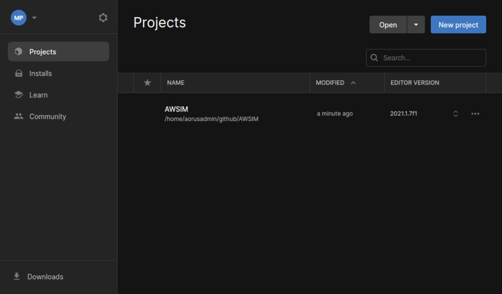
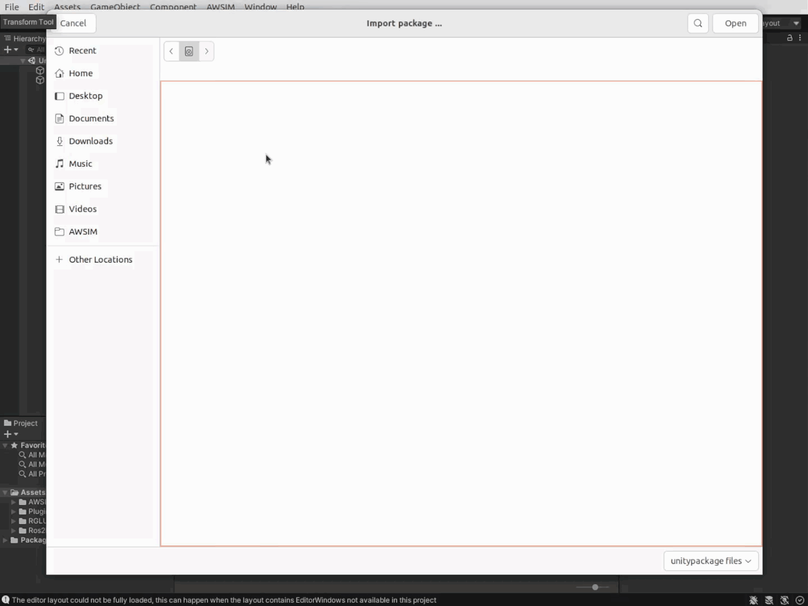

# Setup AWSIM Unity project


!!! note "Before this section"
    Before following through with this section make sure to check [prerequisites](../Prerequisites/) and install *Unity* in accordance with section [Unity installation](../UnityInstallation/).


!!! tip "Advice"
    It is advised to checkout the [Run Demo](../../Installation/RunDemo) and [First steps](../../FirstSteps/SetTheInitializationPosition/) tutorials before reading this section.

To setup the *AWSIM* project in *Unity* *Editor*:

1. Clone the *AWSIM* repository by executing the following command in the terminal:

    ```bash
    git clone git@github.com:tier4/AWSIM.git
    ```

1. Download `Japan_Tokyo_Nishishinjuku.unitypackage`

    [Download Map files (unitypackage)](https://github.com/tier4/AWSIM/releases/download/v1.1.0/Japan_Tokyo_Nishishinjuku.unitypackage){.md-button .md-button--primary}
   
    !!! info
        The Externals directory is added to the `.gitignore` because the map has a large file size and should not be directly uploaded to the repository.

1. Launch *UnityHub*.

1. Open the project in *UnityHub*

    - Click the `Open` button in Unity Hub:

        

    - Navigate the directory where the *AWSIM* repository was cloned to, select it and click `Open` in file explorer:

        

    - The project should open automatically, if it doesn't it still should be added to `Projects` tab in Unity Hub.
        To launch the project in Unity Editor simply click the *AWSIM* item:

        

        !!! note "Safe mode"
            If you get the safe mode dialog when starting *UnityEditor*, you may need to install *openssl*.

            1. Download *libssl*:
            
                ```bash
                wget http://security.ubuntu.com/ubuntu/pool/main/o/openssl1.0/libssl1.0.0_1.0.2n-1ubuntu5.13_amd64.deb
                ```
            
            2. Install it:  
            
                ```bash
                sudo dpkg -i libssl1.0.0_1.0.2n-1ubuntu5.11_amd64.deb
                ```

2. In the open project, from the menu bar at the top, select `Assets -> Import Package -> Custom Package...`

    

3. Navigate the to downloaded `Japan_Tokyo_Nishishinjuku.unitypackage` file and open it

    

4. In import window that appeared click the `Import` button to confirm and wait for the process to finish.

    

5. `Nishishinjuku` package has been successfully imported under `Assets/AWSIM/Externals/` directory.

    

!!! success
    The project is now ready to use. Now you can proceed to the next step [Run Scene](../RunTheScene/).
