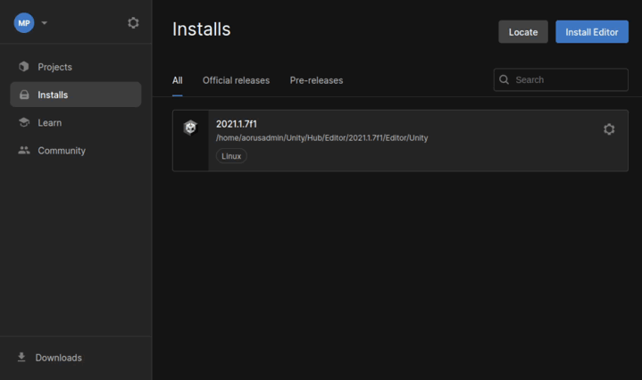

## Unity Hub installation
<!-- TODO gifs of command line?? -->
To install Unity Hub on Linux please follow [these instructions](https://docs.unity3d.com/hub/manual/InstallHub.html#install-hub-linux).

To be on the safe side always check the official documentation on how to install Unity Hub, this code is just for reference.

1. Add the public signing key
    ```
    wget -qO - https://hub.unity3d.com/linux/keys/public | gpg --dearmor | sudo tee /usr/share/keyrings/Unity_Technologies_ApS.gpg > /dev/null
    ```
1. Add Unity Hub repository to your sources
    ```
    sudo sh -c 'echo "deb [signedby=/usr/share/keyrings/Unity_Technologies_ApS.gpg] https://hub.unity3d.com/linux/repos/deb stable main" > /etc/apt/sources.list.d/unityhub.list'
    ```
1. Update package cache and install package
    ```
    sudo apt update
    sudo apt-get install unityhub
    ```

## Unity installation

!!! info

    AWSIM's Unity version is currently **2021.1.7f1**

Follow the steps below to install Unity on your machine:

1. Install UnityHub to manage Unity projects. Please refer to [UnityHub installation](#unityhub-installation) section.
1. Install Unity 2021.1.7f1 via UnityHub.
    - Open Unity Hub as every other application on your PC (terminal or application menu)
    - Click `Install Editor` in `Installs` tab and navigate to `download archive` as shown below

    - Unity webpage will open, here navigate Unity version *2021.1.7* and download it as shown below

    - At this point, your Unity installation process should have started.
        <!-- TODO this is an old command for AppImage, does this method work for packaged application as well? -->

        === "Ubuntu 22"
        - *NOTE*: If the installation process has not started after clicking the green button (image above), please copy the hyperlink (by rightclicking the button and selecting `Copy link address`) and add it as a argument for Unity Hub app. An example command:
        ```
        ./UnityHub.AppImage unityhub://2021.1.7f1/d91830b65d9b
        ```

    - After successful installation the version will be available under the `Installs` tab in Unity Hub.

