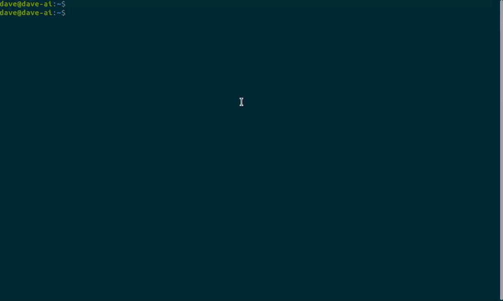
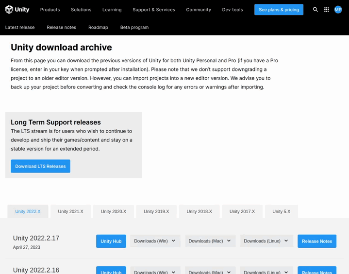

This section describes the *Unity* installation required to run the *AWSIM* project. To install *Unity*, it is necessary to install *Unity Hub*, which is described in step one.
## 1. Unity Hub installation
To install *Unity* on *Linux* you need to install *Unity Hub*, run the following commands:

1. Add the public signing key

    ```
    wget -qO - https://hub.unity3d.com/linux/keys/public | gpg --dearmor | sudo tee /usr/share/keyrings/Unity_Technologies_ApS.gpg > /dev/null
    ```

2. Add Unity Hub repository to your sources

    ```
    sudo sh -c 'echo "deb [signedby=/usr/share/keyrings/Unity_Technologies_ApS.gpg] https://hub.unity3d.com/linux/repos/deb stable main" > /etc/apt/sources.list.d/unityhub.list'
    ```

3. Update package cache and install package

    ```
    sudo apt update
    sudo apt-get install unityhub
    ```

!!! warning "Unity Hub installation"
    To be on the safe side always check the official documentation on how to install *Unity Hub*, this manual is just for reference.

    Please follow [these instructions](https://docs.unity3d.com/hub/manual/InstallHub.html#install-hub-linux) if you have any problems.

!!! success
    A properly installed and running *Unity Hub* should look like this.

    

## 2. Unity installation
!!! info "Unity version"
    *AWSIM's* *Unity* version is currently ***Unity 2021.1.7f1***

Follow the steps below to install *Unity 2021.1.7f1* via *UnityHub*:

1. Open *UnityHub* by executing the command `unityhub` in the terminal or by using application menu.
1. Click `Install Editor` in `Installs` tab and navigate to `download archive` as shown below

    

1. *Unity* webpage will open, here navigate *Unity* version *2021.1.7* and download it as shown below

    

1. At this point, your *Unity* installation process should have started.

    !!! question "Installation process has not started (Ubuntu 22)"
        If the installation process has not started after clicking the blue button (image above), please copy the hyperlink (by rightclicking the button and selecting `Copy link address`) and add it as a argument for *UnityHub* app. An example command:

        ```
        unityhub unityhub://2021.1.7f1/d91830b65d9b
        ```

!!! success
    After successful installation the version will be available under the `Installs` tab in *Unity Hub*.
    Now you can proceed to the next step [Setup Unity Project](../SetupUnityProject/).

    
