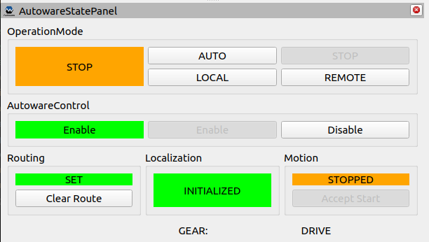

<!-- DM: gites, mozna dopisac jedynie ze jak nie planuje sie to nalezy sprawdzic czy pojazd ma dobra lokalizacje (czy znajduje sie poprawnie na pasie) a takze czy wgl goal ejst mozliwy do osiagniecia -->
Before performing this step, make sure that the *Ego* position has been automatically initialized according to this [section](../SetTheInitializationPosition/).
# Set a single goal
In order to set up a single goal to which the path should be planned, follow these steps:

1. Click `2D Goal Pose` button

    

1. Click and drag the mouse on the road to set goal position and orientation.
Planned path should appear on the road after a while.

    

    !!! tip
        Remember that for route planning to be carried out correctly, *Ego* must have an precise location that is compatible between *Autoware* and *AWSIM*. 
        Manual setting of the *Ego* position is described in this [section](../SetTheInitializationPosition/).

    !!! tip
        Remember to always set orientation aligned with road direction. Road direction is marked as small arrow marks on the road area.

    !!! question 
        If a path to the selected goal has not been planned, make sure that such a path exists - check if *Ego* would be able to reach this goal.

1. As a result, `SET` information should be visible in the `Routing` part of the `AutowareStatePanel`:
    

!!! success
    A properly planned path to the selected goal should look like this. 
    Now you can proceed to the next step: [adding a checkpoints](../AddCheckpointsOnTheWayToTheGoal/) or [enable self-driving](../EnableSelf-driving/).
    
