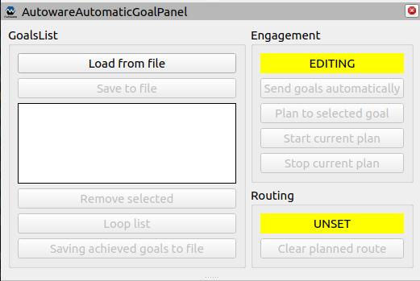
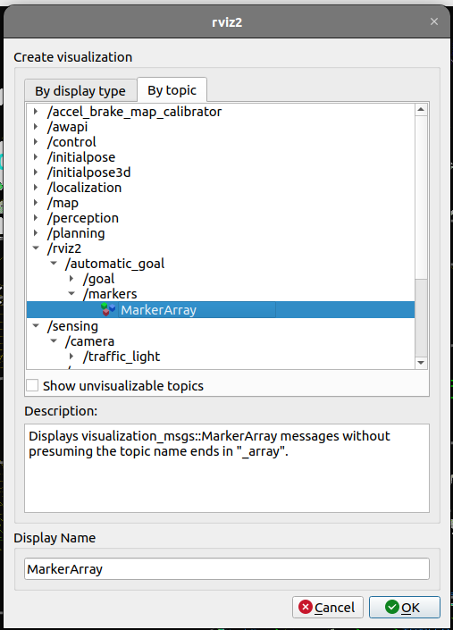
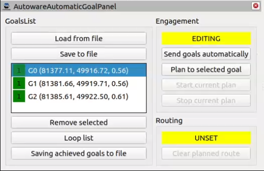
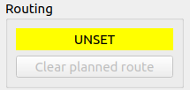
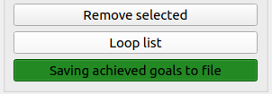
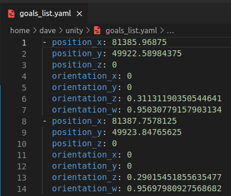

# Set a list of goals
Setting a single goal and starting the path to achieve it requires manual defining goal and starting self-driving.
In order to simplify the execution of many goals, the `AutomaticGoalRvizPlugin` was developed.

## 1. Setup the *AutowareAutomaticGoalPlugin* in Rviz
1. Open `Panels->Add New Panel`, expand `tier4_automatic_goal_rviz_plugin` and select `AutowareAutomaticGoalPanel` then press `OK`.

    

    !!! success
        A properly added `AutowareAutomaticGoalPanel` should look like this.

        

1. Open `Add a new tool`, expand `tier4_automatic_goal_rviz_plugin` and select `AutowareAutomaticGoalTool` then press `OK`.

    

    !!! success
        A properly added `2D AppendGoal` should look like this.

        

1. Click `Add` in `Displays` panel, then select tab `By topic`, expand `/rviz2/automatic_goal/markers` and select `MarkerArray` then press `OK`.
Now you can `Rename` it to any name you want.

    

    !!! success
        A properly added `MarkerArray` should look like this.

        

## 2. Add goals to the list
Click on `2D AppendGoal` and select the first target goal on the map. Then add more sequentially.

!!! example
    An example of adding several goals.
    <video width="1920" controls>
    <source src="add_goals.mp4" type="video/mp4">
    </video>
<br>

## 3. Start sending goals automatically
Select the first goal to achieve from the list in  `AutowareAutomaticGoalTool` and click on `Send goals automatically` to start the auto-execution.<br>
`Ego` will reach the selected goal and then the path to the next one will be automatically planned and the movement will start.

!!! success
    A properly executed goal list should look like this.
    

!!! example
    An example of automatic execution of a list from 3
    <video width="1920" controls>
    <source src="follow_goals.mp4" type="video/mp4">
    </video>

!!! question
    If the `Engagement` part of plugin goes into `ERROR` mode (usually returns to `EDITING `later), it means that one of the services returned a calling error (`code!=0`).
    In this situation, check the terminal output for more information.
    
       - Often it is enough to try again.
       - Sometimes a clearing of the current route is required before retrying.


## 3. Other plugin features
In addition to automatically sending goals, the plugin provides several additional features that can be helpful.

### 3.1. Achieve one selected goal
To plan a path to a single goal, select a goal from the list and click `Plan to selected goal`.
Then, to execute only that one path - no auto-execution, click `Start current plan`.

!!! example
    An example of achieving a selected goal.

    <video width="1920" controls>
    <source src="selected_goal.mp4" type="video/mp4">
    </video>

### 3.2. Stop and restart
To stop click `Stop current plan`. In that case, to start the execution to another goal, it is necessary to clear the planned path by clicking `Clear planned route`.<br>
Then you can select another goal and click

   - `Send goals automatically` - to achieve the rest of the list or just
   - `Start current plan` - to achieve only selected goal.

!!! success
    A properly stopped plan and cleared path looks like this.

    

!!! example
    An example of stopping the current plan and starting another.

    <video width="1920" controls>
    <source src="stop_restart.mp4" type="video/mp4">
    </video>

### 3.3. Loop the list
To enable loop, click the `Loop list` for a list with at least 2 goals.

!!! success
    A properly enabled list loop looks like this.

    

!!! warning
    For the looped list to work correctly, make sure that it is possible to plan a path from the last goal in the list to the first one.

### 3.4. Save achieved goals
To enable the saving of achieved goals to a file, click `Saving achieved goals to a file` and select the target path for the file in the dialog window.

As a result, a file `goals_achieved.log` will be created in the selected path, which will be modified each time a goal is reached.

!!! success
    A properly executed goal list should look like this.

    

!!! example
    Sample file `goals_achieved.log` content for a looped list with 3 goals.

    

### 3.5. Save and load the list 
To save the current goal list, click `Save to file`, then select the path where you want to save the file.

As a result, a file `goals_list.yaml` will be created in the selected path, which will be modified each time a goal is reached.

To load a list of goals, click `Load from file` and select a file `goals_list.yaml` from the previously selected path.

!!! example
    Sample file `goals_list.yaml` content for a list with 2 goals.

    

### 3.6. Automatically goals sending without plugin
The saved goals list can be executed without using a plugin - using a node `automatic_goal_sender`. This node is in the same package as the plugin. 

To activate the automatic sending of goals without a plugin, you need to:

1. Create and save a goal list to a file.
2. Run launch `automatic_goal_sender.launch.xml` with two parameters:

    - `goals_list_file_path` - is the path to the saved goal list file to be loaded,
    - `goals_achieved_dir_path` - is the path to the directory where the file `goals_achieved.log` will be created and the achieved goals will be written to it.

    ```
    ros2 launch tier4_automatic_goal_rviz_plugin automatic_goal_sender.launch.xml goals_list_file_path:="/home/ros2/goals_list.yaml" goals_achieved_dir_path:="/home/ros2/"
    ```

!!! example
    An example of automatically goals sending using `automatic_goal_sender`.

    <video width="1920" controls>
    <source src="no_panel_run.mp4" type="video/mp4">
    </video>
