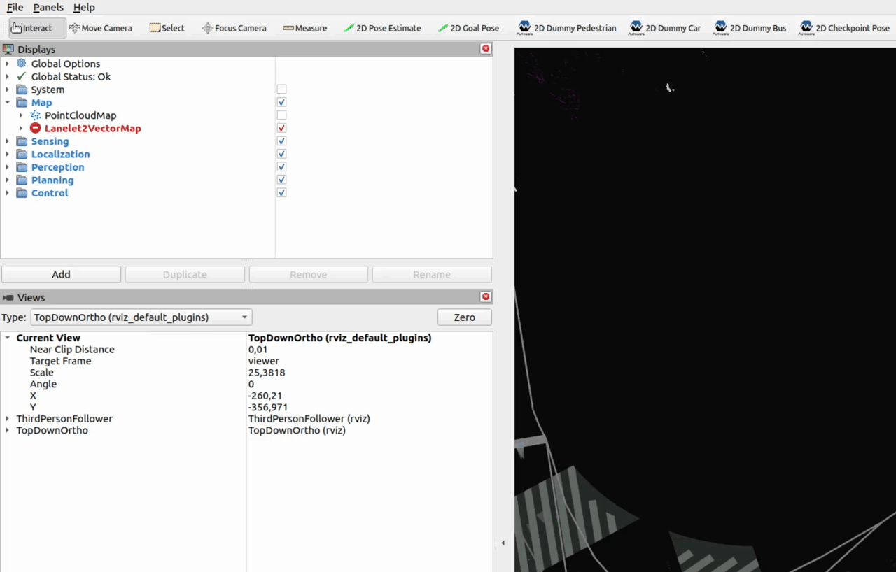

<!-- DM: napisz tutaj, ze manualnie mozna tez poprawic pozycje jesli jest niedokladna
prosilbym Ci tez zebys takei video nagrywal w blizej samego ego - zeby fullsceen nie byl konieczny, wgl skrocilbym to o te 20-30 sekund bezczynnosci i dopisal ze to zazwyczaj trwa troche - zalezy od wydajnosci maszyny, jesli cos nie dziala to nalezy sprawdzic czy napewno wczytywane sa odpowiednie pliki mapy dla odpowiedniego swiata w awsim (i czy wgl sie wczytuja - mozna zasugerowac czytelnikowi sprawdzenie outputu autoware, zobaczyc czy na awutoware wyrzuci blad jak nie bedzie dobrej sciezki i pokazac ze wtedy trzeba to sprawdzic) -->
## Automatic position initialization

When launching Autioware after AWSIM has been launched the ego vehicle position should be automatically initialized in Autoware.
When this does not happen please see this [section](#manual-position-initialization).

The full process can be seen in the video below (open in full screen mode to see the details).

<video width="1920" controls>
  <source src="autoware_launch.webm" type="video/webm">
</video>

## Manual position initialization
<!-- DM: dobrze jakby pojazd na gifie byl widoczny w zlym miejscu i przeniosl sie na to co sugerujesz  -->
In order to set position of ego vehicle manually

1. Click `2D Pose Estimate` button.

    

1. Click and drag on the road area position to set estimated position and orientation.

    

    !!! important
        The position and orientation to set in demo should be the same as in the video in [this section](#automatic-position-initialization).

1. Wait for the ego vehicle to appear.
