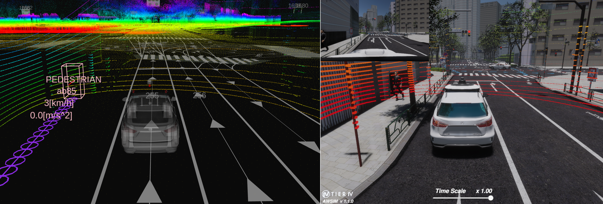
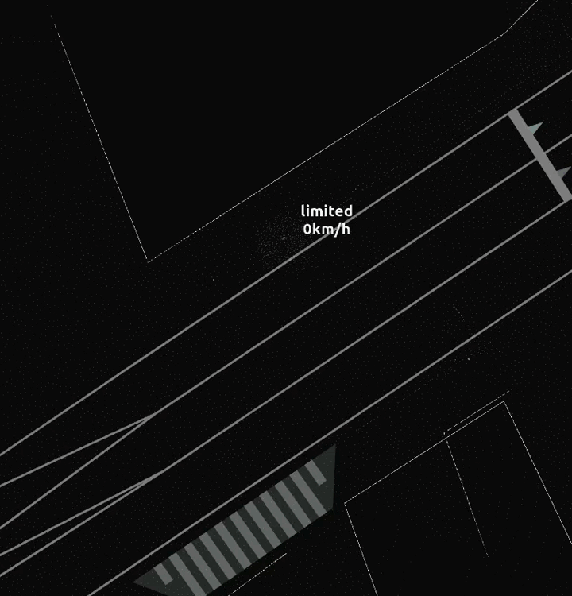
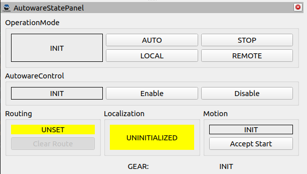
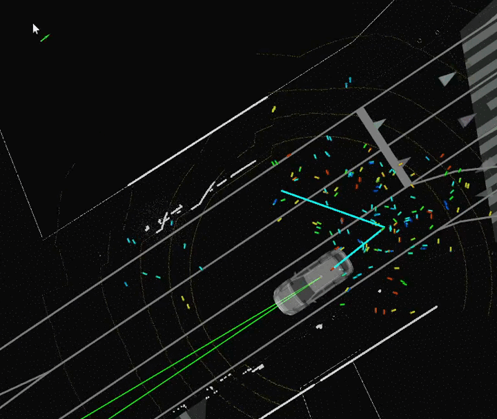
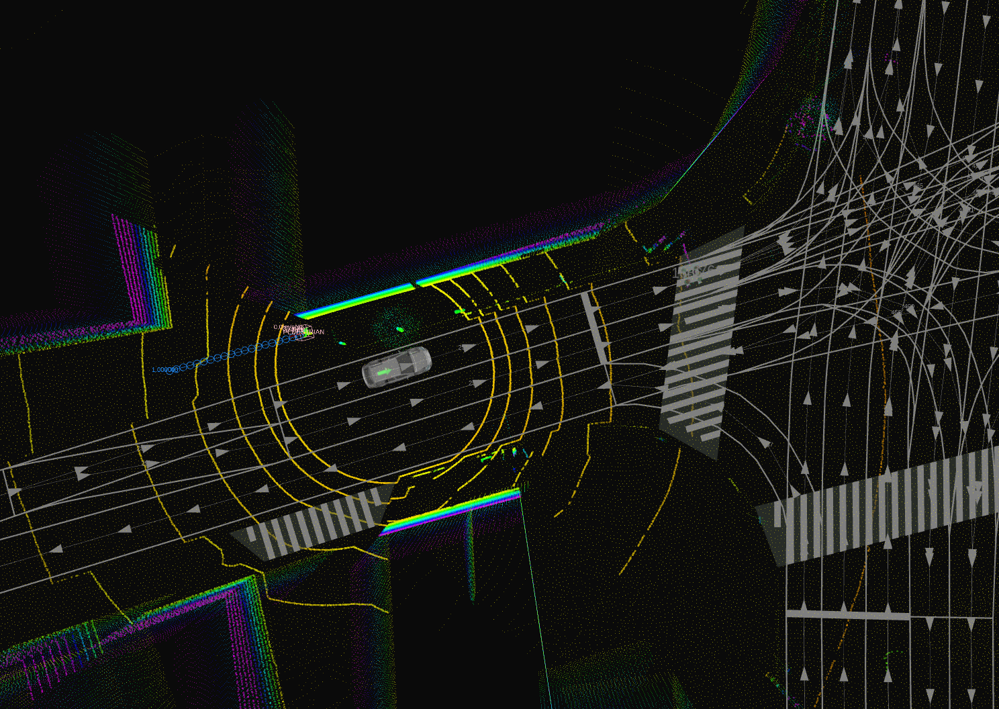

## Automatic position initialization

When you run *Autoware* while the *AWSIM demo* is running in the background, then the *Ego* position should be initialized automatically in *Autoware*. It might take some time - depending on machine performance.

- As a result, `INITIALIZED` information should be visible in the `Localization` part of  the `AutowareStatePanel`:
    

- If the *Ego* position has not been initialized precisely please see this [section](#manual-position-initialization).

!!! success
    The correct result of the automatic position initialization should look like this. 
    Now you can proceed to the next step: [setting a single goal](../SetASingleGoal/).
    

!!! example "Automatic position initialization example"
    

!!! question
    If automatic initialization does not work, make sure you start *Autoware* with the correct path to the map files `<mapfiles_dir_path>`.
    

## Manual position initialization
In order to set position of *Ego* vehicle manually

1. Click `2D Pose Estimate` button

    

2. Click and drag on the road area position to set estimated position and orientation.
Then wait for the Vehicle to localize itself.

    

!!! success
    The correct result of the precise position initialization should look like this. 
    Now you can proceed to the next step: [setting a single goal](../SetASingleGoal/).
    
