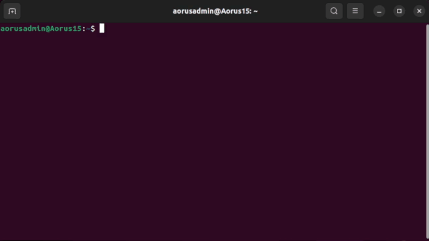

<!-- DM: tutaj na pewno brakuje mi czytelnego rodzielenia linux/windows, na wstepie powinnny byc odnosniki  przenoszace do tej czesci tekstu, jeszcze lepiej jakby udalo sie 'zwinac' wybrana, mysle ze tez lepiej dodawac tutaj jakies bullety zeby to bylo wszystko czytelne bo srednio jest -->
### PC specs
<!-- copied from old -->
Please make sure that your machine meets the following requirements in order to run the simulation correctly:

| Required PC Specs         |                                 |
| :------------------------ | :------------------------------ |
| OS                        | Ubuntu 22.04                    |
| CPU                       | 6 cores and 12 thread or higher |
| GPU                       | RTX2080Ti or higher             |
| Nvidia Driver (Windows)   | >=472.50                        |
| Nvidia Driver (Ubuntu 22) | >=515.43.04                     |

## Linux
### Localhost settings
<!-- TODO copied from old and added what I think is some additional help -->

The simulation is based on the appropriate network setting, which allows for trouble-free communication of the AWSIM simulation with the Autoware software.
To apply required localhost settings please add the following lines to `~/.bashrc` file.

``` bash
export ROS_LOCALHOST_ONLY=1
export RMW_IMPLEMENTATION=rmw_cyclonedds_cpp

if [ ! -e /tmp/cycloneDDS_configured ]; then
	sudo sysctl -w net.core.rmem_max=2147483647
	sudo ip link set lo multicast on
	touch /tmp/cycloneDDS_configured
fi
```

If you are having trouble with network connection consider replacing `export ROS_LOCALHOST_ONLY=1` with `export ROS_DOMAIN_ID=XX` where `XX` is a unique number in your network between 0 and 101 inclusive.
For more information about `ROS_DOMAIN_ID` head to official [documentation](https://docs.ros.org/en/rolling/Concepts/About-Domain-ID.html).

!!! note

    Adding these lines to your `.bashrc` file will require you to supply your password first time you open a terminal after each PC restart.

### Install Git
To download AWSIM from a [remote repository](https://github.com/tier4/AWSIM) you need to install [git](https://git-scm.com/).
To do that paste the commands below into terminal.

```
sudo apt-get -y update
sudo apt-get -y install git
```

### Install Nvidia GPU driver
On Ubuntu you can open `Additional Drivers` application and from there select one driver and install it.


Other possibility is to install drivers from command line.

- Add Nvidia driver to apt repository.
```
sudo add-apt-repository ppa:graphics-drivers/ppa
sudo apt update
```
- Install the recommended version of the driver.
```
sudo ubuntu-drivers autoinstall
```

!!! note

    After installing drivers PC reboot is required.


To check whether the drivers are working correctly run `nvidia-smi` command in terminal and check whether you get a result similar to the one below.



### Install Vulkan Graphics Library
To install Vulkan Graphics Library

- Update the environment.
```
sudo apt update
```
- Install Vulkan library
```
sudo apt install libvulkan1
```

## Windows
<!-- TODO -->
### Localhost settings
<!-- TODO -->
### Install Git
<!-- TODO -->
### Install Nvidia GPU driver (**gif** - how to test)
<!-- TODO -->
### Install Vulkan Graphics Library
<!-- TODO -->

## Installing Autoware
<!-- TODO copied from old -->

In order to configure and run the Autoware software with the AWSIM demo, please:

1. Download `map files (pcd, osm)` and unzip them.

    [Download Map files (pcd, osm)](https://github.com/tier4/AWSIM/releases/download/v1.1.0/nishishinjuku_autoware_map.zip){.md-button .md-button--primary}

1. Clone [Autoware](https://github.com/autowarefoundation/autoware) and move to the directory.
```
git clone https://github.com/autowarefoundation/autoware.git
cd autoware
```
1. Switch branch to `awsim-stable`. *NOTE: The latest `main` branch is for [ROS 2 humble](https://docs.ros.org/en/rolling/Releases/Release-Humble-Hawksbill.html).*
```
git checkout awsim-stable
```
1. Configure the environment. (Skip if Autoware environment has been configured before)
```
./setup-dev-env.sh
```
1. Create the `src` directory and clone external dependent repositories into it.
```
mkdir src
vcs import src < autoware.repos
```
1. Install dependent ROS packages.
```
source /opt/ros/humble/setup.bash
rosdep update
rosdep install -y --from-paths src --ignore-src --rosdistro $ROS_DISTRO
```
1. Build the workspace.
```
colcon build --symlink-install --cmake-args -DCMAKE_BUILD_TYPE=Release -DCMAKE_CXX_FLAGS="-w"
```
