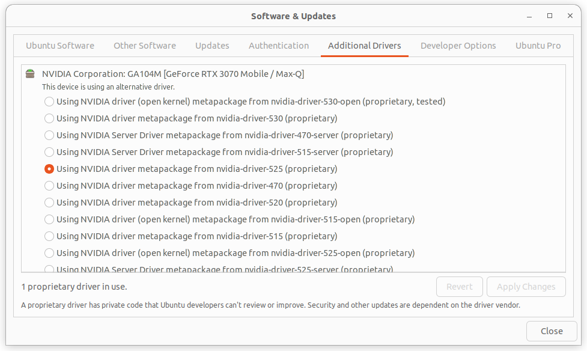
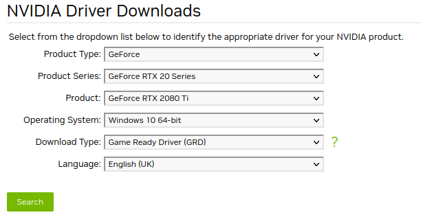

Below are the preconditions that must be met for *AWSIM* to work properly. Select the appropriate system and follow the steps.

## System Requirements
Before installation, please make sure that your machine meets the following requirements in order to run the simulation correctly:

| System Requirements |                                                                          |
| :------------------ | :----------------------------------------------------------------------- |
| OS                  | Ubuntu 22.04 / Windows 10 or 11 (64 bit)                                 |
| CPU                 | 6 cores and 12 thread or higher                                          |
| GPU                 | Nvidia GPU with at least 8GB of memory (recommended RTX2080Ti or higher) |

!!! info  
    System requirements may vary depending on simulation contents which may change as the simulator develops.

## Ubuntu
Follow these steps to get your *Ubuntu* system ready to run *AWSIM* with *Autoware*.

### 1. Localhost settings

The simulation is based on the appropriate network setting, which allows for trouble-free communication of the *AWSIM* simulation with the *Autoware* software.

To apply required localhost settings please add the following lines to `~/.bashrc` file:

``` bash
export ROS_LOCALHOST_ONLY=1
export RMW_IMPLEMENTATION=rmw_cyclonedds_cpp

if [ ! -e /tmp/cycloneDDS_configured ]; then
	sudo sysctl -w net.core.rmem_max=2147483647
	sudo ip link set lo multicast on
	touch /tmp/cycloneDDS_configured
fi
```

!!! Warning "ROS_DOMAIN_ID"
    If you are having trouble with network connection consider replacing `export ROS_LOCALHOST_ONLY=1` with `export ROS_DOMAIN_ID=XX` where `XX` is a unique number in your network between *0* and *101* inclusive.

    For more information about `ROS_DOMAIN_ID` head to official [documentation](https://docs.ros.org/en/rolling/Concepts/About-Domain-ID.html).

!!! info

    Adding these lines to your `.bashrc` file will require you to supply your password first time you open a terminal after each PC restart.

### 2. Install Git
To download *AWSIM* from a [remote repository](https://github.com/tier4/AWSIM) you need to install [git](https://git-scm.com/).

Install it by executing the following commands in the terminal:

```
sudo apt update
sudo apt install git
```

### 3. Install Nvidia GPU driver
To run *AWSIM* on *Ubuntu*, it is required to install *Nvidia* `515.43.04` drivers or higher.

To check what version you currently have installed, run the `nvidia-smi` command in the terminal. 
!!! example
    The message displayed in the example means that the drivers are in version `525.105.17` and work properly:<br>
    

If you do not have drivers installed or you need to update them, select one of the options below and follow it.
!!! Warning "System restart"

    After installing the graphics driver, a system restart is **required**.

#### 3.1 App option
You can open `Additional Drivers` application and from there select one driver and install it.

    

To verify that the drivers have been installed correctly, run the command `nvidia-smi` again and check.
#### 3.2 Command line option

Other possibility is to install drivers from command line.

1. Add *Nvidia* driver to apt repository:
```
sudo add-apt-repository ppa:graphics-drivers/ppa
sudo apt update
```
1. Install the recommended version of the driver:
```
sudo ubuntu-drivers autoinstall
```

To verify that the drivers have been installed correctly, run the command `nvidia-smi` again and check.

### 4. Install Vulkan Graphics Library
*AWSIM* uses *Vulkan Graphics Library*, to install it run the following commands:

1. Update the environment.
```
sudo apt update
```
1. Install Vulkan library
```
sudo apt install libvulkan1
```

### 5. Installing Autoware
*AWSIM* has been developed to work with *Autoware*, to install *Autoware* follow these steps:

!!! warning "Supported ROS2 distribution"
    The *AWSIM*-compatible version of *Autoware* is developed for the [***ROS2 Humble distribution***](https://docs.ros.org/en/rolling/Releases/Release-Humble-Hawksbill.html)

1. Clone [Autoware](https://github.com/autowarefoundation/autoware) and move to the directory.
```
git clone https://github.com/autowarefoundation/autoware.git
cd autoware
```
1. Switch branch to `awsim-stable`. 
```
git checkout awsim-stable
```
1. Configure the environment. (Skip if *Autoware* environment has been configured before)
```
./setup-dev-env.sh
```
1. Create the `src` directory and clone external dependent repositories into it.
```
mkdir src
vcs import src < autoware.repos
```
1. Install dependent ROS packages.
```
source /opt/ros/humble/setup.bash
rosdep update
rosdep install -y --from-paths src --ignore-src --rosdistro $ROS_DISTRO
```
1. Build the workspace.
```
colcon build --symlink-install --cmake-args -DCMAKE_BUILD_TYPE=Release -DCMAKE_CXX_FLAGS="-w"
```

!!! note "Autoware installation details"
    More details related to *Autoware* installation process can be found here: [Autoware Installation](https://autowarefoundation.github.io/autoware-documentation/main/installation/autoware/source-installation/)

## Windows
Follow these steps to get your *Windows* system ready to run *AWSIM*.
!!! tip
    Unfortunately, *Autoware* is not officially supported on *Windows*, but It can be run on a separate *Ubuntu* machine that communicates with *AWSIM* running on *Windows* via *ROS2*.
### 1. Install ROS2
Install ROS2 Humble following the steps in the [official manual](https://docs.ros.org/en/humble/Installation/Windows-Install-Binary.html).

### 2. Install Git
1. Navigate to [git-scm.com](https://git-scm.com/download/win) and download the latest version installer for Windows.
2. After launching the installer, follow the instructions on the *Setup* screen until the installation is complete.
3. Open the windows command prompt (or *Git Bash*)  and execute command `git version` to verify *Git* was installed properly.
### 3. Install Nvidia GPU driver
To run *AWSIM* on *Windows*, it is required to install *Nvidia* `472.50` drivers or higher.

1. Navigate to the [Nvidia site](https://www.nvidia.co.uk/Download/index.aspx?lang=en-uk) and find the driver according to your Windows version and graphics card.

    

1. For the found driver, check if its version is appropriate, if yes then click and Download.

    

2. After launching the installer, follow the instructions on the *Setup* screen until the installation is complete.

!!! Warning

    After installing the graphics driver, a system restart is **required**.

<!-- ## 4. Install Vulkan Graphics Library -->
<!-- TODO (need to check, as Vulkan should be installed along with Nvidia drivers on Windows) -->
<!-- ## 5. Installing Autoware -->
<!-- TODO (autoware is not supported on Windows) -->

