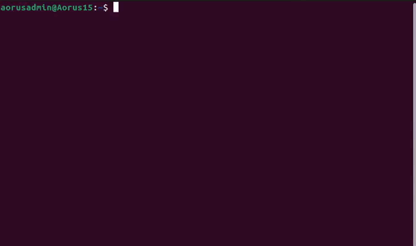
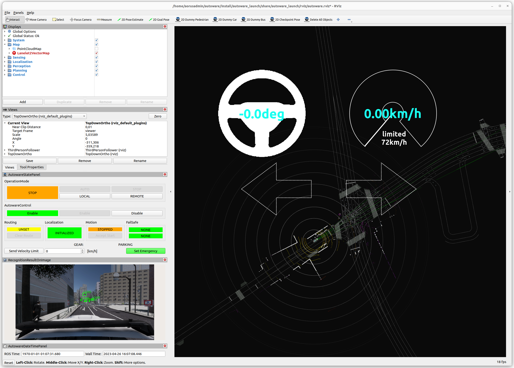

!!! note
    Before following through with this section make sure to check [prerequisites](../Prerequisites/).

## Ubuntu
### 1. Download demo and run

To run the demo, please follow the steps below.

1. Download the `AWSIM_v1.1.0.zip`.

    [Download AWSIM Demo for Ubuntu](https://github.com/tier4/AWSIM/releases/download/v1.1.0/AWSIM_v1.1.0.zip){.md-button .md-button--primary}

2. Unzip the downloaded file.

3. Make the `AWSIM_demo.x86_64` file executable.

    Rightclick the `AWSIM_demo.x86_64` file and check the `Execute` checkbox
    

    or execute the command below.

    ```
    chmod +x <path to AWSIM folder>/AWSIM_demo.x86_64
    ```

4. Launch `AWSIM_demo.x86_64`.
    ```
    ./<path to AWSIM folder>/AWSIM_demo.x86_64
    ``` 

    !!! info

        It may take some time for the application to start the so please wait until image similar to the one presented below is visible in your application window.

#### Demo configuration
    
The simulation provided in the *AWSIM* demo is configured as follows:

| Demo Settings     |                                                     |
| :---------------- | :-------------------------------------------------- |
| Vehicle           | Lexus RX 450h                                       |
| Environment       | Japan Tokyo Nishishinjuku                           |
| Sensors           | GNSS * 1,  IMU * 1,  LiDAR * 1,  Traffic camera * 1 |
| Traffic           | Randomized traffic                                  |
| ROS2 Distribution | Humble                                              |


!!! success
    The *AWSIM demo* that has been started and working properly should look like this:

    

### 2. Run demo with Autoware
To run *AWSIM* with *Autoware* follow these steps:
!!! warning
    The *AWSIM*-compatible version of *Autoware* is developed for the [***ROS2 Humble distribution***](https://docs.ros.org/en/rolling/Releases/Release-Humble-Hawksbill.html)

!!! info "Communication test"
    Before launching *Autoware* please check whether the demo has started the communication.
    To do that
    
    - Source ROS (if you haven't already)

        ```bash
        source /opt/ros/humble/setup.bash
        ```
    - Run the following command and inspect te output.
    If topics are listed correctly then the communication should be working.
    Otherwise please visit the [troubleshooting page](../../../DeveloperGuide/TroubleShooting/).

        ```bash
        ros2 topic list
        ```

        
    

1. Download `map files (pcd, osm)` and unzip them to the desired location<br> (keep the path to the folder - it will be needed).

    [Download Map files (pcd, osm)](https://github.com/tier4/AWSIM/releases/download/v1.1.0/nishishinjuku_autoware_map.zip){.md-button .md-button--primary}

2. Launch *AWSIM* demo like in [section before](#download-and-run)

3. Open new terminal and source *ROS2* and the *Autoware* workspace by executing:

    ```
    source /opt/ros/humble/setup.bash
    source <autoware_workspace_path>/install/setup.bash
    ```

4. In the same terminal launch the *Autoware* by executing the commands with your own path to the `map files`:

    ```
    ros2 launch autoware_launch e2e_simulator.launch.xml vehicle_model:=sample_vehicle sensor_model:=awsim_sensor_kit map_path:=<mapfiles_dir_path>
    ```

    !!! warning

        `<mapfiles_dir_path>` must be changed arbitrarily.
        Specify the path to the outermost map folder.
        
        When specifying the path the `~` operator cannot be used - please specify absolute full path, or use the `$HOME` environmental variable.


!!! success
    The *Autoware* that has been started and communicating properly with *AWSIM* should look like this. <br>Now you can proceed and get to know the [first steps of using *AWSIM* with *Autoware*](../../FirstSteps/SetTheInitializationPosition/).
    
  


## Windows
!!! warning
    Unfortunately, the official demo for *Windows* has not yet been released.
