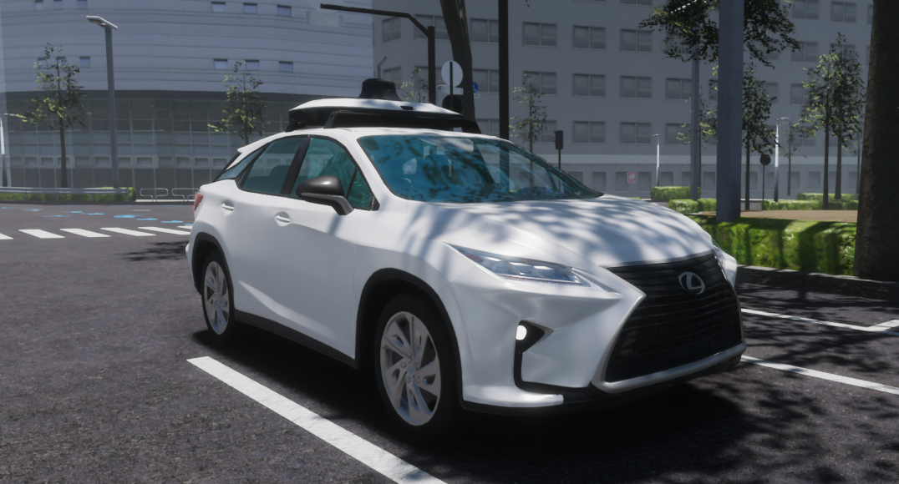
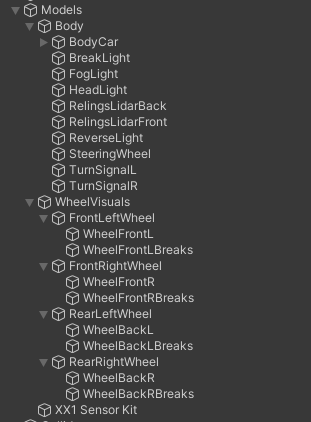
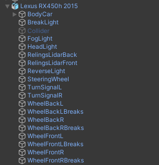
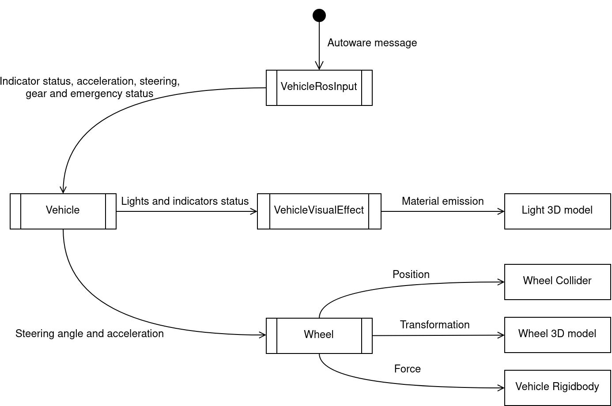
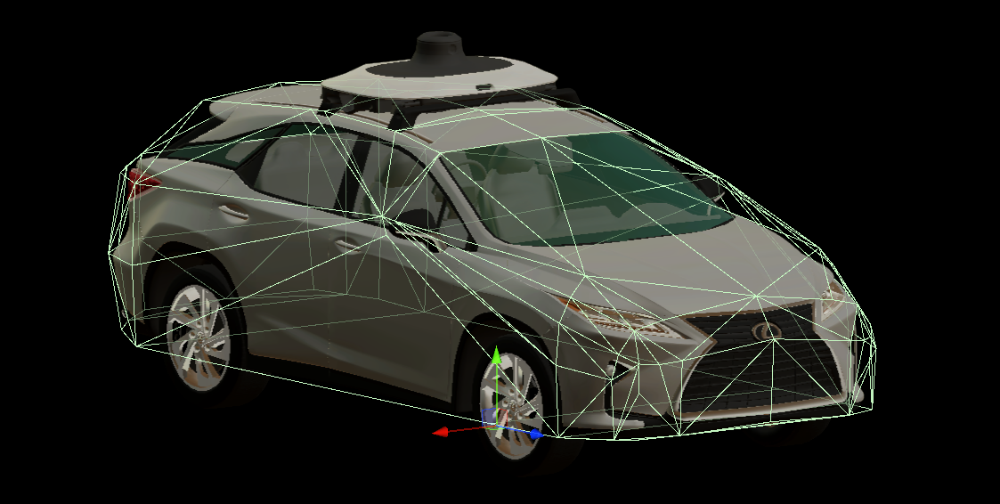
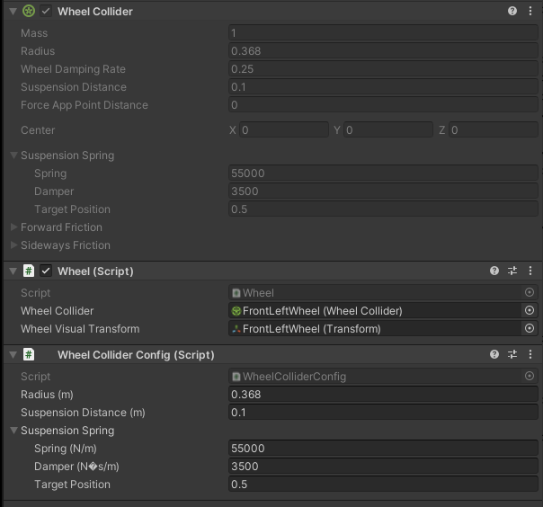
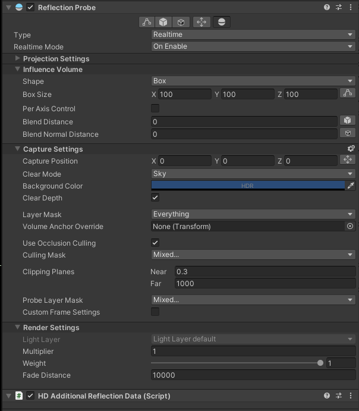
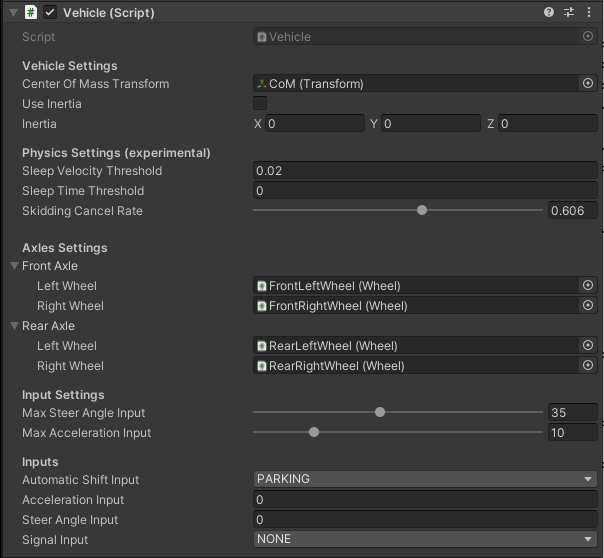
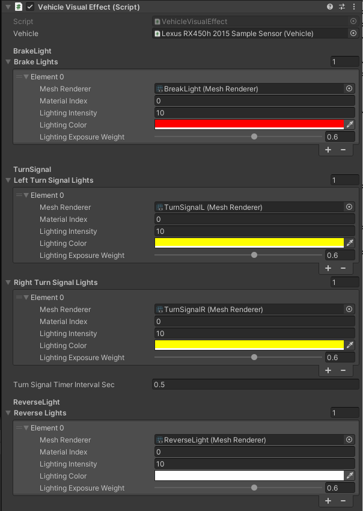
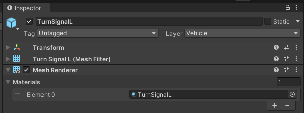

## Introduction
`EgoVehicle` is a playable object that simulates a vehicle that can autonomously move around the scene.
It has components (scripts) that make it possible to control it by keyboard or by *Autoware* (using *ROS2* communication). Moreover, it provides sensory data needed for self-localization in space and detection of objects in the surrounding environment.

The default prefab `EgoVehicle` was developed using a *Lexus RX450h 2015* vehicle model with a configured sample sensor kit.



!!! tip "Own EgoVehicle prefab"
    If you would like to develop your own  `EgoVehicle` prefab, we encourage you to read this [tutorial](../../../../../DeveloperGuide/Tutorials/AddANewVehicle/AddAVehicle/).

### Supported features

This vehicle model was created for *Autoware* simulation, and assuming that [*Autoware*](https://autowarefoundation.github.io/autoware-documentation/main/design/autoware-architecture/vehicle/) has already created a gas pedal map,
this vehicle model uses acceleration as an input value.
It has the following features:

- Longitudinal control by acceleration ($\frac{m}{s^2}$).
- Lateral control by two-wheel model.
- Yaw, roll and pitch controlled by [*Physics*](https://docs.unity3d.com/Manual/PhysicsSection.html) engine.
- Mass-spring-damper suspension model ([`WheelColliders`](#wheels-colliders)).
- Logical, not mechanical, automatic gears change.
- 3D *Mesh* (`*.fbx`) as road surface for vehicle driving, gradient resistance.

!!! note "AutowareSimulation"
    If you would like to see how `EgoVehicle` works or run some tests, we encourage you to familiarize yourself with the `AutowareSimulation` scene described in this [section](../../../../ProjectGuide/DefaultExistingScenes/).

### *Lexus RX450h 2015* parameters
|         Parameter         | Value                                                             | Unit           |
| :-----------------------: | :---------------------------------------------------------------- | :------------- |
|          *Mass*           | $1500$                                                            | $kg$           |
|       *Wheel base*        | $2.5$                                                             | $m$            |
|       *Tread width*       | $Ft = 1.8; Rr = 1.8$                                              | $m$            |
| *Center of Mass position* | $x = 0; y = 0.5; z = 0$                                           | $m$            |
|    *Moment of inertia*    | $\mathrm{yaw} = 2000; \mathrm{roll} = 2000; \mathrm{pitch} = 700$ | $kg \cdot m^2$ |
|       *Spring rate*       | $Ft = 55000; Rr = 48000$                                          | $N$            |
|       *Damper rate*       | $Ft = 3000; Rr = 2500$                                            | $\frac{N}{s}$  |
|    *Suspension stroke*    | $Ft = 0.2; Rr = 0.2$                                              | $m$            |
|      *Wheel radius*       | $0.365$                                                           | $m$            |

!!! info "Vehicle inertia"

    In general, measuring the moment of inertia is not easy, and past papers published by *NHTSA* are helpful.<br>
    [Measured Vehicle Inertial Parameters - NHTSA 1998](https://www.researchgate.net/publication/228945609_Measured_Vehicle_Inertial_Parameters-NHTSA)

### Prefab and Fbx
Prefab can be found under the following path:

```
Assets/AWSIM/Prefabs/NPCs/Vehicles/Lexus RX450h 2015 Sample Sensor.prefab
```

!!! note "EgoVehicle name"
    In order to standardize the documentation, the name `EgoVehicle` will be used in this section as the equivalent of the prefab named `Lexus RX450h 2015 2015 Sample Sensor`.

`EgoVehicle` prefab has the following content:


As you can see, it consists of 3 parents for *GameObjects*:

- `Models` - aggregating visual elements,
- `Colliders` - aggregating colliders,
- `URDF` - aggregating sensors,
- and 2 single *GameObjects*: `CoM` and `Reflection Probe`.

All objects are described in the sections below.

### Visual elements
Prefab is developed using models available in the form of `*.fbx` files.
The visuals elements have been loaded from the appropriate `*.fbx` file and are aggregated and added in object `Models`.

`*.fbx` file for *Lexus RX450h 2015* is located under the following path:

```
Assets/AWSIM/Models/Vehicles/Lexus RX450h 2015.fbx
```

`Models` object has the following content:



As you can see, the additional visual element is `XX1 Sensor Kit`.


It was also loaded from the `*.fbx` file which can be found under the following path:

```
Assets/AWSIM/Models/Sensors/XX1 Sensor Kit.fbx
```

!!! example "Lexus RX450h 2015.fbx"
    The content of a sample `*.fbx` file is presented below, all elements except `Collider` have been added to the prefab as visual elements of the vehicle.
    `Collider` is used as the *Mesh* source for the `Mesh Collider` in the `BodyCollider` object.

    

### Link in the default Scene
The default scene contains a single `Lexus RX450h 2015 Sample Sensor` prefab that is added as a child of the `EgoVehicle` *GameObject*.


In `EgoVehicle` prefab, the local coordinate system of the vehicle (main prefab link) should be defined in the axis of the rear wheels projected onto the ground - in the middle of the distance between them.
This aspect holds significance when characterizing the dynamics of the object, as it provides convenience in terms of describing its motion and control.


### Components


There are several components responsible for the full functionality of `Vehicle`:

- *[Rigidbody](https://docs.unity3d.com/ScriptReference/Rigidbody.html)* - ensures that the object is controlled by the physics engine in *Unity* - e.g. pulled downward by gravity.
- [*Vehicle* (script)](#vehicle-script) - provides the ability to set the acceleration of the vehicle and the steering angle of its wheels.
- [*Vehicle Keyboard Input* (script)](#vehicle-keyboard-script) - provides the ability to set inputs in the *Vehicle* (script) via the keyboard.
- [*Vehicle Ros Input* (script)](#vehicle-ros-script) - provides the ability to set inputs in the *Vehicle* (script) via subscribed *ROS2* topics (outputs from *Autoware*).
- [*Vehicle Visual Effect*](#vehicle-visual-effect-script) - provides the ability to simulate vehicle lights, such as turn signals, brake lights, and hazard light.

Scripts can be found under the following path:

```
Assets/AWSIM/Scripts/Vehicles/*
```

### Architecture
The *Ego Vehicle* architecture - with dependencies - is presented on the following diagram.


**Communication**

The communication between *Ego Vehicle* components is presented on two different diagrams - a flow diagram and a sequence diagram.

The flow diagram presents a flow of information between the *Ego Vehicle* components.



The sequence diagram provides a deeper insight in how the communication is structured and what are the steps taken by each component.
Some tasks performed by the elements are presented for clarification.


!!! info "Sequence diagram"
    Please keep in mind, that *Autoware* message callbacks and the update loop present on the sequence diagram are executed independently and concurrently.
    One thing they have in common are resources - the *Vehicle* Script.

## CoM
`CoM` (*Center of Mass*) is an additional link that is defined to set the center of mass in the `Rigidbody`.
The *Vehicle* (script) is responsible for its assignment.
This measure should be defined in accordance with reality.
Most often, the center of mass of the vehicle is located in its center, at the height of its wheel axis - as shown below.


## Colliders
*Colliders* are used to ensure collision between objects.
In `EgoVehicle`, the main `Collider` collider and colliders in `Wheels` `GameObject` for each wheel were added.

`Colliders` object has the following content:


### BodyCollider


`Collider` is a vehicle object responsible for ensuring collision with other objects.
Additionally, it can be used to detect these collisions.
The `MeshCollider` takes a *Mesh* of object and builds its `Collider` based on it.
The *Mesh* for the `Collider` was also loaded from the `*.fbx` file similarly to the visual elements.



### Wheels Colliders


`WheelsColliders` are an essential elements from the point of view of driving vehicles on the road.
They are the only ones that have contact with the roads and it is important that they are properly configured.
Each vehicle, apart from the visual elements related to the wheels, should also have 4 colliders - one for each wheel.

*Wheel* (script) provides a reference to the collider and visual object for the particular wheel.
Thanks to this, the [*Vehicle* (script)](#vehicle-script) has the ability to perform certain actions on each of the wheels, such as:

- update the steering angle in `WheelCollider`,

- update the visual part of the wheel depending on the speed and angle of the turn,

- update the wheel contact information stored in the [`WheelHit`](https://docs.unity3d.com/ScriptReference/WheelHit.html) object,

- update the force exerted by the tire forward and sideways depending on the acceleration (including cancellation of skidding),

- ensure setting the tire sleep (it is impossible to put `Rigidbody` to sleep, but putting all wheels to sleep allows to get closer to this effect).

*WheelColliderConfig* (script) has been developed to prevent inspector entry for `WheelCollider` which ensures that friction is set to 0 and only wheel suspension and collisions are enabled.


!!! tip "Wheel Collider Config"
    For a better understanding of the meaning of `WheelCollider` we encourage you to read [this manual](https://docs.unity3d.com/Manual/class-WheelCollider.html).

## Rigidbody


`Rigidbody` ensures that the object is controlled by the physics engine.
The `Mass` of the vehicle should approximate its actual weight.
In order for the vehicle to physically interact with other objects - react to collisions, `Is Kinematic` must be turned off.
The `Use Gravity` should be turned on - to ensure the correct behavior of the body during movement.
In addition, `Interpolate` should be turned on to ensure the physics engine's effects are smoothed out.

## Reflection Probe


[`Reflection Probe`](https://docs.unity3d.com/Manual/class-ReflectionProbe.html) is added to `EgoVehicle` prefab to simulate realistic reflections in a scene.
It is a component that captures and stores information about the surrounding environment and uses that information to generate accurate reflections on objects in real-time.
The values in the component are set as default.

*HD Additional Reflection Data* (script) is additional component used to store settings for [*HDRP's*](https://unity.com/srp/High-Definition-Render-Pipeline) reflection probes and is added automatically.

## URDF and Sensors


`URDF` (*Unified Robot Description Format*) is equivalent to the simplified [`URDF`](https://docs.ros.org/en/humble/Tutorials/Intermediate/URDF/URDF-Main.html) format used in *ROS2*.
This format allows to define the positions of all sensors of the vehicle in relation to its local coordinate system.
`URDF` is built using multiple *GameObjects* as children appropriately transformed with relation to its parent.

A detailed description of the `URDF` structure and sensors added to prefab `Lexus RX450h 2015` is available in this [section](../URDF/).

## Vehicle (script)


*Vehicle* (script) provides an inputs that allows the `EgoVehicle` to move.
Script inputs provides the ability to set the acceleration of the vehicle and the steering angle of its wheels, taking into account the effects of suspension and gravity.
It also provides an input to set the gear in the gearbox and to control the turn signals.
Script inputs can be set by one of the following scripts: [*Vehicle Ros Input* (script)](#vehicle-ros-script) or [*Vehicle Keyboard Input* (script)](#vehicle-keyboard-script).

The script performs several steps periodically:

- checks whether the current inputs meet the set limits and adjusts them within them,
- calculates the current linear velocity, angular velocity vector and local acceleration vector,
- set the current steering angle in the script for each wheel and perform their updates,
- if the current gear is `PARKING` and the vehicle is stopped (its speed and acceleration are below the set thresholds), it puts the vehicle ([`Rigidbody`](https://docs.unity3d.com/ScriptReference/Rigidbody.Sleep.html)) and its wheels ([*Wheel* (script)](#wheels-colliders)) to sleep,
- if the vehicle has not been put to sleep, it sets the current acceleration to each with the appropriate sign depending on the `DRIVE` and `REVERSE` gear.

#### Elements configurable from the editor level
The script uses the [`CoM`](#com) link reference to assign the center of mass of the vehicle to the `Rigidbody`.
In addiction, `Use inertia` allows to define the [`inertia`](https://docs.unity3d.com/ScriptReference/Rigidbody-inertiaTensor.html) tensor for component `Rigidbody` - by default it is disabled.

`Physics Settings` - allows to set values used to control vehicle physics:

- `Sleep Velocity Threshold` - velocity threshold used to put vehicle to sleep,
- `Sleep Time Threshold` - time threshold for which the vehicle must not exceed the `Sleep Velocity Threshold`, have contact with the ground and a set acceleration input equal to zero,
- `Skidding Cancel Rate` - coefficient that determines the rate at which skidding is canceled, affects the anti-skid force of the wheels - the higher the value, the faster the cancellation of the skid.

`Axles Settings` contains references to ([*Wheel* (script)](#wheels-colliders)) scripts to control each wheel.
Thanks to them, the *Vehicle* (script) is able to set their steering angle and accelerations.

`Input Settings` - allows to set limits for values on script input:

- `Max Steer Angle Input` - maximum value of acceleration set by the script (also negative),
- `Max Acceleration Input` -  maximum steering angle of the wheels set by the script (also negative).

`Inputs` - are only used as a preview of the currently set values in the script input:
    


#### Input Data
| Category              | Type        | Description                                                                                                                                                                           |
| :-------------------- | :---------- | :------------------------------------------------------------------------------------------------------------------------------------------------------------------------------------ |
| *AccelerationInput*   | float       | Acceleration input (m/s^2). On the plane, output the force that will result in this acceleration. On a slope, it is affected by the slope resistance, so it does not match the input. |
| *SteerAngleInput*     | float       | Vehicle steering input (degree). Negative steers left, positive right                                                                                                                 |
| *AutomaticShiftInput* | enumeration | Vehicle gear shift input (AT).<br>Values: `PARKING`, `REVERSE`, `NEUTRAL`, `DRIVE`.                                                                                                   |
| *SignalInput*         | enumeration | Vehicle turn signal input.<br>Values: `NONE`, `LEFT`, `RIGHT`, `HAZARD`.                                                                                                              |

#### Output data 
| Category            | Type        | Description                                                       |
| :------------------ | :---------- | :---------------------------------------------------------------- |
| *LocalAcceleration* | Vector3     | Acceleration(m/s^2) in the local coordinate system of the vehicle |
| *Speed*             | float       | Vehicle speed (m/s).                                              |
| *SteerAngle*        | float       | Vehicle steering angle (degree).                                  |
| *Signal*            | enumeration | Vehicle turn signal.                                              |
| *Velocity*          | Vector3     | Vehicle velocity (m/s)                                            |
| *LocalVelocity*     | Vector3     | Vehicle local velocity (m/s)                                      |
| *AngularVelocity*   | Vector3     | Vehicle angular velocity (rad/s)                                  |

The acceleration or deceleration of the vehicle is determined by `AutomaticShiftInput` and `AccelerationInput`.
The vehicle will not move in the opposite direction of the (`DRIVE` or `REVERSE`) input.

!!! example
    Sample vehicle behaves:

    - *Sample 1* - vehicle will accelerate with input values (gradient resistance is received).

        ```
        AutomaticShiftInput = DRIVE
        Speed = Any value
        AccelerationInput > 0
        ```

    - *Sample 2* - vehicle will decelerate (like a brake).

        ```
        AutomaticShiftInput = DRIVE
        Speed > 0
        AccelerationInput < 0
        ```

    - *Sample 3* - vehicle will continuously stop.

        ```
        AutomaticShiftInput = DRIVE
        Speed <= 0
        AccelerationInput < 0
        ```

## Vehicle Ros (script)


*Vehicle Ros* (script) is responsible for subscribing to messages that are vehicle control commands.
The values read from the message are set on the inputs of the [*Vehicle* (script)](#vehicle-script) script.

The concept for vehicle dynamics is suitable for *Autoware's* [`autoware_auto_control_msgs/AckermannControlCommand`](https://gitlab.com/autowarefoundation/autoware.auto/autoware_auto_msgs/-/blob/master/autoware_auto_control_msgs/msg/AckermannControlCommand.idl) and [`autoware_auto_vehicle_msgs/GearCommand`](https://gitlab.com/autowarefoundation/autoware.auto/autoware_auto_msgs/-/blob/master/autoware_auto_vehicle_msgs/msg/GearCommand.idl) messages interface usage.
The script sets gear, steering angle of wheels and acceleration of the vehicle (read from the aforementioned messages) to the *Vehicle* (script) input.
In the case of *VehicleEmergencyStamped* message it sets the absolute acceleration equal to 0.
In addition, also through *Vehicle* (script), the appropriate lights are turned on and off depending on *TurnIndicatorsCommand* and *HazardLightsCommand*  messages.

#### Elements configurable from the editor level
- `* Command Topic` - topic on which suitable type of information is subscribed (default: listed in the table below)
- `QoS`- Quality of service profile used in the publication (default assumed as [`"system_default"`](https://docs.ros.org/en/humble/Concepts/About-Quality-of-Service-Settings.html): `Reliable`, `TransientLocal`, `Keep last/1`)
- `Vehicle` - reference to a script in the vehicle object where the subscribed values are to be set (default: `None`)

#### Subscribed Topics
- QoS: `Reliable`, `TransientLocal`, `KeepLast/1`

| Category                  | Topic                                  | Message type                                         | Frequency (*Autoware* dependent) |
| :------------------------ | :------------------------------------- | :--------------------------------------------------- | :------------------------------: |
| *TurnIndicatorsCommand*   | `/control/command/turn_indicators_cmd` | `autoware_auto_vehicle_msgs/TurnIndicatorsCommand`   |               `10`               |
| *HazardLightsCommand*     | `/control/command/hazard_lights_cmd`   | `autoware_auto_vehicle_msgs/HazardLightsCommand`     |               `10`               |
| *AckermannControlCommand* | `/control/command/control_cmd`         | `autoware_auto_control_msgs/AckermannControlCommand` |               `60`               |
| *GearCommand*             | `/control/command/gear_cmd`            | `autoware_auto_vehicle_msgs/GearCommand`             |               `10`               |
| *VehicleEmergencyStamped* | `/control/command/emergency_cmd`       | `tier4_vehicle_msgs/msg/VehicleEmergencyStamped`     |               `60`               |

!!! note "ROS2 Topics"
    If you would like to know all the topics used in communication *Autoware* with *AWSIM*, we encourage you to familiarize yourself with this [section](../../../Ros2TopicList/).


## Vehicle Keyboard (script)


*Vehicle Keyboard* (script) allows `EgoVehicle` to be controlled by the keyboard.
Thanks to this, it is possible to switch on the appropriate gear of the gearbox, turn the lights on/off, set the acceleration and steering of the wheels.
It's all set in the *Vehicle* (script) of the object assigned in the `Vehicle` field.
The table below shows the available control options.


|       Button       | Option                                  |
| :----------------: | :-------------------------------------- |
|        `d`         | Switch to move forward (drive gear)     |
|        `r`         | Switch to move backwards (reverse gear) |
|        `n`         | Switch to neutral                       |
|        `p`         | Switch to parking gear                  |
|    `UP ARROW `     | Forward acceleration                    |
|    `DOWN ARROW`    | Reverse acceleration (decelerate)       |
| `LEFT/RIGHT ARROW` | Turning                                 |
|        `1`         | Turn left blinker on (right off)        |
|        `2`         | Turn right blinker on (left off)        |
|        `3`         | Turn on hazard lights                   |
|        `4 `        | Turn off blinker or hazard lights       |

!!! warning "WASD"
    Controlling the movement of the vehicle with `WASD` as the equivalent of arrow keys is acceptable, but remember that the `d` button engages the drive gear.

#### Elements configurable from the editor level
- `Max Acceleration `- maximum value of acceleration set by the script (also negative)
- `Max Steer Angle` - maximum steering angle of the wheels set by the script (also negative)

!!! warning "Value limits" 
    `Max Acceleration` and `Max Steer Angle` values greater than those set in the *Vehicle* (script) are limited by the script itself - they will not be exceeded.

## Vehicle Visual Effect (script)


This part of the settings is related to the configuration of the emission of materials when a specific lighting is activated.
There are 4 types of lights: `Brake`, `Left Turn Signal`, `Right Turn Signal` and `Reverse`.
Each of the lights has its visual equivalent in the form of a *Mesh*.
In the case of `EgoVehicle`, each light type has its own *GameObject* which contains the *Mesh* assigned.



For each type of light, the appropriate `Material Index` (equivalent of element index in mesh) and `Lighting Color` are assigned - yellow for `Turn Signals`, red for `Break` and white for `Reverse`.

`Lighting Intensity` values are also configured - the greater the value, the more light will be emitted.
This value is related to `Lighting Exposure Weight` parameter that is a exposure weight - the lower the value, the more light is emitted.

All types of lighting are switched on and off depending on the values obtained from the *Vehicle* (script) of the vehicle, which is assigned in the `Vehicle` field.

#### Elements configurable from the editor level
- `Turn Signal Timer Interval Sec` - time interval for flashing lights - value $0.5$ means that the light will be on for $0.5s$, then it will be turned off for $0.5s$ and turned on again.<br>
(default: `0.5`)
