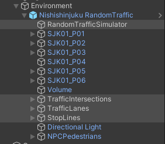
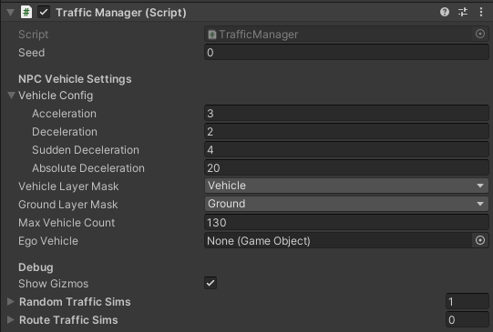
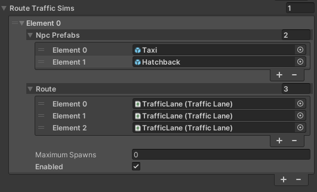
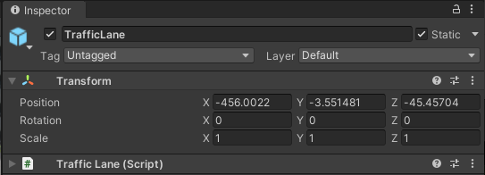
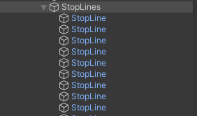

# TrafficComponents
This is a section that describes in detail all objects related to simulated traffic in the `Environment` prefab.

The random traffic system consists of the following components:

- `RandomTrafficSimulator`:  manages lifecycle of NPCs and simulates NPC behaviours.
- `TrafficLane`, `TrafficIntersection` and `StopLine`: represent traffic entities
- `NPCVehicle`: vehicle models (NPCs) controlled by `RandomTrafficSimulator`

## Lanelet2
*Lanelet2* is a library created for handling a map focused on automated driving.
It also supports ROS and ROS2 natively.
In *AWSIM* lanelet2 is used for reading and handling a map of all roads.
You may also see us referring to the actual map data file (`*.osm`) as a *lanelet2*.

!!! info
    If you want to learn more we encourage to visit the [official project page](https://github.com/fzi-forschungszentrum-informatik/Lanelet2/tree/master).

## Random Traffic Simulator
The `RandomTrafficSimulator` simulates city traffic with respect to all traffic rules. The system allows for random selection of car models and the paths they follow. It also allows adding static vehicles in the simulation.

#### Link
The `RandomTrafficSimulator` consists of several *GameObjects*.

- `RandomTrafficSimulator` - this is an *Object* consisting of a `Traffic Manager` Script. 
    You can learn more about it [here](#traffic-intersection-script).
- `TrafficIntersections` - this is a parent *Object* for all `Traffic Lanes`. 
    You can learn more about it [here](#trafficintersections).
- `TrafficLanes` - this is a parent *Object* for all `Traffic Lanes`. 
    You can learn more about it [here](#trafficlanes).
- `StopLines` - this is a parent *Object* for all `Stop Lines`. 
    You can learn more about it [here](#stoplines).

#### Traffic Manager Script
The `Traffic Manager` Script is responsible for all of top level management of the [NPC Vehicles](../../NPCs/Vehicle/).
It does spawn NPC Vehicles on the Traffic Lanes.
This Script also configures all of the spawned NPC Vehicles, so that they all have common parameters.

`Traffic Manager` Script can operate in two modes separately or simultaneously.

##### Random Traffic 
In the Random Traffic mode the NPC Vehicle prefabs (*NPC Prefabs*) can be chosen as well as *Spawnable Lanes*.
The later are the only Traffic Lanes on which the NPC Vehicles can spawn.
After that the NPC Vehicle takes a random route until it drives out of the map - then it is destroyed.

##### Route Traffic
In the Route Traffic mode one of the NPC Vehicle prefabs (*NPC Prefabs*) spawns on the first Route Element (`Element 0`) and then drives on the specified route.
After the first vehicle drove off the next one spawns according to the configuration.
It is **important** for all *Route* section elements to be connected an to be arranged in order of appearance on the map.
The NPC Vehicle disappears after completing the Route.

Many different *Routes* can be added and they will operate independently.

#### Parameter explanation
| Parameter                | Description                                                                                                 |
| ------------------------ | ----------------------------------------------------------------------------------------------------------- |
| **General Settings**     |                                                                                                             |
| Seed                     | Seed value for random generator                                                                             |
| Ego Vehicle              | Transform of ego vehicle                                                                                    |
| Vehicle Layer Mask       | LayerMask that masks only vehicle(NPC and ego) colliders                                                    |
| Ground Layer Mask        | LayerMask that masks only ground colliders of the map                                                       |
| Culling Distance         | Distance at which NPCs are culled relative to EgoVehicle                                                    |
| Culling Hz               | Culling operation cycle                                                                                     |
| **NPC Vehicle Settings** |                                                                                                             |
| Max Vehicle Count        | Maximum number of NPC vehicles to be spawned in simulation                                                  |
| NPC Prefabs              | Prefabs representing controlled vehicles.  They must have `NPCVehicle` component attached.              |
| Spawnable Lanes          | `TrafficLane` components where NPC vehicles can be spawned during traffic simulation                        |
| Vehicle Config           | Parameters for NPC vehicle control `Sudden Deceleration` is a deceleration related to emergency braking |
| **Debug**                |                                                                                                             |
| Show Gizmos              | Enable the checkbox to show editor gizmos that visualize behaviours of NPCs                                 |

## TrafficIntersections
Traffic Intersection is a representation of a road intersection.
It consists of several components.
Traffic Intersection is used in the Scene for managing Traffic Lights.
All Traffic Lights present on one Traffic Intersection must be synchronized and that is why the logic of Traffic Light operation is included in the Traffic Intersection.

#### Link
Every Traffic Intersection has its own *GameObject* and is added as a child of the aggregate `TrafficIntersections` *Object*.
Traffic Intersections are an element of an Environment, so they should be placed as children of an appropriate Environment *Object*.

#### Prefab
Traffic Intersection prefab consists of

- Box Collider - marks the area of the Traffic Intersection, it should cover the whole intersection area
- `Traffic Intersection` Script - controls all Traffic Lights on the given intersection according to the configuration

#### Traffic Intersection Script
The `Traffic Intersection` Script is used for controlling all Traffic Lights on a given intersection.
The `Collider Mask` field is a mask on which all Vehicle Colliders are present.
It - together with Box Collider - is used for keeping track of how many Vehicles are currently present on the Traffic Intersection.
The [`Traffic Light Groups`](#traffic-lights-groups) and [`Lighting Sequences`](#lighting-sequences) are described below.

##### Traffic Light Groups
The Traffic Light Group is a collection of all Traffic Lights that are in the same state at all times.
This includes all redundant Traffic Lights shining in one direction as well as the ones in the opposite direction - in the case they should indicate exactly the same thing.
This grouping simplifies the creation of [Lighting Sequences](#lighting-sequences).

##### Lighting Sequences
Lighting Sequences is the field in which the whole intersection Traffic Lights logic is defined.
It consists of different *Elements*.
Each *Element* is a collection of *Orders* that should take an effect for the period of time specified in the `Interval Sec` field.
`Lighting Sequences` *Elements* are executed sequentially, in order of definition and looped  - after the last element sequence goes back to the first element.

The `Group Lighting Orders` field defines which [Traffic Light Groups](#traffic-light-groups) should change their state and how.
For every `Group Lighting Orders` *Element* the [Traffic Lights Group](#traffic-light-groups) is specified with the exact description of the goal state for all Traffic Lights in that group - which bulb should light up and with what color.

One `Lighting Sequences` *Element* has many `Group Lighting Orders`, which means that for one period of time many different orders can be given.
E.g. when Traffic Lights in one direction change color to green - Traffic Lights in the parallel direction change color to red.

!!! info "Traffic Light state persistance"
    If in a given `Lighting Sequences` *Element* no order is given to some [Traffic Light Group](#traffic-light-groups) - this Group will keep its current state into the next `Lighting Sequences` *Element*.

??? info "Lighting Sequence Sample - details"
    <table>
        <tr>
            <td>Description</td>
            <td>Editor</td>
        </tr>
        <tr>
            <td>
                Traffic Lights in Pedestrian Group 1 change color to flashing green.  
                Other Groups keep their current state.  
                This state lasts for 5 seconds.
            </td>
            <td></td>
        </tr>
        <tr>
            <td>
                Traffic Lights in Pedestrian Group 1 change color to solid red.  
                Other Groups keep their current state.  
                This state lasts for 1 second.
            </td>
            <td></td>
        </tr>
        <tr>
            <td>
                Traffic Lights in Vehicle Group 1 change color to solid yellow.  
                Other Groups keep their current state.  
                This state lasts for 5 seconds.
            </td>
            <td></td>
        </tr>
        <tr>
            <td>
                Traffic Lights in Vehicle Group 1 change color to solid red.  
                Other Groups keep their current state.  
                This state lasts for 3 seconds.
            </td>
            <td></td>
        </tr>
        <tr>
            <td>
                Traffic Lights in Vehicle Group 2 change color to solid green.  
                Traffic Lights in Pedestrian Group 2 change color to solid green.  
                Other Groups keep their current state.  
                This state lasts for 15 seconds.
            </td>
            <td></td>
        </tr>
        <tr>
            <td>
                Traffic Lights in Pedestrian Group 2 change color to flashing green.  
                Other Groups keep their current state.  
                This state lasts for 5 seconds.
            </td>
            <td></td>
        </tr>
        <tr>
            <td>
                Traffic Lights in Pedestrian Group 2 change color to solid red.  
                Other Groups keep their current state.  
                This state lasts for 1 second.
            </td>
            <td></td>
        </tr>
        <tr>
            <td>
                Traffic Lights in Vehicle Group 2 change color to solid yellow.  
                Other Groups keep their current state.  
                This state lasts for 5 seconds.
            </td>
            <td></td>
        </tr>
        <tr>
            <td>
                Traffic Lights in Vehicle Group 2 change color to solid red.  
                Other Groups keep their current state.  
                This state lasts for 3 second.  
                Sequence **loops back** to the first element of the list.
            </td>
            <td></td>
        </tr>
    </table>

#### Collider
Every Traffic Intersection contains a Box Collider element.
It needs to accurately cover the whole area of the Traffic Intersection.
The Box Collider - together with the [Traffic Intersection Script](#traffic-intersection-script) - is used for detecting Vehicles entering the Traffic Intersection.

## TrafficLanes
<!-- TODO -->

#### Link
<!-- TODO -->

#### Prefab
<!-- TODO -->

#### Traffic Lane Script
<!-- TODO -->

Right Of Way Lanes

## StopLines
<!-- TODO -->

#### Link
<!-- TODO -->

#### Prefab
<!-- TODO -->

## Gizmos
<!-- TODO -->
Gizmos are useful for checking current behavior of NPCs and its causes.
Gizmos have a high computational load so please disable them if the simulation is laggy.

!!! node "Draft note"
    (description of what it is and how spawned NPCs behave in the environment)

    - Architecture description [30% current] (**graph**)
    - Seed, Spawnable Lanes, Max Vehicle Count, Spawning process (description, **gif**: example of spawning on a specific line)
    - Vehicle Prefabs (**screens** - examples of vehicles and the impact of boundaries)
    - Vehicle and Ground Layer masks (impact on spawning and behavior)
    - Vehicle Config (an explanation of each and a reference to SpeedMode)
    - Simulator steps (cognition, decision, control -> SpeedMode and Yielding states, **graph**)
    - Yielding process (stop lines, **gifs**)
    - Visualization description (**screens**: yielding, SpeedMode)

    **TrafficIntersection**

    (description of what it is and where it occurs in the environment, **screen**)

    - Traffic Lights (description, bulbs, dependence of the location on the lanelet, impact on the recognition of traffic lights in Autoware, **screens**)
    - Traffic Intersection Script
        - Collider Mask (probably out of date)
        - Traffic Light Groups (what they are and the result of adding traffic lights to them)
        - Lighting Sequences (description, how it works - **gifs**)

    **StopLine**

    (description of what it is and where it occurs in the environment **screen**, impact on Random Traffic)

    - Stop Line Script
        - Points
        - Stop sign (why this association occurs)
        - Traffic light (why this association occurs)

    **TrafficLane**

    (description of what it is and where it occurs in the environment **screen**, impact on Random Traffic)

    - Traffic Lane Script
        - Waypoints (**screen**)
        - Turn Direction (**screens**)
        - Next and Prev Lanes (**screens**)
        - Right of Way Lanes (**gifs**: a few examples with explanations regarding to Random Traffic)
        - Stop Line (**screen**)
        - Speed Limit

