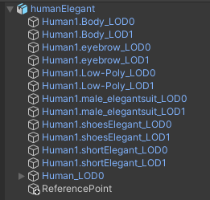
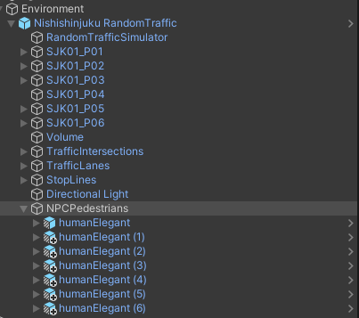
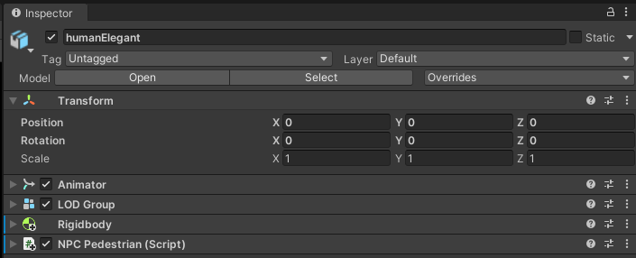
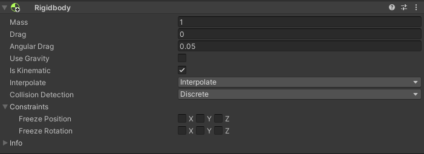
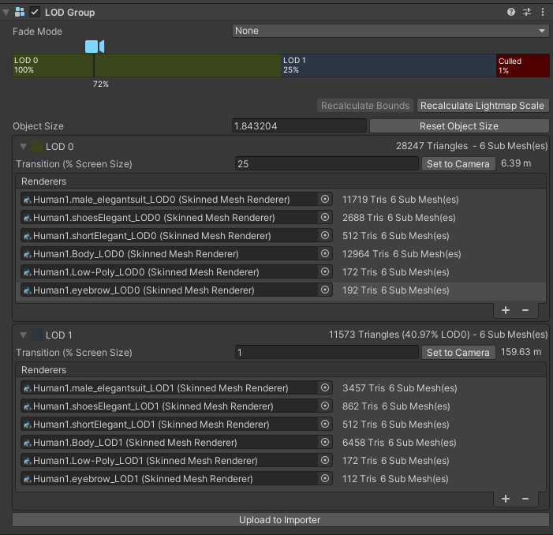
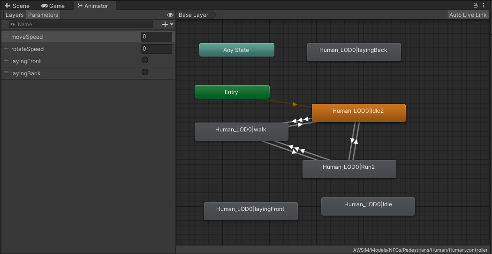
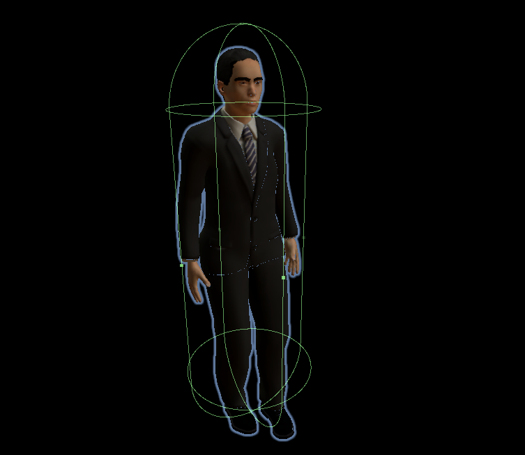

## Introduction
`NPCPedestrian` is an object that simulates a human standing or moving on the scene. It can move cyclically in any chosen place thanks to the available scripts. Traffic light tracking will be implemented in the future.


!!! note "Sample scene"
    If you would like to see how `NPCPedestrian` works or run some tests, we encourage you to familiarize yourself with the `NPCPedestrianSample` default scene described in this [section](../../../DefaultExistingScenes/).

### Prefab and Fbx

Prefab can be found under the following path:

```
Assets/AWSIM/Prefabs/NPCs/Pedestrians/humanElegant.prefab
```

### Visual elements

Prefab is developed using models available in the form of `*.fbx` file.
From this file, the visual elements of the model, `Animator` and `LOD` were loaded.
The `Animator` and `LOD` are added as components of the main-parent *GameObject* in prefab, while the visual elements of the model are added as its children.

`*.fbx` file can be found under the following path:

```
Assets/AWSIM/Models/NPCs/Pedestrians/Human/humanElegant.fbx
```

`NPCPedestrian` prefab has the following content:<br>


The `ReferencePoint` is used by the *NPCPedestrian* (script) described [here](#npcpedestrian-script).

### Link in the default Scene
Pedestrians implemented in the scene are usually added in one aggregating object - in this case it is `NPCPedestrians`. This object is added to the `Environment` prefab.



### Components


There are several components responsible for the full functionality of `NPCPedestrian`:

- *[Animator](https://docs.unity3d.com/Manual/class-Animator.html)* - provides motion animations in the scene, which are composed of clips controlled by the controller.
- *[LOD Group](https://docs.unity3d.com/Manual/class-LODGroup.html)* - provides level of detail configuration for shaders - affects *GPU* usage.
- *[Rightbody](https://docs.unity3d.com/ScriptReference/Rigidbody.html)* - ensures that the object is controlled by the physics engine in *Unity* - e.g. pulled downward by gravity.
- *NPCPedestrian* (script) - ensures that the movement of the object is combined with animation.
- *SimplePedestrianWalkerController* (script) - provides pedestrian movement in a specific direction and distance in a cyclical manner.

Scripts can be found under the following path:

```
Assets/AWSIM/Scripts/NPCs/Pedestrians/*
```


## RightBody


`RightBody` ensures that the object is controlled by the physics engine. In order to connect the animation to the object, the `Is Kinematic` option must be enabled. By setting  `Is Kinematic`, each `NPCPedestrian` object will have no physical interaction with other objects - it will not react to a vehicle that hits it. The `Use Gravity` should be turned off - the correct position of the pedestrian in relation to the ground is ensured by the *NPCPedestrian* (script). In addition, `Interpolate` should be turned on to ensure the physics engine's effects are smoothed out.

## LOD (Level of Detail)


`LOD` provides dependence of the level of detail of the object depending on the ratio of the *GameObject’s* screen space height to the total screen height. The pedestrian model has two object groups: suffixed `LOD0` and `LOD1`.
`LOD0` objects are much more detailed than `LOD1` - they have many more vertices in the *Meshes*.
Displaying complex meshes requires more performance, so if the *GameObject* is a small part of the screen, less complex `LOD1` objects are used.

In the case of the `NPCPedestrian` prefab, if its object is less than 25% of the height of the screen then objects with the `LOD1` suffix are used. For values less than 1% the object is culled.


## Animator


`Animator` component provides animation assignments to a *GameObject* in the scene. It uses a developed [`Controller`](https://docs.unity3d.com/Manual/class-AnimatorController.html) which defines which animation clips to use and controls when and how to blend and transition between them. 

The `AnimationController` for humans should have the two float parameters for proper transitions. Transitions between animation clips are made depending on the values of these parameters:

- `moveSpeed` - pedestrian movement speed in m/s,
- `rotateSpeed` - pedestrian rotation speed in rad/s.


Developed controller can be found in the following path:<br>
`Assets/AWSIM/Models/NPCs/Pedestrians/Human/Human.controller`



!!! example "Walking to running transition"
    The example shows the state of walking and then transitions to running as a result of exceeding the condition `moveSpeed>1.6`
    <video width="1920" controls>
        <source src="animator.mp4" type="video/mp4">
    </video>

## NPCPedestrian (script)


The script takes the `Rightbody` and `Animator` components and combines them in such a way that the actual animation depends on the movement of `Rightbody`. It provides an inputs that allows the pedestrian to move - change his position and orientation. In addition, the `ReferencePoint` point is used to ensure that the pedestrian follows the ground plane correctly.

#### Elements configurable from the editor level
 - `Ray Cast Max Distance` - ray-cast max distance for locating the ground.
 - `Ray Cast Origin Offset` - upward offset of the ray-cast origin from the *GameObject* local origin for locating the ground.


#### Input Data

| Category      | Type    | Description                                                                                          |
| :------------ | :------ | :--------------------------------------------------------------------------------------------------- |
| *SetPosition* | Vector3 | Move the `NPCPedestrian` so that the reference point is at the specified coordinates.                |
| *SetRotation* | Vector3 | Rotate the `NPCPedestrian` so that the orientation of the reference point becomes the specified one. |


## SimplePedestrianWalkerController (script)


`SimplePedestrianWalkerController` is a script that allows the pedestrian to cyclically move back and forth along a straight line.
One-way motion is performed with a fixed time as parameter `Duration` and a constant linear velocity as parameter `Speed`. The script obviously uses the `NPCPedestrian` controls provided by the *NPCPedestrian* (script) inputs.

!!! example "Pedestrian walking on the sidewalk"
    <video width="1920" controls>
        <source src="walk.mp4" type="video/mp4">
    </video>

## Collider


`Collider` is an optional pedestrian component. By default, `NPCPedestrian` doesn't have this component added, It can be added if you want to detect a collision, e.g. with an `EgoVehicle`.
There are several types of [colliders](https://docs.unity3d.com/ScriptReference/Collider.html), choose the right one and configure it for your own requirements.

!!! example "Capsule Collider"
    An example of a `CapsuleCollider` that covers almost the entire pedestrian.
    
    


