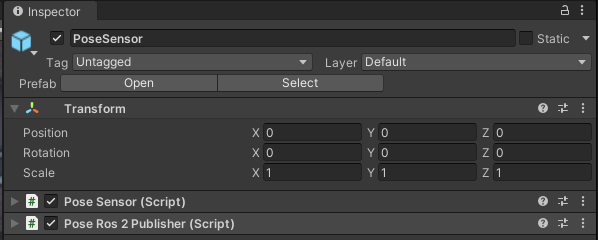

# PoseSensor

## Introduction
`PoseSensor` is a component which provides access to the current position and rotation - of the *GameObject* to which this component is attached - as the ground truth.
Due to the usage of the *MGRS* offset in the [environment](../../../Environment/Environment/), the position published by `PoseSensor` is also in the *MGRS* coordinate system.

### Prefab
Prefab can be found under the following path:

```
Assets/AWSIM/Prefabs/Sensors/PoseSensor.prefab
```


### Link in the default Scene
The `PoseSensor` is added to the `EgoVehicle` prefab, to the `base_link` object located in the `URDF`.
Thanks to this, the published position is the position of the `base_link` in the *Scene*.


A detailed description of the `URDF` structure and sensors added to prefab `Lexus RX450h 2015` is available in this [section](../../../EgoVehicle/URDF/).

### Components


The `PoseSensor` functionality is split into two scripts:

- *PoseSensor* (script) - it calculates the position as its *output* and calls the callback for it.
- *PoseRos2Publisher* (script) - provides the ability to publish `PoseSensor` output as [`PoseStamped`](https://docs.ros2.org/latest/api/geometry_msgs/msg/PoseStamped.html) published on a specific *ROS2* topic.

Scripts can be found under the following path:

```
Assets/AWSIM/Prefabs/Sensors/Pose/*
```

## PoseSensor (script)


This is the main script in which all calculations are performed:

1. the position and rotation of the object in *Unity* are read,
2. this position and rotation are transformed to the *ROS2* coordinate system,
3. the result of the transformation is saved as the output of the component,
4. for the current output a `callback` is called (which can be assigned externally).

#### Elements configurable from the editor level

- `Output Hz` - frequency of output calculation and callback calling (default: `100Hz`)


#### Output Data

|  Category  |     Type     | Description                                                                    |
| :--------: | :----------: | :----------------------------------------------------------------------------- |
| *Position* |  `Vector3`   | The true value of the position of the object - in the *MGRS* coordinate system |
| *Rotation* | `Quaternion` | The true value of the rotation of the object                                   |


## PoseRos2Publisher (script)


Converts the data output from `PoseSensor` to *ROS2* [`PoseStamped`](https://docs.ros2.org/latest/api/geometry_msgs/msg/PoseStamped.html) message and publishes it.
The conversion and publication is performed using the `Publish(PoseSensor.OutputData outputData)` method, which is the `callback` triggered by *PoseSensor* (script) for the current output.

#### Elements configurable from the editor level
- `Topic` - the *ROS2* topic on which the message is published<br>(default: `"/awsim/ground_truth/vehicle/pose"`)
- `Frame ID` - frame in which data is published, used in [`Header`](https://docs.ros2.org/latest/api/std_msgs/msg/Header.html)<br>(default: `"base_link"`)
- `Qos Settings` - Quality of service profile used in the publication<br>(default: `Reliable`, `Volatile`, `Keep last`, `1`)

#### Published Topics
- Frequency: `100Hz`
- QoS: `Reliable`, `Volatile`, `Keep last/1`

| Category | Topic                              | Message type                                                                                       | `frame_id`  |
| :------: | :--------------------------------- | :------------------------------------------------------------------------------------------------- | :---------: |
|   Pose   | `/awsim/ground_truth/vehicle/pose` | [`geometry_msgs/PoseStamped`](https://docs.ros2.org/latest/api/geometry_msgs/msg/PoseStamped.html) | `base_link` |
