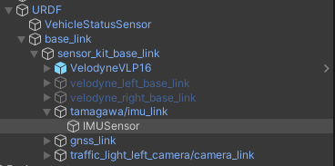

# IMUSensor
`IMUSensor` is a component that simulates an *IMU* (*Inertial Measurement Unit*) sensor.
Measures acceleration $\frac{m}{s^2}$ and angular velocity $\frac{rad}{s}$ based on the transformation of the *GameObject* to which this component is attached.

## Prefab
Prefab can be found under the following path:

```
Assets\AWSIM\Prefabs\Sensors\IMUSensor.prefab
```


## Link
`IMUSensor` has its own frame `tamagawa/imu_link` in which its data is published.
The sensor prefab is added to this frame.
The `tamagawa/imu_link` link is added to the `sensor_kit_base_link` in the `base_link` object located in the `URDF`.



## Scripts 
The `IMUSensor` functionality is split into two scripts:

- *IMUSensor Script* - it calculates the acceleration and angular velocity as its *output* and calls the callback for it.
- *ImuRos2Publisher Script* - provides the ability to publish `IMUSensor` output as [Imu](https://docs.ros2.org/latest/api/sensor_msgs/msg/Imu.html) message type published on a specific *ROS2* topics.


Scripts can be found under the following path:

```
Assets\AWSIM\Scripts\Sensors\Imu\*
```

## IMUSensor Script


This is the main script in which all calculations are performed:

- the angular velocity is calculated as the derivative of the orientation with respect to time,
- acceleration is calculated as the second derivative of position with respect to time,
- in the calculation of acceleration, the gravitational vector is considered - which is added.

!!! warning 
    If the angular velocity about any axis is `NaN` (infinite), then  angular velocity is published as vector zero.

### Elements configurable from the editor level
- `Output Hz` - frequency of output calculation and callback (default: `30Hz`)
      
### Output Data
|       Category       |  Type   | Description                       |
| :------------------: | :-----: | :-------------------------------- |
| *LinearAcceleration* | Vector3 | Measured acceleration (m/s^2)     |
|  *AngularVelocity*   | Vector3 | Measured angular velocity (rad/s) |

## ImuRos2Publisher Script 


Converts the data output from `IMUSensor` to *ROS2* [Imu](https://docs.ros2.org/latest/api/sensor_msgs/msg/Imu.html) type message and publishes it.
The conversion and publication is performed using the `Publish(IMUSensor.OutputData outputData)` method, which is the `callback` triggered by *IMUSensor Script* for the current output.

!!! warning
    In each 3x3 covariance matrices the row-major representation is filled with `0` and does not change during the script run.
    In addition, the field `orientation` is assumed to be `{1,0,0,0}` and also does not change.

### Elements configurable from the editor level
- `Topic` - the *ROS2* topic on which the message is published<br>(default: `"/sensing/imu/tamagawa/imu_raw"`)
- `Frame id` - frame in which data is published, used in [`Header`](https://docs.ros2.org/latest/api/std_msgs/msg/Header.html)<br>(default: `tamagawa/imu_link"`)
- `Qos Settings` - Quality of service profile used in the publication<br>(default: `Reliable`, `Volatile`, `Keep last`, `1000`)

### Published Topics
- Frequency: `30Hz`
- QoS:  `Reliable`, `Volatile`, `Keep last/1000`

|  Category  | Topic                           | Message type                                                                   |     `frame_id`      |
| :--------: | :------------------------------ | :----------------------------------------------------------------------------- | :-----------------: |
| *IMU data* | `/sensing/imu/tamagawa/imu_raw` | [`sensor_msgs/Imu`](https://docs.ros2.org/latest/api/sensor_msgs/msg/Imu.html) | `tamagawa/imu_link` |
