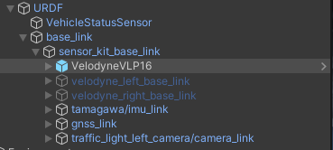
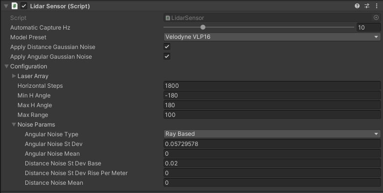

# LidarSensor

## Introduction
`LidarSensor` is the component that simulates the *LiDAR* (*Light Detection and Ranging*) sensor.
*LiDAR* works by emitting laser beams that bounce off objects in the environment, and then measuring the time it takes for the reflected beams to return, allowing the sensor to create a *3D* map of the surroundings.
This data is used for object detection, localization, and mapping.

*LiDAR* in an autonomous vehicle can be used for many purposes.
The ones mounted on the top of autonomous vehicles are primarily used

- to scan the environment for localization in space
- to detect and identify obstacles such as approaching vehicles, pedestrians or other objects in the driving path.

*LiDARs* placed on the left and right sides of the vehicle are mainly used to monitor the traffic lane and detect vehicles moving in adjacent lanes, enabling safe maneuvers such as lane changing or turning.

`LidarSensor` component is a part of [`RGLUnityPlugin`](../../../ExternalLibraries/RGLUnityPlugin/) that integrates the external [*RobotecGPULidar*](https://github.com/RobotecAI/RobotecGPULidar) (`RGL`) library with *Unity*.

!!! warning "Use RGL in your scene"
    If you want to use `RGL` in your scene, make sure the scene has an [`SceneManager` component](../../../../../DeveloperGuide/Tutorials/AddANewScene/AddASceneManager) added and all objects meet the [usage requirements](../../../../ProjectGuide/ExternalLibraries/RGLUnityPlugin/#usage-requirements).

!!! note "RGL default scenes"
    If you would like to see how `LidarSensor` works using `RGL` or run some tests, we encourage you to familiarize yourself with the [`RGL` test scenes section](../../../DefaultExistingScenes/#rgl-test-scenes).

!!! note "Supported *LiDARs*"
    The current scripts implementation allows you to configure the prefab for any mechanical *LiDAR*.
    You can read about how to do it [here](../../../../../DeveloperGuide/Tutorials/AddANewLiDARModel/).
    *MEMS-based LiDARs* due to their different design are not yet fully supported.

### Prefabs
Prefabs can be found under the following path:

```
Assets/AWSIM/Prefabs/RobotecGPULidars/*
```


The table of available prefabs can be found below:

| LiDAR                 | Path                     | Appearance                                       |
| :-------------------- | :----------------------- | :----------------------------------------------- |
| *HESAI Pandar40P*     | `HesaiPandar40P.prefab`  |  |
| *HESAI PandarQT64*    | `HesaiPandarQT64.prefab` |   |
| *Ouster OS1-64*       | `OusterOS1-64.prefab`    |     |
| *Velodyne VLP-16*     | `VelodyneVLP16.prefab`   |      |
| *Velodyne VLC-32C*    | `VelodyneVLP32C.prefab`  |      |
| *Velodyne VLS-128-AP* | `VelodyneVLS128.prefab`  |     |


### Link in the default Scene
`LidarSensor` is configured in default vehicle `EgeVehicle` prefab, it is added to `URDF` object as a child of `sensor_kit_base_link`.
`LidarSensor` placed in this way does not have its own frame, and the data is published relative to `sensor_kit_base_link`.
More details about the location of the sensors in the vehicle can be found [`here`](../../EgoVehicle/URDF/).



A detailed description of the `URDF` structure and sensors added to prefab `Lexus RX450h 2015` is available in this [section](../../EgoVehicle/URDF/).

!!! warning "Additional LiDARs"
    For a *LiDAR* placed on the left side, right side or rear, an additional link should be defined.

### Components and Resources


The *LiDAR* sensor simulation functionality is split into three components:

- *LidarSensor* (script) - provides lidar configuration, creates *RGL* pipeline to simulate lidar, and performs native *RGL* raytrace calls,
- *RglLidarPublisher* (script)  - extends *RGL* pipeline with nodes to publish *ROS2* messages.
- *PointCloudVisualization* (script) - visualizes point cloud collected by sensor.

Moreover, the scripts use `Resources` to provide configuration for prefabs of supported lidar models:

- *LaserModels* - provides a list of supported models,
- *LaserArrayLibrary* - provides data related to laser array construction for supported models,
- *LaserConfigurationLibrary* - provides full configuration, with ranges and noise for supported models.
These are elements of the `RGLUnityPlugin`, you can read more [here](../../../ExternalLibraries/RGLUnityPlugin/).

## LidarSensor (script)

This is the main component that creates the `RGL` node pipeline for the *LiDAR* simulation.
The pipeline consists of:

- setting ray pattern,
- transforming rays to represent pose of the sensor on the scene,
- applying gaussian noise,
- performing raytracing,
- removing non-hits from the result point cloud,
- transforming point cloud to sensor frame coordinate system.

`LidarSensor` provides public methods to extend this pipeline with additional `RGL` nodes.
In this way, other components can request point cloud processing operations and receive data in the desired format.

`LidarSensor` component in the output provides 3 types of data.
Two of them: *rosPCL24* and *rosPCL48* are point clouds that are published by the [*RglLidarPublisher*](#rgllidarpublisher-component) component.
Whereas vector *onlyHits* is used for visualization by the [*PointCloudVisualization*](#pointcloudvisualization-component) component.

#### Elements configurable from the editor level

- `Automatic Capture Hz` - the rate of sensor processing (default: `10Hz`)
- `Model Preset` - allows selecting one of the built-in *LiDAR* models (default: `RangeMeter`)
- `Apply Distance Gaussian Noise` - enable/disable distance gaussian noise (default: `true`)
- `Apply Angular Gaussian Noise` - enable/disable angular gaussian noise (default: `true`)
- *Configuration*:
    - `Laser Array` - geometry description of lidar array, should be prepared on the basis of the manual for a given model of *LiDAR* (default: loaded from `LaserArrayLibrary`)
    - `Horizontal Steps` - the number of laser array firings between `Min H Angle` and `Max H Angle` (default: `1`)
    - `Min H Angle` - minimum horizontal angle, left (default: `0`)
    - `Max H Angle` - maximum horizontal angle, right (default: `0`)
    - `Max Range` - maximum range of the sensor (default: `40`)
    - *Noise Params*: 
        - `Angular Noise Type` - angular noise type<br>(default: `Ray Based`)
        - `Angular Noise St Dev` - angular noise standard deviation in degree<br>(default: `0.05729578`)
        - `Angular Noise Mean` - angular noise mean in degrees<br>(default: `0`)
        - `Distance Noise St Dev Base` - distance noise standard deviation base in meters<br>(default: `0.02`)
        - `Distance Noise Rise Per Meter` - distance noise standard deviation rise per meter<br>(default: `0`)
        - `Distance Noise Mean` - distance noise mean in meters<br>(default: `0`)

#### Output Data
|  Category  |    Type    | Description                                                                               |
| :--------: | :--------: | :---------------------------------------------------------------------------------------- |
| *onlyHits* | Vector3[ ] | Vertices for visualization in *Unity's* coordinate system                                 |
| *rosPCL24* |  byte[ ]   | Vertices for publishing *Autoware* format pointcloud in *ROS2* coordinate system          |
| *rosPCL48* |  byte[ ]   | Vertices for publishing extended *Autoware* format pointcloud in *ROS2* coordinate system |

## RglLidarPublisher (script)


`RglLidarPublisher` extends the main `RGL` pipeline created in `LidarSensor` with `RGL` nodes that produce point clouds in specific format and publish them to the *ROS2* topic.
Thanks to the *ROS2* integration with `RGL`, point clouds can be published directly from the native library.
`RGL` creates *ROS2* node named `/RobotecGPULidar` with publishers generated by `RGL` nodes.

Currently, `RglLidarPublisher` implements two ROS2 publishers:

- *rosPCL24* - a 24-byte point cloud format used by *Autoware*
- *rosPCL48* - a 48-byte extended version point cloud format used by *Autoware*

Details on the construction of these formats are available in the `PointCloudFormats` under the following path:


```
Assets/AWSIM/Scripts/Sensors/LiDAR/PointCloudFormats.cs
```


!!! note "*rosPCL48* format"
    For a better understanding of the *rosPCL48* format, we encourage you to familiarize yourself with the point cloud pre-processing process in *Autoware*, which is described [here](https://autowarefoundation.github.io/autoware-documentation/latest/design/autoware-architecture/sensing/data-types/point-cloud/#channel).

#### Elements configurable from the editor level
- `Pcl 24 Topic` - the *ROS2* topic on which the [`PointCloud2`](https://docs.ros2.org/latest/api/sensor_msgs/msg/PointCloud.html) message is published<br>(default: `"lidar/pointcloud"`)
- `Pcl 48 Topic` - the *ROS2* topic on which the [`PointCloud2`](https://docs.ros2.org/latest/api/sensor_msgs/msg/PointCloud.html) message is published<br>(default: `"lidar/pointcloud_ex"`)
- `Frame ID` - frame in which data are published, used in [`Header`](https://docs.ros2.org/latest/api/std_msgs/msg/Header.html) (default: `"world"`)
- `Publish PCL24` - if publish cloud *PCL24* (default: `true`)
- `Publish PCL48` - if publish cloud *PCL48* (default: `true`)
- `Qos Settings` - Quality of service profile used in the publication<br>(default: `Best effort`, `Volatile`, `Keep last`, `5`)

#### Published Topics
- Frequency: `10Hz`
- QoS:  `Best effort`, `Volatile`, `Keep last/5`

|         Category          | Topic                  | Message type               | `frame_id` |
| :-----------------------: | :--------------------- | :------------------------- | :--------: |
| PointCloud 24-byte format | `/lidar/pointcloud`    | `sensor_msgs/PointCloud2`  |  `world`   |
| PointCloud 48-byte format | `/lidar/pointcloud_ex` | `sensor_msgs/PointCloud2 ` |  `world`   |

## PointCloudVisualization (script)


A component visualizing a point cloud obtained from `RGL` in the form of a [`Vector3`](https://docs.unity3d.com/ScriptReference/Vector3.html) list as colored points in the *Unity* scene.
Based on the defined color table, it colors the points depending on the height at which they are located.

The obtained points are displayed as the vertices of mesh, and their coloring is possible thanks to the use of `PointCloudMaterial` material which can be found in the following path:
```
Assets/RGLUnityPlugin/Resources/PointCloudMaterial.mat
```

`Point Cloud Visualization` preview:


### Elements configurable from the editor level
- `Point Shape` - the shape of the displayed points (default: `Box`)
- `Point Size` - the size of the displayed points (default: `0.05`)
- `Colors` - color list used depending on height<br>(default: `6` colors: `red, orange, yellow, green, blue, violet`)
- `Auto Compute Coloring Heights` - automatic calculation of heights limits for a list of colors (default: `false`)
- `Min Coloring Height` - minimum height value from which color matching is performed, below this value all points have the first color from the list (default: `0`)
- `Max Coloring Height` - maximum height value from which color matching is performed, above this value all points have the last color from the list (default: `20`)
