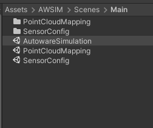
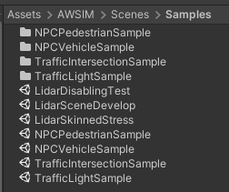
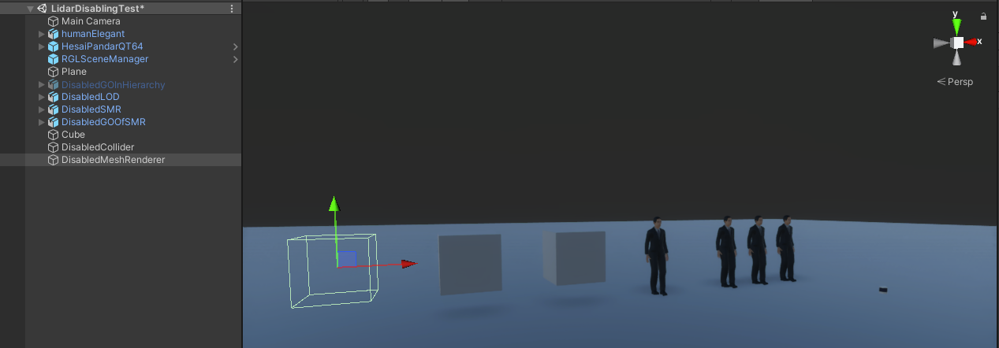

In the *AWSIM Unity* project there is one main scene (*AutowareSimulation*) and several additional ones that can be helpful during development.
This section describes the purpose of each scene in the project.

## AutowareSimulation
The `AutowareSimulation` scene is the main scene that is designed to run the *AWSIM* simulation together with *Autoware*.
It allows for effortless operation, just run this scene, run *Autoware* with the correct map file and everything should work right out of the box.
The description of how to do this can be found in this [section](../../BuildFromSource/RunScene/).

## PointCloudMapping
The `PointCloudMapping` is a scene that is designed to create a point cloud using the *Unity* world.
Using the [*RGLUnityPlugin*](../ExternalLibraries/RGLUnityPlugin/) and prefab `Environment` - on which there are models with [`Meshes`](https://docs.unity3d.com/ScriptReference/Mesh.html) - we are able to obtain a `*.pcd` file of the simulated world.

<video width="1920" controls>
<source src="mapping.mp4" type="video/mp4">
</video>

## SensorConfig
Scene `SensorConfig` was developed to perform a quick test of sensors added to the `EgoVehicle` prefab.
Replace the `Lexus` prefab with a vehicle prefab you developed and check whether all data that should be published is present, whether it is on the appropriate topics and whether the data is correct.

<video width="1920" controls>
<source src="sensor_config_test.mp4" type="video/mp4">
</video>

## NPCVehicleSample
The `NPCVehicleSample` was developed to conduct a quick test of the developed vehicle.
Replace the taxi prefab with a vehicle prefab you developed (`EgoVehicle` or `NPCVehicle`) and check whether the basic things are configured correctly.
The description of how to develop your own vehicle and add it to the project is in this [section](../../../DeveloperGuide/Tutorials/AddANewVehicle/).

<video width="1920" controls>
<source src="vehicle_test.mp4" type="video/mp4">
</video>

## NPCPedestrianSample
The `NPCPedestrianSample` was developed to conduct a quick test of the developed pedestrian.
Replace the NPC prefab in `NPC Pedestrian Test` script with a prefab you developed and check whether the basic things are configured correctly.

<video width="1920" controls>
<source src="human_test.mp4" type="video/mp4">
</video>

## TrafficIntersectionSample
The `TrafficIntersectionSample` was developed to conduct a quick test of the developed traffic intersection.
Replace the intersection configuration with your own and check whether it works correctly.
You can add additional groups of lights and create much larger, more complex sequences.
A description of how to configure your own traffic intersection is in this [section](../../../DeveloperGuide/Tutorials/AddARandomTraffic/AddATrafficIntersection/).

<video width="1920" controls>
<source src="intersection_test.mp4" type="video/mp4">
</video>

## TrafficLightSample
The `TrafficLightSample` was developed to conduct a quick test of a developed traffic lights model in cooperation with the script controlling it.
Replace the lights and configuration with your own and check whether it works correctly.

<video width="1920" controls>
<source src="light_test.mp4" type="video/mp4">
</video>

## RGL test scenes
The scenes described below are used for tests related to the external library `RGLUnityPlugin` (`RGL`) - you can read more about it in this [section](../ExternalLibraries/RGLUnityPlugin/).

### LidarSceneDevelop
The scene `LidarSceneDevelop` can be used as a complete, minimalistic example of how to setup `RGL`.
It contains `RGLSceneManager` component, four lidars, and an environment composed of floor and walls.

<video width="1920" controls>
<source src="scene_develop.mp4" type="video/mp4">
</video>

### LidarSkinnedStress
The scene `LidarSkinnedStress` can be used to test the performance of `RGL`.
E.g. how performance is affected when using `Regular Meshes` compared to `Skinned Meshes`.
The scene contains a large number of animated models that require meshes to be updated every frame, thus requiring more resources (*CPU* and data exchange with *GPU*).

<video width="1920" controls>
<source src="skinned_stress.mp4" type="video/mp4">
</video>

### LidarDisablingTest
The scene `LidarDisablingTest` can be used to test `RGL` performance with similar objects but with different configurations.
It allows you to check whether `RGL` works correctly when various components that can be sources of `Meshes` are disabled (`Colliders`, `Regular Meshes`, `Skinned Meshes`, ...).

<video width="1920" controls>
<source src="disabling_test.mp4" type="video/mp4">
</video>
