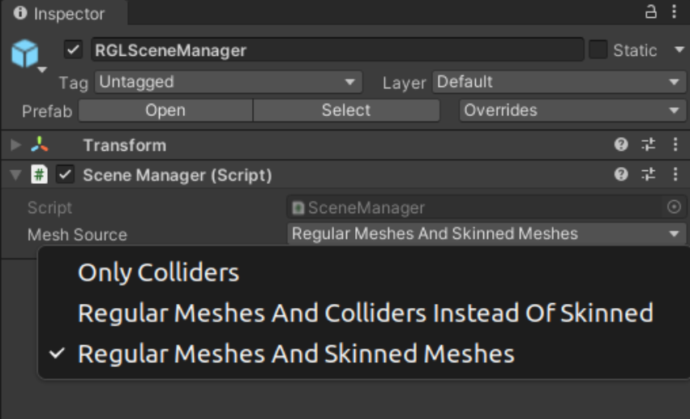
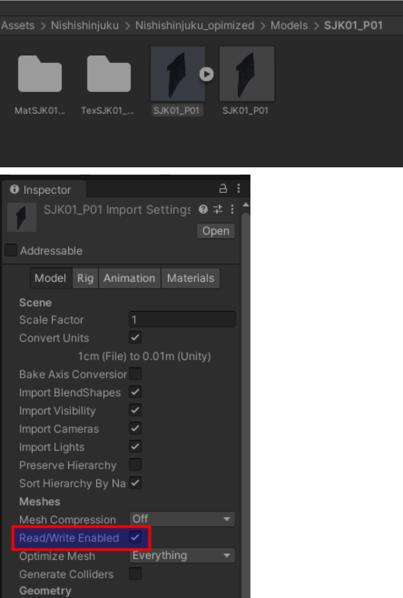

[Robotec GPU Lidar](https://github.com/RobotecAI/RobotecGPULidar) (`RGL`) is an open source high performance lidar simulator running on CUDA-enabled GPUs. It is a cross-platform solution compatible with both *Windows* and *Linux* operating systems. `RGL` utilizes `RTX` cores for acceleration, whenever they are accessible. 

`RGL` is used in `AWSIM` for performance reasons, thanks to it it is possible to perform a large number of calculations using the GPU, which is extremely helpful due to the size of the scenes. `AWSIM` is integrated with `RGL` out-of-the-box - using `RGLUnityPlugin` asset.

## Concept

Describing the concept of using `RGL` in `AWSIM`, we distinguish:

- *Scene* - A location where raytracing occurs. In `AWSIM`, the scene is a `Environment` prefab containing models with their own meshes. Entities are placed in the scene for ray-tracing purposes.

- *Mesh* - A handle to the on-GPU data of the 3D model of objects that in `AWSIM` are provided in the form of gameobjects containing [Mesh Filter](https://docs.unity3d.com/Manual/class-MeshFilter.html)

- *Entity* - represents a 3D object on the scene with its position and rotation. In `AWSIM`, it is a vehicle (`Ego`) that moves in the environment. It consists of a lightweight reference to a `Mesh` object and a transformation matrix.

- *Node* - Performs specific operations such as setting rays for raytracing, transforming rays, manipulating output formats and perform raytracing. In `AWSIM`, the nodes works in the `LidarSensor` script - where they are combined in a graph.

- *Graph* - A collection of connected Nodes that can be run to calculate results. It allows users to customize functionality and output format by adding or removing Nodes. Typically used for simulating Lidar.

Creating a point cloud is based on the use of a scene with meshes, placing an Entity in it in the initial position and creating a graph for this position. Then Entity is moved to another place and another graph is created. `RGL` is designed for dynamic scenes, allowing for the frequent repetition of Entity movement and graph creation steps at a high frequency.

## Package structure

`RGLUnityPlugin` asset contains:

- *Plugins* - dynamically loaded libraries for *Windows* and *Linux* (`*.dll` and `*.so` files)
- *Resources* - visualization shader and material
- *Scripts* - scripts for using `RGL` in *Unity* - details below

### Scripts
  - `SceneManager` - responsible for syncing the scene between *Unity* and `RGL` - this script works within the `RGLSceneManager` component.
  - `LidarSensor` - provide lidar configuration and collect point cloud.
  - `PointCloudVisualization` - visualize `PointCloud` on the *Unity* scene.
  - `RGLDebugger` - provides configuration for Native `RGL` debug tools (logging and tape).
  - A set of classes providing tools to define *LiDAR* specification (mostly: ray poses)
      - `LidarModels` - enumeration of some real-world *LiDARs* names,
      - `LidarConfiguration` - top-level configuration class, horizontal ranges, distance range, laser array,
      - `LidarConfigurationLibrary` - provides a number of pre-defined `LidarConfigurations`,
      - `LaserArray` - definition of a (vertical) array of lasers,
      - `LaserArrayLibrary` - provides a number of pre-defined `LaserArrays`,
      - `Laser` - describes offsets of a single laser within a `LaserArray`.
  - `LowLevelWrappers` scripts - provides some convenience code to call Native `RGL` functions.
  - `Utilities` scripts - miscellaneous utilities to make rest of the code clearer.

## RGLSceneManager
Each scene needs `RGLSceneManager` component to synchronize models between *Unity* and `RGL`. On every frame, it detects changes in the *Unity's* scene and propagates the changes to native `RGL` code. When necessary, it obtains 3D models from *GameObjects* on the scene, and when they are no longer needed, it removes them.

Three different strategies to interact with in-simulation 3D models are implemented. `RGLSceneManager` uses executes one of the following policies to obtain raycast hit:

- `Only Colliders` - active colliders only,
- `Regular Meshes And Colliders Instead Of Skinned` - mesh for non-skinned MeshRenderers or set of colliders (if provided) attached to the rootBone and below for SkinnedMeshRenderers,
- `Regular Meshes And Skinned Meshes` - mesh for both MeshRenderer and SkinnedMeshRenderer.

Mesh source can be changed in the `SceneManager` script properties:

!!! warning
    `RGLSceneManager` performance depends on mesh source option selected.
    
### Usage requirements
Objects, to be detectable by `RGL`, must fulfill the following requirements:

1. Contain one of the components: `Collider`, `Mesh Renderer`, or `Skinned Mesh Renderer`. It depends on `RGLSceneManager` mesh source parameter.
2. Be readable from CPU-accessible memory. It can be achieved using the *“Read/Write Enabled”* checkbox in mesh settings. 

    !!! note
        [Primitive Objects](https://docs.unity3d.com/Manual/PrimitiveObjects.html) are readable by default.

    !!! example
        The activated *Readable* option in the mesh should look like this.
        

<!-- ### Debugging Native RGL library (*advanced*)

1. Create an empty object
2. Attach script `RGLDebugger`
3. Configure debug tools:
   - Logging - saves logs from Native RGL to the file
     - `Log Level` - logging verbosity level.
     - `Log Output Path` - path to the file where logs will be saved
   - Tape (Linux only) - saves all Native RGL functions calls to the file. For playback, it is required to have a special program (available in [RGL repository](https://github.com/RobotecAI/RobotecGPULidar)).
     - `Tape Output Path` - path to the file where tape recording will be saved (should contain filename without extension)
     - `Activate Tape Record` - tape recording activation button
4. Start the simulation

In case of any problems, please create issue in the [RGL repository](https://github.com/RobotecAI/RobotecGPULidar) and attach the generated files with logs and tape. -->
